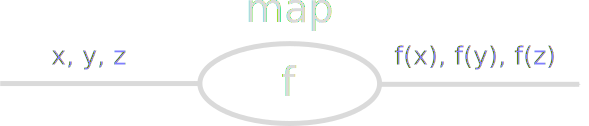
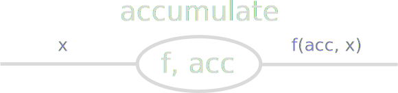
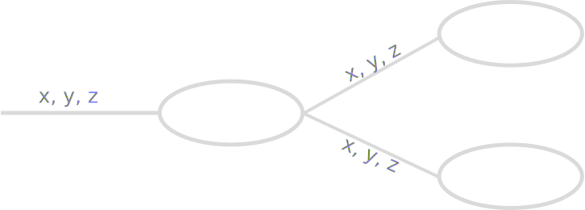
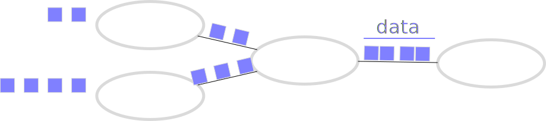
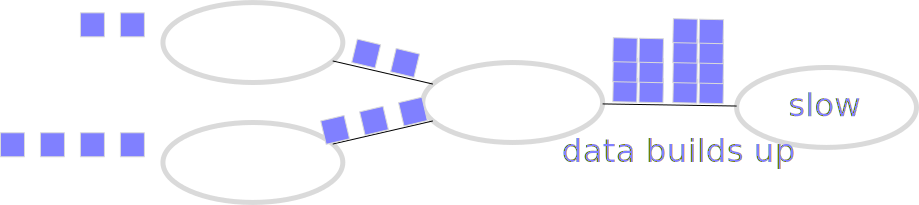
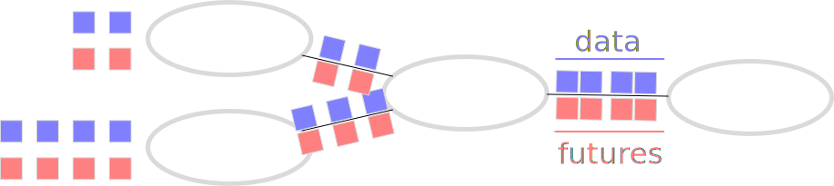
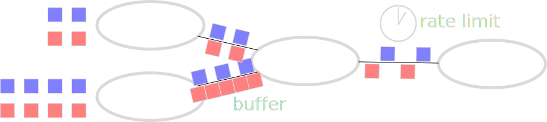

Real Time Processing and Dask
-----------------------------


*Matthew Rocklin*

Anaconda Inc


### We want to combine data analysis

<hr>

### with operational events in real-time


### Example Situations

1.  Streaming Dataframes
    -  Read from streaming sources like Kafka
    -  Transform and aggregate data with Pandas-like interfaces
    -  Shape flow between many sources and sinks
    -  Publish to dashboards or trigger alerts
2.  Responding to network requests
    -  Handle many individual queries
    -  Scale out as needed
    -  Respond in low latency (10-100ms)
3.  Advanced distributed algorithms
    -  Cancel, add, or shape an algorithm as it progresses
    -  Coordinate with Queues, Locks, Shared Variables


### Q: How do we *solve* these workloads in Python?

<hr>

### Q: How do we *scale* these workloads in Python?


### A: You have many options!

<hr>

1.  Streaming Dataframes
    -  Apache Flink\*
    -  Apache Spark Streaming
    -  Apache Beam\*
2.  Responding to network requests
    -  Concurrent.futures
    -  Celery
    -  General web technology nginx\*
3.  Advanced distributed algorithms
    -  ZeroMQ
    -  Ray
    -  Sockets, Queues, Blood, Sweat, and Tears


### A: You have many options!

<hr>

### *but I'm going to talk about Dask*


-  Designed to parallelize the Python ecosystem
    -  Most known for Big Numpy, Pandas, SKLearn APIs
    -  Backed by a general purpose task scheduler
-  Executes efficiently
    -  Scales from laptops to super-computers
    -  Resilient, responsive, and real-time
    -  Millisecond latencies, 300us overheads


### High Level APIs for Numpy, Pandas, Scikit-Learn

```python
import dask.array as da

x = da.random.random((10000, 10000), chunks=(1000, 1000))
y = x + x.T - x.mean(axis=0)
```

### Dask forms Task graphs of normal Python calls


### High Level APIs for Numpy, Pandas, Scikit-Learn

```python
import dask.dataframe as dd

df = dd.read_csv('s3://path/to/data-*.csv')
df.groupby(df.name).balance.sum()
```

### Dask forms Task graphs of normal Python calls


### High Level APIs for Numpy, Pandas, Scikit-Learn

```python
pipe = Pipeline(steps=[('pca', PCA()),
                       ...,
                       ('logistic', LogisticRegression)])
grid = GridSearchCV(pipe, parameter_grid)
```

### Dask forms Task graphs of normal Python calls


### High Level APIs for Numpy, Pandas, Scikit-Learn

```python
pipe = Pipeline(steps=[('pca', PCA()),
                       ...,
                       ('logistic', LogisticRegression)])
grid = GridSearchCV(pipe, parameter_grid)
```

### Dask executes those graphs on parallel hardware


### How do we use this system

### to process real-time events?


### This graph needs to be able to change during computation


### Dask Futures

1.  **Low level:** Don't include pre-canned algorithms
2.  **Flexible:** Don't get in your way
3.  **Standard:** Extend the core Python concurrent.futures API

    Includes standard concurrency primitives

    *Queues, Locks, Shared Variables, ...*
4.  **Fast-ish**: Millisecond latencies, 300 microsecond overheads

.

*Mimics single-machine concurreency, but scales*


### Dask Futures are a low-level real-time system

<hr>

### that helps us build high-level real-time systems


### Futures: Single remote function call

```python
>>> from dask.distributed import Client
>>> client = Client(processes=False)                   # Start Dask Client

>>> # result = function(*args, **kwargs)               # would run locally

>>> future = client.submit(function, *args, **kwargs)  # execute remotely
>>> future                                             # return pointer to eventual data
<Future: status: pending, key: add-c3cae4a08c3bbbbd>
```

*wait a while*

```python
>>> future                                             # task finishes in the background
<Future: status: finished, type: np.ndarray, key: add-c3cae4a08c3bbbbd>

>>> future.result()                                    # block and gather result
array([ ... ])
```


### Futures: Chain dependencies

```python
>>> x = client.submit(f, 1)     # returns a future
>>> y = client.submit(f, 2)     # returns a future
>>> z = client.submit(g, x, y)  # use futures x and y as arguments
```


Lets us build complex task graphs piece by piece

Avoids gathering intermediate results


### Futures: Thousands of tasks per second

```python
>>> for element in L:
...     future = client.submit(function, element)
...     ...
```

-  300 microsecond overhead
-  10 millisecond roundtrip latency


### Futures: Submit tasks from tasks

```python
def func(x):
    """ This task runs on a remote worker """
    client = get_client()        # Connect back to the scheduler

    future = client.submit(...)  # Submit work on other workers

    ...

client.submit(func, ...)         # Submit task from our local process
```

Allows for building complex systems.

See [Dask: Advanced techniques at Scipy 2017](https://www.youtube.com/watch?v=ZxNPVTHQwGo)


### Futures: Concurrency primitives

```python
from dask.distributed import Queue, Lock, Variable

with lock:
    future = queue.get()
    ...
    queue.put(...)
```

Enables coordination in complex workloads


### Futures: options

```python
client.submit(function, *args, **kwargs,  # Run function(*args, **kwargs)
              resources={'GPU': 1},       # Run on a machine with a GPU
              priority=10,                # This is high priority
              retries=5,                  # If this fails retry up to five times
              ...)
```


### Futures are a general purpose concurrency API

<hr>

### That runs cheaply on your laptop

### ... or scales to a cluster


### Try it now

```python
from dask.distributed import Client
client = Client()  # start local workers

future = client.submit(lambda x: x + 1, 10)
future.result()
```

Upgrade (but you probably already have it installed)

    conda install dask
    # or
    pip install dask[complete]

Visit [http://localhost:8787/status](http://localhost:8787/status) for the dashboard


### Example 1: Streaming Dataframes

<hr>

### Want Pandas semantics on streaming data

1.  Read from Kafka, file handles, sockets, ...
2.  Do Pandas-like operations
3.  Control flow between many sources and sinks
4.  Manage side-effects, time, back pressure
5.  Scalable computing

.


### Example 1: Streaming Dataframes

<hr>

### This already exists, see Streamz library

1.  Read from Kafka, file handles, sockets, ...
2.  Do Pandas-like operations
3.  Control flow between many sources and sinks
4.  Manage side-effects, time, back pressure
5.  ~~Scalable computing~~

See [PyData NYC 2017 talk](https://www.youtube.com/watch?v=yI_yZoUaz60)


### Example with Network data

<iframe width="560"
        height="315"
        src="https://www.youtube.com/embed/G981CbrUUwQ"
        frameborder="0"
        allow="autoplay; encrypted-media"
        allowfullscreen></iframe>




<hr>

```python
>>> new_stream = stream.map(func)
```




<hr>

```python
def binop(total, new):
    return total + new

>>> reduce(binop, range(10))      # single final result
45

>>> accumulate(binop, range(10))  # new result for every new element
[0, 1, 3, 6, 10, 15, 21, 28, 36, 45]

>>> new_stream = stream.accumulate(binop, start=0)
```


### Branching




### Joining


### Time and Back Pressure



```python
# Later stages in a pipeline might be slow (like writing to a database)
stream.map(f).combine_latest(other).accumulate(h).map(write_to_database)

for element in data:      # user pushes data into stream
    stream.emit(element)  # needs to be told to slow down
```


### Time and Back Pressure



```python
# Later stages in a pipeline might be slow (like writing to a database)
stream.map(f).combine_latest(other).accumulate(h).map(write_to_database)

for element in data:      # user pushes data into stream
    stream.emit(element)  # needs to be told to slow down
```


### Time and Back Pressure



```python
# Later stages in a pipeline might be slow (like writing to a database)
stream.map(f).combine_latest(other).accumulate(h).map(write_to_database)

for element in data:      # user pushes data into stream
    stream.emit(element)  # needs to be told to slow down
```


### Time and Back Pressure



```python
# Later stages in a pipeline might be slow (like writing to a database)
stream...buffer(100)...rate_limit('5ms')...map(write_to_database)

for element in data:            # user pushes data into stream
    await stream.emit(element)  # needs to be told to slow down
```


### Streamz Handles

1.  Mapping / filtering
2.  Aggregation with state
3.  Branching / Joining
4.  Rate and control flow
5.  Optional dataframe algorithms

<hr>

### Streamz Executes

1.  Concurrently on a single thread
2.  This is often enough
3.  Optional Dask backend exists


### Streaming Dataframes

Need to make Pandas algorithms that support marginal updates

```python
class Sum(Aggregation):
    def on_new(self, accumulator, new):
        result = accumulator + new.sum()
        return result

    def on_old(self, accumulator, old):
        result = accumulator- old.sum()
        return result

    def initial(self, new):
        result = new.sum()
        return result
```

This is hard, but not that hard.  Around 1kLOC.

[github.com/mrocklin/streamz/tree/master/streamz/dataframe](https://github.com/mrocklin/streamz/tree/master/streamz/dataframe)


### Example with Streaming Scalable Dataframes


### Streaming Dataframes - Final Thoughts

-  Streaming distributed interactive dataframes wasn't that hard

    Because we separated into components
    -  **Pandas:** for in-memory computation
    -  **Streamz:** for streaming control flow
    -  **Jupyter:** for interactivity
    -  **Bokeh/Holoviews:** for plotting
    -  **Dask:** for distributed computing
-   Used Dask Futures to add scalability

    Dask addition is 200 LOC

-  Get full scalability, responsiveness, diagnostics, of Dask


### Example 2: Web Servers

-  Receive many small requests

    Lookup in a database
    Machine learning prediction
    ...

-  Enough traffic that we want to scale out
-  Care about scalability and elasticity


### Example demonstration


### Final Thoughts

1.  Think about connecting Python analytics to operations
2.  Dask Futures are one way to do that
    -  Flexible
    -  Familiar
    -  Scalable
3.  You can build interesting systems with them
