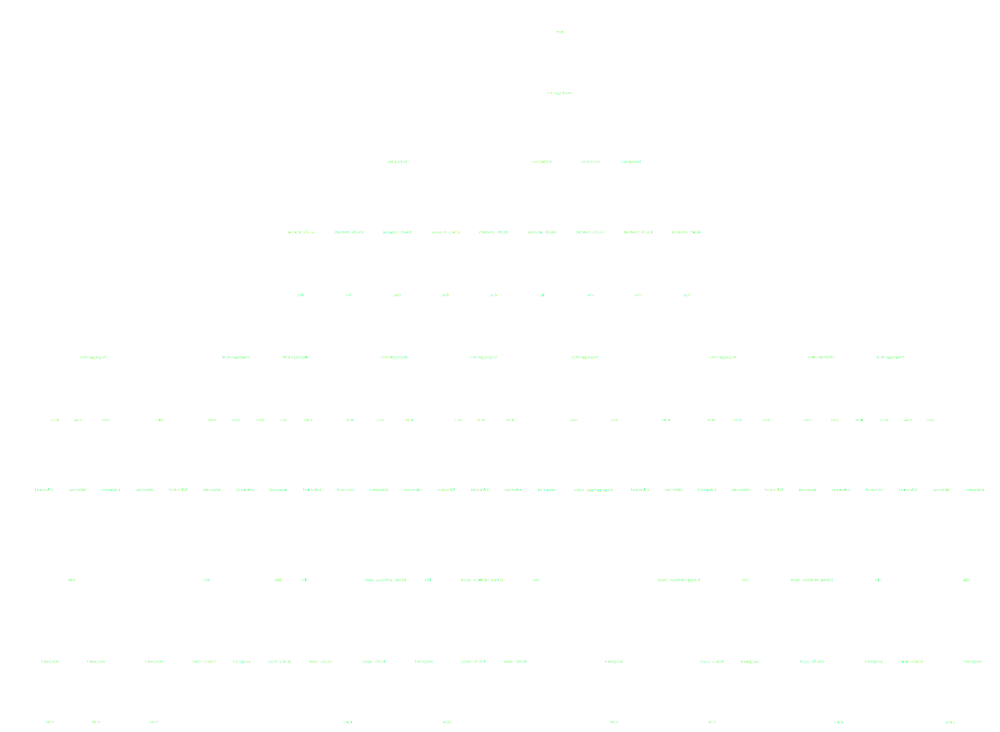

Dask at AOSPy
-------------

*Matthew Rocklin*

Continuum Analytics

*   What are Dask and Dask.array?
*   You can bulid graphs on your own, outside of dask.array.
*   You can run your computations on a cluster.

### What is Dask.array?

*  Numpy-like library
*  Converts computations into blocked algorithms on NumPy
*  Backs XArray for larger arrays

### Blocked algorithms

    x = da.ones((15, 15), chunks=(5, 5))
    x.sum(axis=1)

### Blocked algorithms

    x = da.ones((15, 15), chunks=(5, 5))
    x + x.T

### Blocked algorithms

    x = da.ones((15, 15), chunks=(5, 5))
    x.dot(x.T + 1)

### Blocked algorithms

    x = da.ones((15, 15), chunks=(5, 5))
    (x.dot(x.T + 1) - x.mean(axis=0))

### Blocked algorithms

    x = da.ones((15, 15), chunks=(5, 5))
    (x.dot(x.T + 1) - x.mean(axis=0)).std()

### There are other mechanisms to produce graphs

### Dask.dataframe, Dask.bag, Dask.delayed, concurrent.futures, ...

### Dask.delayed for fine grained Python code

    .

    results = {}

    for a in A:
        for b in B:
            if a < b:
                results[a, b] = f(a, b)
            else:
                results[a, b] = g(a, b)

    best = reduction(results.values())
    .

### Dask.delayed for fine grained Python code

    from dask import delayed, compute

    results = {}

    for a in A:
        for b in B:
            if a < b:
                results[a, b] = delayed(f)(a, b)  # lazily construct graph
            else:
                results[a, b] = delayed(g)(a, b)  # without structure

    best = delayed(reduction)(results.values())
    result = best.compute()

### What is Dask? (not dask.array)

*  Generic task scheduler for computational loads
*  Runs Python functions in parallel with dependencies
*  Knows nothing about arrays, dataframes, etc..

*This happens to be a machine learning grid-search-pipeline problem, can you
tell?*

### What is Dask? (not dask.array)

*  Generic task scheduler for computational loads
*  Runs Python functions in parallel with dependencies
*  Knows nothing about arrays, dataframes, etc..

*This happens to be a machine learning grid-search-pipeline problem, can you
tell?*

### Dask now runs on a cluster

### Dask.array/dataframe/bag can as well (and XArray?)

### Dask/distributed

*   Python-based distributed computing framework
*   Scales to 100-1000 nodes
*   Supports complex-ish computational workloads, like XArray

### Setup

    user@host1$ dask-scheduler
    Starting Scheduler at 192.168.1.100:8786

    user@host2$ dask-worker 192.168.1.100:8786
    user@host3$ dask-worker 192.168.1.100:8786
    user@host4$ dask-worker 192.168.1.100:8786
    user@host5$ dask-worker 192.168.1.100:8786

    >>> from dask.distributed import Client
    >>> client = Client('192.168.1.100:8786')  # changes default scheduler

    >>> my_dask_collection.compute()  # now runs on cluster

### Setup

    user@host1$ dask-scheduler
    Starting Scheduler at 192.168.1.100:8786

    user@host2$ dask-worker 192.168.1.100:8786
    user@host3$ dask-worker 192.168.1.100:8786
    user@host4$ dask-worker 192.168.1.100:8786
    user@host5$ dask-worker 192.168.1.100:8786

    >>> from dask.distributed import Client
    >>> client = Client('192.168.1.100:8786')  # changes default scheduler

    >>> my_dask_collection.compute()  # now runs on cluster

### Setup

    user@host1$ dask-scheduler
    Starting Scheduler at 192.168.1.100:8786

    user@login$ qsub ... dask-worker 192.168.1.100:8786

    >>> from dask.distributed import Client
    >>> client = Client('192.168.1.100:8786')  # changes default scheduler

    >>> my_dask_collection.compute()  # now runs on cluster
    .
    .
    .

### ... play time ...

*   http://matthewrocklin.com/slides/aospy-2016.html
*   http://54.210.70.200:9000/notebooks/AOSPY-COPYME.ipynb
*   http://54.210.70.200:8787/status

### Final Thoughts

*   How do we make distributed arrays more accessible?
*   Are non-array workloads useful to this community?
*   How else can I help?
*   Government money running out, harder to do free work
*   Help: Please publish examples (blogposts), make me aware of papers [#1496](https://github.com/dask/dask/issues/1496)

### Collaboration Points

*   Deploy distributed dask.arrays on datasets
*   Deploy dask.distributed on job schedulers (SGE, SLURM, LSF, ...)
*   Experiment with multi-user policies and collaboration
*   Special case formats (NetCDF, ...)
*   Performance tuning: scalable algorithms, compression, etc..
*   Performance documentation for users
