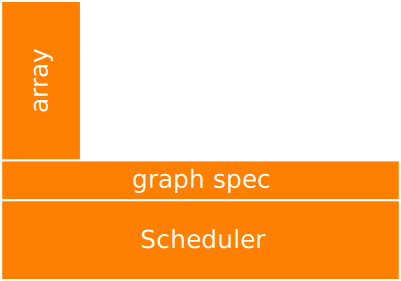
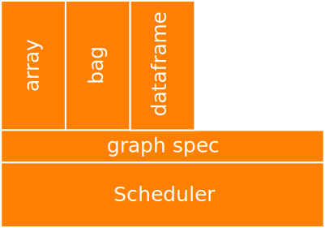
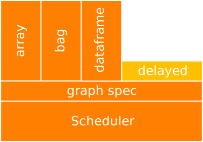
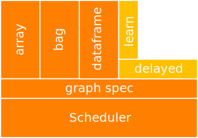
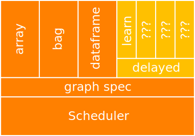
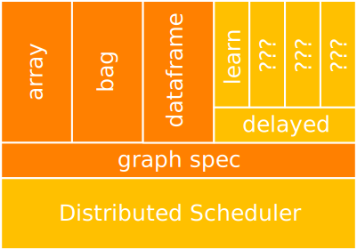

Dask: Flexible Distributed Computing
------------------------------------

*Matthew Rocklin*

*Jim Crist*

Continuum Analytics

### Dask provides parallel NumPy and Pandas on clusters

### ... but ad-hoc algorithms are more exciting

### ... especially with intelligent scheduling

### DataFrame Example

### Dask was designed for arrays and dataframes

### ... but we've found the lower-level bits quite applicable

### Our community does some very weird things

    .

            df['x'] = df.x.rolling(10).mean()

    .

### Our community does some very weird things

    while df.x.min() - df.x.max():
        if condition:
            df['x'] = df.x.rolling(10).mean()
        else:
            df['x'] = my_arbitrary_function()

### Dask Stack

### Dask Stack

### Dask Stack

### Dask Stack

### Dask Stack

### Dask Stack

### Jim's slides

### Dask.delayed authors arbitrary task graphs

### Now we need to run them efficiently

### Task Scheduling

    x = f(1)
    y = f(2)
    z = g(x, y)

Where and when do we run tasks?

Task Scheduling
---------------

*   Task scheduling is ubiquitous in parallel computing

    Examples: MapReduce, Spark, SQL, TensorFlow, Plasma

*   But raw task scheduler is rarely exposed

    Exceptions: Make, Luigi, Airflow

### Single Machine Scheduler

Stable for a year or so.  Optimized for larger-than-memory use.

### Single Machine Scheduler

Stable for a year or so.  Optimized for larger-than-memory use.

### Single Machine Scheduler

*   **Parallel CPU**: Uses multiple threads or processes
*   **Minimizes RAM**: Choose tasks to remove intermediates
*   **Low overhead:** ~100us per task
*   **Concise**: ~600 LOC, stable for ~12 months
*   **Real world workloads**: dask.array, xarray, dask.dataframe, dask.bag,
    Custom projects with dask.delayed

### Distributed Scheduler

### Distributed Scheduler

*   **Distributed**: One scheduler coordinates many workers
*   **Data local**: Avoids expensive communication
*   **Asynchronous**: Sumbit multiple jobs without blocking
*   **Multi-user**: Several users share the same system
*   **HDFS Aware**: Works well with HDFS, S3, YARN, etc..
*   **Solidly supports**: dask.array, dask.dataframe, dask.bag, dask.delayed
*   **Less Concise**: ~3000 LOC Tornado TCP application

### Distributed Scheduler

### Distributed Scheduler

### Distributed Scheduler

### Distributed Scheduler

### Distributed Scheduler

### Distributed Scheduler

### Distributed Scheduler

### Distributed Scheduler

### Distributed Scheduler

### Distributed Scheduler

### Distributed Scheduler

### Distributed Scheduler

### Distributed Scheduler

### Distributed Scheduler

### Distributed Scheduler

### IT

    $ dask-scheduler
    Running scheduler at scheduler-hostname:8786 ...

    $ dask-worker scheduler-hostname:8786
    $ dask-worker scheduler-hostname:8786

### User

    >>> from dask.distributed import Executor
    >>> e = Executor('scheduler-hostname:8786', set_as_default=True)

    >>> import dask.dataframe as dd
    >>> df = dd.read_csv('s3://my-bucket/2015-*.*.csv')
    >>> df.groupby(df.timestamp.dt.hour).value.mean().compute()
    .

### IT

    $ dask-scheduler
    Running scheduler at scheduler-hostname:8786

    $ dask-worker scheduler-hostname:8786
    $ dask-worker scheduler-hostname:8786

### User

    >>> from dask.distributed import Executor
    >>> e = Executor('scheduler-hostname:8786', set_as_default=True)

    >>> import dask.array as da
    >>> x = da.from_array(my_distributed_array_store)
    >>> x = x - x.mean(axis=0) / x.std(axis=0)
    .

### IT

    $ dask-scheduler
    Running scheduler at scheduler-hostname:8786

    $ dask-worker scheduler-hostname:8786
    $ dask-worker scheduler-hostname:8786

### User

    >>> from dask.distributed import Executor
    >>> e = Executor('scheduler-hostname:8786', set_as_default=True)

    >>> from dask import delayed
    >>> remote_data = e.scatter(sequence)
    >>> values = [delayed(f)(x) for x in remote_data]
    >>> total = delayed(sum)(values)

### Easy to get started

    $ conda install dask distributed -c conda-forge
    or
    $ pip install dask distributed --upgrade

    >>> from dask.distributed import Executor
    >>> e = Executor()  # sets up local cluster

### Example

### Dask exposes low-level distributed task scheduling to users

### Optimized for general computation, not arrays, SQL, etc..

### Internals

*  Tornado web application over TCP sockets with custom protocol
*  Event driven (new worker, task finished, worker died, ...)
*  State is ~30 Python dictionaries indexing each other
*  Processes 1000s of tasks per second
*  Language agnostic (msgpack protocol)
