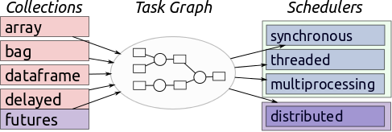
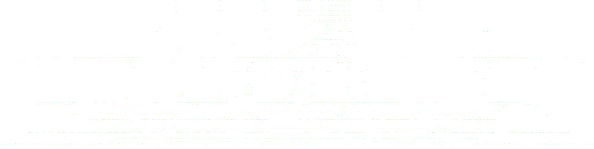
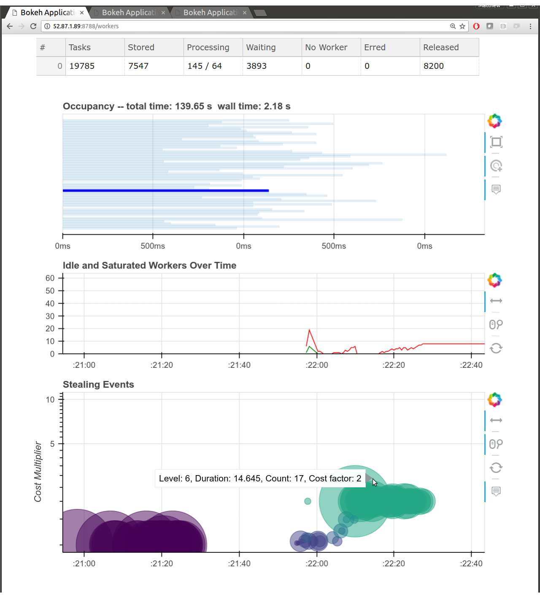

Dask: Parallel Programming in Python
------------------------------------


*Matthew Rocklin*

Continuum Analytics


### Dask enables parallel computing

-  **Parallelizes libraries** like Pandas, NumPy, and SKLearn
-  **Scales** from 1 to 1000's of computers (Spark-like scaling)
-  **Flexible** backed by a task scheduler (like Airflow, Celery)
-  **Adapts** to custom systems
-  **Pure Python** and built from standard technology
-  **Supported** by community, for/non-profit, and government


### History

1.  Parallel NumPy algorithms
2.  Computational task scheduler (single machine)
3.  Dataframes and Bags
4.  Custom computations (dask.delayed)
5.  Distributed scheduler
6.  Asynchronous workflows (concurrent.futures)
7.  Increased diversity of workloads
    -  Auto-scaling
    -  Multi-client collaboration
    -  Other languages (Julia client exists)
    -  Non-task-based APIs


### Parallelism in Python

Sequential code

    data = [...]
    results = []
    for x in data:
        result = func(x)
        results.append(result)

Map (also sequential)

    results = map(func, data)

Parallel map

    from multiprocessing import Pool
    pool = Pool()

    results = pool.map(func, data)


### Parallelism in Python

Sequential code

    data = [...]
    results = []
    for x in data:
        result = func(x)
        results.append(result)

Map (also sequential)

    results = map(func, data)

Parallel map

    from concurrent.futures import ProcessPoolExecutor
    executor = ProcessPoolExecutor()

    results = executor.map(func, data)


### Parallelism in Python

Sequential code

    data = [...]
    results = []
    for x in data:
        result = func(x)
        results.append(result)

Map (also sequential)

    results = map(func, data)

Parallel map

    from concurrent.futures import ThreadPoolExecutor
    executor = ThreadPoolExecutor()

    results = executor.map(func, data)


### Parallelism in Python

Sequential code

    data = [...]
    results = []
    for x in data:
        result = func(x)
        results.append(result)

Map (also sequential)

    results = map(func, data)

Parallel map

    import pyspark
    sc = pyspark.SparkContext()

    results = sc.parallelize(data).map(func).collect()


### More complex code

    .
    .
    .
    .
    results = []
    for x in L1:
        for y in L2:
            if x < y:
                z = f(x, y)
            else:
                z = g(x, y)
            results.append(z)

    .


### More complex code

    import dask
    f = dask.delayed(f)
    g = dask.delayed(g)

    lazy = []
    for x in L1:
        for y in L2:
            if x < y:
                z = f(x, y)
            else:
                z = g(x, y)
            lazy.append(z)

    results = dask.compute(*lazy)


### More complex code

    from concurrent.futures import ThreadPoolExecutor
    executor = ThreadPoolExecutor()
    .

    futures = []
    for x in L1:
        for y in L2:
            if x < y:
                z = executor.submit(f, x, y)
            else:
                z = executor.submit(g, x, y)
            futures.append(z)

    results = [future.result() for future in futures]


### Scalability and Flexibility

*  Big data systems are scalable but rarely flexible.  Also inefficient.
*  Single-machine systems are flexible and convenient

<a href="https://pbs.twimg.com/media/C2162quUsAAXvin.jpg"></a>


### Dask enables parallel Python

<hr>

### ... originally designed to parallelize NumPy and Pandas

<hr>

### ... but also used today for arbitrary computations


### Dask.array


    import numpy as np
    x = np.random.random(...)
    u, s, v = np.linalg.svd(x.dot(x.T))

    import dask.array as da
    x = da.random.random(..., chunks=(1000, 1000))
    u, s, v = da.linalg.svd(x.dot(x.T))


### Dask.DataFrame


    import pandas as pd
    df = pd.read_csv('myfile.csv', parse_dates=['timestamp'])
    df.groupby(df.timestamp.dt.hour).value.mean()

    import dask.dataframe as dd
    df = dd.read_csv('hdfs://myfiles.*.csv', parse_dates=['timestamp'])
    df.groupby(df.timestamp.dt.hour).value.mean()


### Fine Grained Python Code

    .

<hr>

    results = {}

    for a in A:
        for b in B:
            if a < b:
                results[a, b] = f(a, b)
            else:
                results[a, b] = g(a, b)

    .


### Fine Grained Python Code

    from dask import delayed, compute

<hr>

    results = {}

    for a in A:
        for b in B:
            if a < b:
                results[a, b] = delayed(f)(a, b)  # lazily construct graph
            else:
                results[a, b] = delayed(g)(a, b)  # without structure

    results = compute(results)  # trigger all computation


### Dask APIs Produce Task Graphs

<hr>

### Dask Schedulers Execute Task Graphs




### 1D-Array


    >>> np.ones((15,))
    array([ 1., 1., 1., 1., 1., 1., 1., 1., 1., 1., 1., 1., 1., 1., 1.])

    >>> x = da.ones((15,), chunks=(5,))


### 1D-Array


    x = da.ones((15,), chunks=(5,))
    x.sum()


### ND-Array - Sum


    x = da.ones((15, 15), chunks=(5, 5))
    x.sum(axis=0)


### ND-Array - Transpose


    x = da.ones((15, 15), chunks=(5, 5))
    x + x.T


### ND-Array - Matrix Multiply


    x = da.ones((15, 15), chunks=(5, 5))
    x.dot(x.T + 1)


### ND-Array - Compound Operations


    x = da.ones((15, 15), chunks=(5, 5))
    x.dot(x.T + 1) - x.mean()


### ND-Array - Compound Operations


    import dask.array as da
    x = da.ones((15, 15), chunks=(5, 5))
    y = (x.dot(x.T + 1) - x.mean()).std()


### Dask APIs Produce Task Graphs

<hr>

### Dask Schedulers Execute Task Graphs


### Dask.array/dataframe/delayed author task graphs

<hr>


<hr>

### Now we need to run them efficiently


### Dask.array/dataframe/delayed author task graphs

<hr>


<hr>

### Now we need to run them efficiently


-  Dynamic task scheduler for generic applications
-  Handles data locality, resilience, work stealing, etc..
-  With 10ms roundtrip latencies and 200us overheads
-  Native Python library respecting Python protocols
-  Lightweight and well supported


### Single Machine Scheduler

Optimized for larger-than-memory use.

*   **Parallel CPU**: Uses multiple threads or processes
*   **Minimizes RAM**: Choose tasks to remove intermediates
*   **Low overhead:** ~100us per task
*   **Concise**: ~1000 LOC
*   **Real world workloads**: Under heavy load by many different projects


### Distributed Scheduler

*   **Distributed**: One scheduler coordinates many workers
*   **Data local**: Moves computation to correct worker
*   **Asynchronous**: Continuous non-blocking conversation
*   **Multi-user**: Several users share the same system
*   **HDFS Aware**: Works well with HDFS, S3, YARN, etc..
*   **Solidly supports**: dask.array, dask.dataframe, dask.bag, dask.delayed,
    concurrent.futures, ...
*   **Less Concise**: ~5000 LOC Tornado TCP application

    All of the logic is hackable Python, separate from Tornado


### Distributed Network


### Distributed Network

Set up locally

    from dask.distributed import Client
    client = Client()  # set up local scheduler and workers

Set up on a cluster

    host1$ dask-scheduler
    Starting scheduler at 192.168.0.1:8786

    host2$ dask-worker 192.168.0.1:8786
    host3$ dask-worker 192.168.0.1:8786
    host4$ dask-worker 192.168.0.1:8786


### Brief and Incomplete Summary of Parallelism Options

-  Embarrassingly parallel systems (multiprocessing, joblib)
-  Big Data collections (MapReduce, Spark, Flink, Database)
-  Task schedulers (Airflow, Luigi, Celery, Make)


### map

    # Sequential Code
    data = [...]
    output = map(func, data)

<hr>

    # Parallel Code
    pool = multiprocessing.Pool()
    output = pool.map(func, data)

-   Pros
    -   Easy to install and use in the common case
    -   Lightweight dependency
-   Cons
    -  Data interchange cost
    -  Not able to handle complex computations


### Big Data collections

    from pyspark import SparkContext
    sc = SparkContext('local[4]')

    rdd = sc.parallelize(data)
    rdd.map(json.loads).filter(...).groupBy(...).count()

    df = spark.read_json(...)
    df.groupBy('name').aggregate({'value': 'sum'})

-   Pros
    -   Larger set of operations
    -   Scales nicely on clusters
    -   Well trusted by enterprise
-   Cons
    -  Heavyweight and JVM focused
    -  Not able to handle complex computations


### This is what I mean by complex


### Spark does the following well

<table>
<tr>
  <td>
    
  </td>
  <td>
    
  </td>
  <td>
    
  </td>
</tr>
</table>


### Task Schedulers (Airflow, Luigi, Celery, ...)


-  Pros
    -  Handle arbitrarily complex task graphs
    -  Python Native
-  Cons
    -  No inter-worker storage or data interchange
    -  Long latencies (relatively)
    -  Not designed for computational loads


### Want a task scheduler (like Airflow, Luigi)

<hr>

### Built for computational loads (like Spark, Flink)


### NumPy


### Dask.Array


### Pandas


### Dask.DataFrame


### Many problems don't fit into a

### "big array" or "big dataframe"

<hr>

### Fortunately the system that backs dask.array/dataframes

### can be used for general applications


### Python


### Dask


### Custom Script

    filenames = ['mydata-%d.dat' % i for i in range(10)]
    data = [load(fn) for fn in filenames]

    reference = load_from_sql('sql://mytable')
    processed = [normalize(d, reference) for d in data]

    rolled = []
    for i in range(len(processed) - 2):
        a = processed[i]
        b = processed[i + 1]
        c = processed[i + 2]
        r = roll(a, b, c)
        rolled.append(r)

    compared = []
    for i in range(20):
        a = random.choice(rolled)
        b = random.choice(rolled)
        c = compare(a, b)
        compared.append(c)

    best = reduction(compared)


### Custom Script


    data = [load(fn) for fn in filenames]


### Custom Script


    reference = load_from_sql('sql://mytable')


### Custom Script


    processed = [normalize(d, reference) for d in data]


### Custom Script


    rolled = []
    for i in range(len(processed) - 2):
        a = processed[i]
        b = processed[i + 1]
        c = processed[i + 2]
        r = roll(a, b, c)
        rolled.append(r)


### Custom Script


    compared = []
    for i in range(20):
        a = random.choice(rolled)
        b = random.choice(rolled)
        c = compare(a, b)
        compared.append(c)


### Custom Script


    best = reduction(compared)


### This flexibility is novel and liberating

<hr>

### But it's also tricky to do well


### Contrast with High Level Parallelism

**Spark**

    outputs = collection.filter(predicate)
                        .groupBy(key)
                        .map(function)

<hr>

**SQL**

    SELECT city, sum(population)
    WHERE population > 1000000
    GROUP BY city

<hr>

**Matrices**

    solve(A.dot(A.T), x)


### Map - Shuffle - Reduce

<table>
<tr>
  <td>
    
  </td>
  <td>
    
  </td>
  <td>
    
  </td>
</tr>
</table>

*  Build optimized Map
*  Build optimized Shuffle
*  Build optimized Aggregations
*  Get a decent database-like project


### Many parallel problems don't fit this model


### Custom Pipelines


### ETL: Luigi


http://luigi.readthedocs.io/en/stable/


### ETL: Airflow


https://github.com/apache/incubator-airflow


### Efficient TimeSeries - Resample


    df.value.resample('1w').mean()


### Efficient TimeSeries - Rolling


    df.value.rolling(100).mean()


### ND-Array - Sum


    x = da.ones((15, 15), chunks=(5, 5))
    x.sum(axis=0)


### ND-Array - Transpose


    x = da.ones((15, 15), chunks=(5, 5))
    x + x.T


### ND-Array - Matrix Multiply


    x = da.ones((15, 15), chunks=(5, 5))
    x.dot(x.T + 1)


### ND-Array - Compound Operations


    x = da.ones((15, 15), chunks=(5, 5))
    x.dot(x.T + 1) - x.mean()


### ND-Array - Compound Operations


    x = da.ones((15, 15), chunks=(5, 5))
    (x.dot(x.T + 1) - x.mean()).std()


### Modern SVD


    u, s, v = da.linalg.svd(x)


### Modern Approximate SVD


    u, s, v = da.linalg.svd_compressed(x, k=10)


### Arbitrary graph execution eases developer burden

<hr>

### It enables algorithms and custom applications

<hr>

### But it's hard to do well


### Arbitrary Graph Scheduling is Hard


### Optimal Graph Scheduling is NP-Hard


### Scalable Scheduling Requires Linear Time Solutions




### Fortunately we can do pretty well with heuristics


### Dask.array/dataframe/delayed author task graphs

<hr>


<hr>

### Now we need to run them efficiently


### Dask.array/dataframe/delayed author task graphs

<hr>


<hr>

### Now we need to run them efficiently


### Dask schedulers target different architectures

<hr>

### Easy swapping enables scaling up *and down*

<hr>


### Start with a single machine

    import dask.dataframe as dd
    df = dd.read_csv('/path/to/*.csv')
    df.groupby(df.timestamp.dt.month).value.var().compute()

### Connect to a cluster later

    from dask.distributed import Client
    client = Client('scheduler-address:8786')

    df = dd.read_csv('hdfs:///path/to/*.csv')
    df.groupby(df.timestamp.dt.month).value.var().compute()


### Start with a single machine

    import dask.dataframe as dd
    df = dd.read_csv('/path/to/*.csv')
    df.groupby(df.timestamp.dt.month).value.var().compute()

### Connect to a cluster later

    from dask.distributed import Client
    client = Client('scheduler-address:8786')

    df = dd.read_csv('s3:///path/to/*.csv')
    df.groupby(df.timestamp.dt.month).value.var().compute()


### Start with a single machine

    import dask.dataframe as dd
    df = dd.read_csv('/path/to/*.csv')
    df.groupby(df.timestamp.dt.month).value.var().compute()

### Connect to a cluster later

    from dask.distributed import Client
    client = Client('scheduler-address:8786')

    import dask.dataframe as dd
    df = dd.read_custom('internal://db/project')
    df.groupby(df.timestamp.dt.month).value.var().compute()


### Single Machine Scheduler

Optimized for larger-than-memory use.

*   **Parallel CPU**: Uses multiple threads or processes
*   **Minimizes RAM**: Choose tasks to remove intermediates
*   **Low overhead:** ~50us per task
*   **Concise**: ~600 LOC, stable for ~12 months

### Distributed Scheduler

Optimized for 10-1000 machine clusters

*   **Distributed**: One scheduler coordinates many workers
*   **Data local**: Moves computation to correct worker
*   **Asynchronous**: Continuous non-blocking conversation
*   **Multi-user**: Several users share the same system
*   **Hackable**: all of the logic is hackable Python


### Easy to get started

    $ conda install dask distributed -c conda-forge
    or
    $ pip install dask[complete] distributed --upgrade

<hr>

    computer1:$ dask-scheduler

    computer2:$ dask-worker scheduler-hostname:8786
    computer3:$ dask-worker scheduler-hostname:8786

<hr>

    >>> from dask.distributed import Client
    >>> client = Client('scheduler-hostname:8786')

    >>> dask.compute(...)


### Dask.array/dataframe/delayed author task graphs

<hr>


<hr>

### Now we need to run them efficiently


### Dask.array/dataframe/delayed author task graphs

<hr>


<hr>

### Now we need to run them efficiently


### Dask schedulers target different architectures

<hr>

### Easy swapping enables scaling up *and down*


### Single Machine Scheduler

Stable for a year or so.  Optimized for larger-than-memory use.

*   **Parallel CPU**: Uses multiple threads or processes
*   **Minimizes RAM**: Choose tasks to remove intermediates
*   **Low overhead:** ~100us per task
*   **Concise**: ~600 LOC, stable for ~12 months
*   **Real world workloads**: dask.array, xarray, dask.dataframe, dask.bag,
    Custom projects with dask.delayed


### Distributed Scheduler


### Distributed Scheduler


### Distributed Scheduler


### Distributed Scheduler


### Distributed Scheduler


### Distributed Scheduler


### Distributed Scheduler


### Distributed Scheduler


### Distributed Scheduler


### Distributed Scheduler


### Distributed Scheduler


### Distributed Scheduler


### Distributed Scheduler


### Distributed Scheduler


### Distributed Scheduler


### Distributed Scheduler

*   **Distributed**: One scheduler coordinates many workers
*   **Data local**: Moves computation to correct worker
*   **Asynchronous**: Continuous non-blocking conversation
*   **Multi-user**: Several users share the same system
*   **HDFS Aware**: Works well with HDFS, S3, YARN, etc..
*   **Solidly supports**: dask.array, dask.dataframe, dask.bag, dask.delayed,
    concurrent.futures, ...
*   **Less Concise**: ~3000 LOC Tornado TCP application

    But all of the logic is hackable Python


### Easy to get started

    $ conda install dask distributed -c conda-forge
    $ pip install dask[complete] distributed --upgrade

<hr>

    >>> from dask.distributed import Client
    >>> client = Client()  # sets up local cluster

<hr>

    $ dask-scheduler

    $ dask-worker scheduler-hostname:8786
    $ dask-worker scheduler-hostname:8786


### Dask.array/dataframe/delayed author task graphs

<hr>


<hr>

### Now we need to run them efficiently


### Dask.array/dataframe/delayed author task graphs

<hr>


<hr>

### Now we need to run them efficiently


### You can safely ignore the rest of this talk


### All decisions are done in-the-small (almost)


### All decisions are done in constant time (almost)


### Task Scheduling


    x = f(1)
    y = f(2)
    z = g(x, y)


### Which function to run first?


### Prefer Tasks on Critical Path


### Which function to run first?


### Expose Parallelism


### Which function to run first?


### Release Data


### Release Data, free Memory


### Distributed Network


### Two Workers


### Two Workers


### Two Workers


### Two Workers


### Two Workers


### Data Locality


### Data Locality


### Data Locality


### .


### Minimize Communication


### Balance Computation and Communication


### .


### Work Steal


### Work Steal


### Intelligent scheduling requires measurement

*  Measure size of outputs in bytes (`__sizeof__`)
*  Measure process reported memory use
*  Measure computation time (EWMA, with restarts)
*  Measure communication time / network distance
*  Measure disk load time
*  ...


### Other Optimizations ...

*  Gracefully scale up or down based on load
*  Optionally compress messages based on small samples
*  Oversubscribe workers with many small tasks
*  Batch many-small-messages in 2ms windows
*  Spill unused data to disk
*  ...

<hr>

#### These optimizations suffice to make dask.array/dataframe fast
#### But they are not specific to arrays/dataframes
#### These optimizations apply to all situations, including novel ones


### Fine-grained scheduling requires constant-time decisions

*  Computational graphs scale out to 100,000s of tasks
*  We spend ~200us per task in the scheduler, 5000 tasks/s
*  Each task is ~1-10kB in RAM

### How do we make this fast?

*  Heavily indexed Pure Python data structures.
*  No classes, just bytestrings and dicts/sets/deques.


### Comparison to Spark

-  Reasons to prefer Spark
    -   More established
    -   All-in-one framework for clusters
    -   Full SQL support plus extensions
    -   Complements existing JVM infrastructure
-  Reasons to prefer Dask
    -   Grows out of existing Python stack
    -   Familiar to Python users and applications
    -   Supports more complex computations
    -   Integrates nicely into existing systems, lightweight


### Spark

<table>
<tr>
<td>Map</td>
<td>Shuffle</td>
<td>Reduce</td>
</tr>
<tr>
  <td>
    
  </td>
  <td>
    
  </td>
  <td>
    
  </td>
</tr>
</table>

### Dask


### Comparison to Airflow/Luigi/Celery

*  Airflow/Luigi/Celery are optimized for ETL cases
    *  Cron functionality
    *  Expressive retry logic
    *  Batteries included for common problems
*  Dask is optimized for interactive computation
    *  10ms roundtrips
    *  200us overhead
    *  Inter-worker communication


### Visual Dashboards

<hr>

### Optimizing performance requires understanding performance


### Live Performance Dashboards


### Worker Statistics


### Scheduler Statistics




### Live Profile Plots

<iframe src="https://cdn.rawgit.com/mrocklin/52e1c411878fcdd64e04574877fe265e/raw/
98d9f38c51b250523e9c584779e74156ab14a4fe/task-stream-custom-etl.html"
        width="1000" height="600"></iframe>


### Live Profile Plots

<iframe src="https://cdn.rawgit.com/mrocklin/e09cad939ff7a85a06f3b387f65dc2fc/raw/
fa5e20ca674cf5554aa4cab5141019465ef02ce9/task-stream-image-fft.html"
        width="1000" height="600"></iframe>


*   **What Dask needed:**

    *   Customized / Bespoke Visuals
    *   Responsive real-time streaming updates
    *   Powerful client-side rendering (10k-100k elements)
    *   Easy to develop for non-web developers

*   **Bokeh**

    *   Python library for interactive visualizations on the web
    *   Use in a notebook, embed in static HTML, or use with Bokeh Server...  [example](http://bokeh.pydata.org/en/latest/docs/gallery/periodic.html)

*   **Bokeh Server**

    *   Bokeh Server maintains shared state between the Python server and web
        client


### Setup Data Source

    from bokeh.models import ColumnDataSource
    tasks = ColumnDataSource({'start': [], 'stop': [], 'color': [],
                              'worker': [], 'name': []})

### Construct Plot around Data Source

    from bokeh.plotting import figure
    plot = figure(title='Task Stream')
    plot.rect(source=tasks, x='start', y='stop', color='color', y='worker')
    plot.text(source=tasks, x='start', y='stop', text='name')

### Push to Data Source on Server

    while True:
        collect_diagnostics_data()
        tasks.update({'start': [...], 'stop': [...], 'color': [...],
                      'worker': [...], 'name': [...]})


### Dask enables Machine Learning

1.  Model parallelism with Scikit-Learn

    ```python
    pipe = Pipeline(steps=[('pca', PCA()),
                           ('logistic', LogisticRegression)])
    grid = GridSearchCV(pipe, parameter_grid)
    ```

2.  Implement known algorithms with dask.array

    ```python
    eXbeta = da.exp(X.dot(beta))
    gradient = X.T.dot(eXbeta / (eXbeta + 1) - y)
    ...
    ```

3.  Collaborate with other distributed systems

    -  **Pre-process** with dataframe
    -  **Deploy** other services
    -  **Pass data** from Dask and **train** with other service

4.  Build custom systems with dask.delayed, concurrent.futures


### Final Slide:  Dask is ...

*   **Familiar:** Pandas and Numpy users find it easy to switch
*   **Flexible:** Handles arbitrary task graphs efficiently
*   **Well Founded:** Builds on the existing Python ecosystem
*   **Community Backed:** Involves core developers of other projects
*   **Accessible:** Just a Python library

<hr>

    $ pip install dask[complete] distributed --upgrade
    $ ipython
    >>> from distributed import Client
    >>> client = Client()  # starts a "cluster" on your local machine


### Acknowledgements

*  Countless open source developers
*  SciPy developer community
*  Continuum Analytics
*  XData Program from DARPA


<hr>

### Questions?


