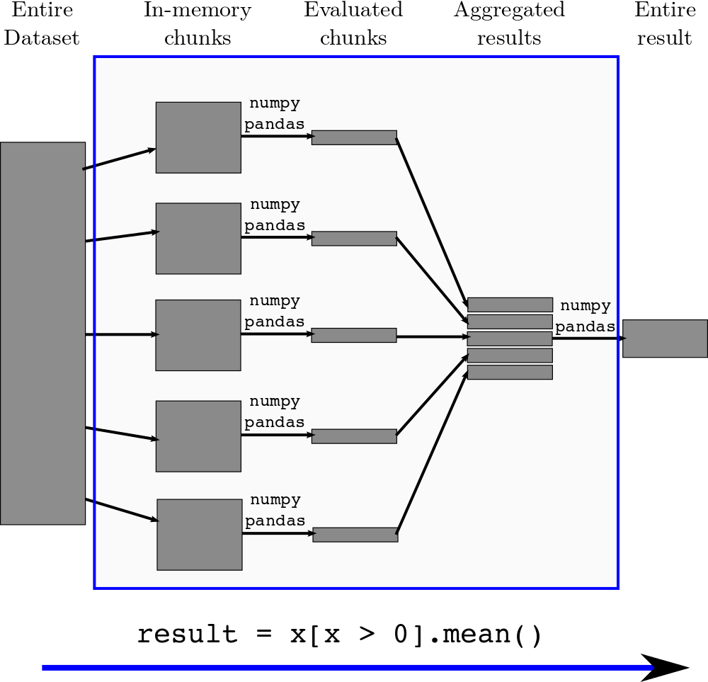

## Outline

1.  Expression Chunking with Pandas has been successful [notebook
1](http://nbviewer.ipython.org/url/blaze.pydata.org/notebooks/timings-csv.ipynb), [notebook 2](http://nbviewer.ipython.org/url/blaze.pydata.org/notebooks/timings-bcolz.ipynb), but doesn't generalize.
2.  Simple task scheduling with [`dask`](http://dask.readthedocs.org/en/latest/)
3.  Build simple OOC-NumPy operations with dask by hand [notebook](http://nbviewer.ipython.org/github/ContinuumIO/dask/blob/master/notebooks/simple-numpy-sum.ipynb)
4.  Blaze builds these for us
.  Running schedules efficiently
    [blog 1](http://mrocklin.github.com/blog/work/2014/12/27/Towards-OOC)
    [blog 2](http://mrocklin.github.com/blog/work/2014/12/30/Towards-OOC-Frontend)
    [blog 3](http://mrocklin.github.com/blog/work/2015/01/06/Towards-OOC-Scheduling)
6.  Possible directions

### Expression chunking and simple communication pattern

We have a large array of floats

    >>> from blaze import symbol, mean
    >>> x = symbol('x', '1000000000 * float64')

We want to find the mean of the positive elements

    >>> expr = mean(x[x > 0])

We pull the data in chunk by chunk, do an operation on each chunk, concatenate the results into an aggregate, then do a different operation on the aggregate.

    >>> from blaze.expr.split import split
    >>> split(x, expr)
    (chunk     -> summary(count=count(chunk[chunk > 0]),       # do per chunk
                          total = sum(chunk[chunk > 0])),
     aggregate -> sum(aggregate.total) / sum(aggregate.count)) # do on results

### Expression chunking and simple communication pattern

### This doesn't generalze to complex communication patterns (transpose, tensordot, join, ...)

### Task scheduling

* Represent inter-dependent computations as a graph.
* Graph encodes which functions produce/consume which data
* This is a common.  We implement a minimal system in `dask`.

* See example in [`dask` docs](http://dask.readthedocs.org/en/latest/)
* See example generating OOC NumPy graphs [notebook](http://nbviewer.ipython.org/github/ContinuumIO/dask/blob/master/notebooks/simple-numpy-sum.ipynb)

### Blaze currently generates dasks for the following:

1.  Elementwise operations (like `+`, `*`, `exp`, `log`, ...)
2.  Dimension shuffling like `np.transpose`
3.  Tensor contraction like `np.tensordot`
4.  Reductions like `np.mean(..., axis=...)`
5.  All combinations of the above

### Blaze doesn't yet generate the following:

1.  Slicing (though this should be easy to add)
2.  Solve, SVD, QR, or any complex linear algebra.
3.  Anything that NumPy can't do.

### A useful class of operations:

    top(in_memory_function, 'z', 'ij', 'x', 'ijk', 'y', 'jki')

### Examples

    top(lambda x: x + 1, 'out', 'ij', 'x', 'ij')  # embarassingly parallel

    top(np.transpose, 'out', 'ij', 'x', 'ji')  # transpose

    top(dotmany, 'out', 'ik', 'x', 'ij', 'y', 'jk')  # blocked dot product

    def dotmany(A, B):
        return sum(map(np.dot, A, B))

### Avoid Temporaries

A lot of logic goes in to keeping our memory footprint small

We do this through two optimizations

1.  Inlining computationally-cheap but storage-expensive functions
2.  Choosing to run tasks that free resources

The goal here isn't to teach you these things, but to give a flavor of the relevant issues.

### Dask inlining and avoiding temporaries

### Dask inlining and avoiding temporaries

A nested task:

    ('x_6', 6, 0): (dotmany, [(np.transpose, (ndslice, 'A', (1000, 1000), 0, 6)),
                              (np.transpose, (ndslice, 'A', (1000, 1000), 1, 6))],
                              [(ndslice, 'B', (1000, 1000), 0, 0),
                               (ndslice, 'B', (1000, 1000), 1, 0)]),

### We now look at actual traces

Our workers often choose between several available tasks.

This choice strongly impacts performance.

We choose to run tasks that immediately release resources.

### Embarrassingly parallel computation

    expr = (((A + 1) * 2) ** 3)

### More complex computation

    expr = (B - B.mean(axis=0)) + (B.T / B.std())

### Fail case

    expr = (A.T.dot(B) - B.mean(axis=0))

## Future Directions

### Immediate directions

1.  Make it actually work (find and fix memory leak)
2.  Better on-disk caching (fix chest)
3.  Better concurrent scheduler?  (feedback welcome, I'm out of my element)
4.  Other applications for `dask` than `Array`?

### Bigger questions

1.  Distributed-memory scheduler
2.  Do we care?  Relative value of ndarrays vs tables.  This project comes at a cost.
3.  Who else can work on this?

