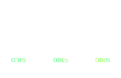
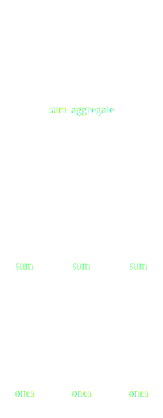
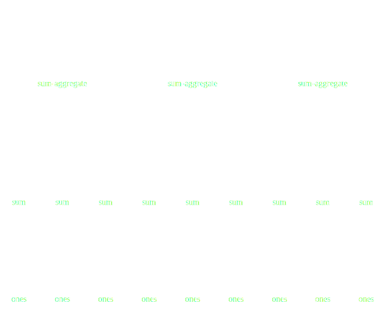

Dask: Scaling Earth Science in Python
-------------------------------------


*Matthew Rocklin*

Anaconda Inc.


Dask: Scaling Science in Python
-------------------------------


*Matthew Rocklin*

Anaconda Inc.


Dask: Scaling Python
--------------------


*Matthew Rocklin*

Anaconda Inc.


### Main points for today

-  Explain parallel array computing behind Joe's example
-  Explore Dask beyond array computing


### How did Joe run his computation in parallel?


-  Jupyter Notebook
-  XArray to describe earth science computation
-  Numpy-like array code
-  ...
-  ...
-  ...
-  Cluster of hardware

<hr>

Dask mediates between Python code and distributed hardware


-  Jupyter Notebook
-  XArray to describe earth science computation
-  Numpy-like array code
-  **Parallel array algorithms**
-  **Distributed execution**
-  **Sensible deployment on the Cloud**
-  Cluster of hardware

<hr>

Dask mediates between Python code and distributed hardware


-  Jupyter Notebook
-  XArray to describe earth science computation
-  Numpy-like array code
-  **Parallel array algorithms (dask.array)**
-  Distributed execution
-  Sensible deployment on the Cloud
-  Cluster of hardware

<hr>

Dask array converts array code into task graphs


### Dask APIs Produce Task Graphs

<hr>

### Dask Schedulers Execute Task Graphs


### 1D-Array



    >>> x = np.ones((15,))
    >>> x
    array([ 1., 1., 1., 1., 1., 1., 1., 1., 1., 1., 1., 1., 1., 1., 1.])

    >>> x = da.ones((15,), chunks=(5,))
    dask.array<ones, shape=(15,), dtype=float64, chunksize=(5,)>


### 1D-Array



    x = da.ones((15,), chunks=(5,))
    x.sum()


### ND-Array - Sum



    x = da.ones((15, 15), chunks=(5, 5))
    x.sum(axis=0)


### ND-Array - Transpose


    x = da.ones((15, 15), chunks=(5, 5))
    x + x.T


### ND-Array - Matrix Multiply


    x = da.ones((15, 15), chunks=(5, 5))
    x.dot(x.T + 1)


### ND-Array - Compound Operations


    x = da.ones((15, 15), chunks=(5, 5))
    x.dot(x.T + 1) - x.mean()


### ND-Array - Compound Operations


    import dask.array as da
    x = da.ones((15, 15), chunks=(5, 5))
    y = (x.dot(x.T + 1) - x.mean()).std()


### Dask APIs Produce Task Graphs

<hr>

### Dask Schedulers Execute Task Graphs


-  Jupyter Notebook
-  XArray to describe earth science computation
-  Numpy-like array code
-  **Parallel array algorithms (dask.array)**
-  Distributed execution (task schedulers)
-  Sensible deployment on the Cloud
-  Cluster of hardware

<hr>

Execute task graphs on parallel hardware


-  Jupyter Notebook
-  XArray to describe earth science computation
-  Numpy-like array code
-  Parallel array algorithms (dask.array)
-  **Distributed execution (task schedulers)**
-  Sensible deployment on the Cloud
-  Cluster of hardware

<hr>

Execute task graphs on parallel hardware


### Dask.array/dataframe/delayed author task graphs

<hr>


<hr>

### Now we need to run them efficiently


### Dask.array/dataframe/delayed author task graphs

<hr>


<hr>

### Now we need to run them efficiently


### Dynamic task scheduling

-  Which task should we run next?
-  Where should we run that task?
-  Should we balance load or prefer data locality?

<hr>

These are hard and interesting problems

But we won't discuss them here


-  Jupyter Notebook
-  XArray to describe earth science computation
-  Numpy-like array code
-  Parallel array algorithms (dask.array)
-  **Distributed execution (task schedulers)**
-  Sensible deployment
-  Cluster of hardware

<hr>

Deploy workers on distributed hardware


-  Jupyter Notebook
-  XArray to describe earth science computation
-  Numpy-like array code
-  Parallel array algorithms (dask.array)
-  Distributed execution (task schedulers)
-  **Sensible deployment**
-  Cluster of hardware

<hr>

Deploy workers on distributed hardware


### Distributed Network


    host1$ dask-scheduler
    Starting scheduler at tcp://192.168.0.1:8786

    host2$ dask-worker tcp://192.168.0.1:8786
    host3$ dask-worker tcp://192.168.0.1:8786
    host4$ dask-worker tcp://192.168.0.1:8786

    >>> client = Client("tcp://192.168.0.1:8786")  # connect from Python process


### Automatic deployment for most cluster managers

-  Cloud: dask-kubernetes
-  HPC: dask-jobqueue (PBS, SLURM, SGE, ...)
-  Hadoop/Spark: dask-yarn

<hr>

```python
>>> from dask_jobqueue import PBSCluster
>>> cluster = PBSCluster(cores=24,
                         memory="100GB",
                         project="my-project",
                         queue="regular")

>>> cluster.scale(10)  # ask for ten nodes

>>> cluster.adapt(minimum=0, maximum=100)  # or adapt nodes based on load
```


-  Jupyter Notebook
-  XArray
-  Numpy-like array code
-  **Parallel algorithms as task graphs**
-  **Distributed execution**
-  **Sensible deployment**
-  Cluster of hardware

<hr>

These elements can change


-  Script or automated service
-  XArray
-  Numpy-like array code
-  **Parallel algorithms as task graphs**
-  **Distributed execution**
-  **Sensible deployment**
-  Cluster of hardware

<hr>

These elements can change


-  Script or automated service
-  Iris
-  Numpy-like array code
-  **Parallel algorithms as task graphs**
-  **Distributed execution**
-  **Sensible deployment**
-  Cluster of hardware

<hr>

These elements can change


-  Script or automated service
-  ...
-  Pandas, Scikit-Learn, ...
-  **Parallel algorithms as task graphs**
-  **Distributed execution**
-  **Sensible deployment**
-  Cluster of hardware

<hr>

These elements can change


-  Script or automated service
-  ...
-  Pandas, Scikit-Learn, ...
-  **Parallel algorithms as task graphs**
-  ...
-  ...
-  Personal laptop

<hr>

These elements can change


### Dask was designed to parallelize

### An ecosystem of related software


### Dask.array


    import numpy as np
    x = np.random.random((1000, 1000))
    y = x + x.T - x.mean(axis=0)

    import dask.array as da
    x = da.random.random((100000, 100000), chunks=(1000, 1000))
    y = x + x.T - x.mean(axis=0)


### Dask.DataFrame


    import pandas as pd
    df = pd.read_csv('myfile.csv', parse_dates=['timestamp'])
    df.groupby(df.timestamp.dt.hour).value.mean()

    import dask.dataframe as dd
    df = dd.read_csv('s3://myfiles.*.csv', parse_dates=['timestamp'])
    df.groupby(df.timestamp.dt.hour).value.mean()


### Fine Grained Python Code

    .

<hr>

    results = {}
    .
    .

    for a in A:
        for b in B:
            if a < b:
                results[a, b] = f(a, b)
            else:
                results[a, b] = g(a, b)

    .


### Fine Grained Python Code

    import dask

<hr>

    results = {}
    f = dask.delayed(f)  # mark functions as lazily evaluated
    g = dask.delayed(g)

    for a in A:
        for b in B:
            if a < b:
                results[a, b] = f(a, b)  # construct task graph
            else:
                results[a, b] = g(a, b)

    results = dask.compute(results)  # trigger computation


### Scikit-Learn

Scale some Scikit-Learn algorithms directly

```python
from sklearn import ...
pipe = Pipeline(steps=[('pca', PCA()),
                       ('logistic', LogisticRegression)])
grid = GridSearchCV(pipe, parameter_grid)

with parallel_backend('dask'):
    grid.fit(data, labels)
```

Redesign other algorithms, but with the same API

```python
import dask.dataframe as dd
df = dd.read_parquet('...')
data = df[['age', 'income', 'married']]
labels = df['outcome']

from dask_ml.linear_model import LogisticRegression
lr = LogisticRegression()
lr.fit(data, labels)
```


### GeoPandas (experimental)

Pandas and GeoSpatial data (points, lines, polygons)

```python
geopandas.read_file('nyc-taxi-zones.shp')
         .to_crs({'init' :'epsg:4326'})
         .plot(column='borough', categorical=True)
```


### GeoPandas (experimental)

Pandas and GeoSpatial data (points, lines, polygons)

```python
df = geopandas.sjoin(taxi_rides, zones, op='within')
```


### Credit modeling in banks


### There are many more such projects

### developed by a broad community

### benefitting each other without explicit coordination


### Example with automated machine learning with TPOT

[Example](https://mybinder.org/v2/gh/dask/dask-examples/master?urlpath=lab/tree/machine-learning/tpot.ipynb)


### Learn More


[dask.org](https://dask.org)

[examples.dask.org](https://examples.dask.org)
