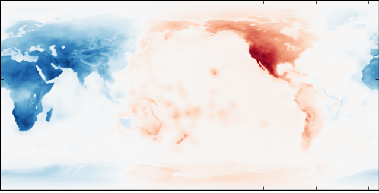
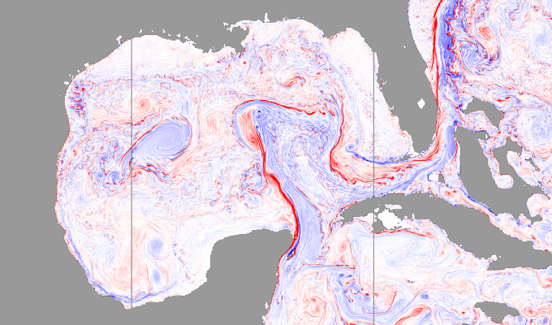
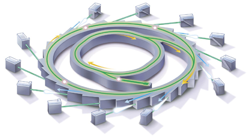
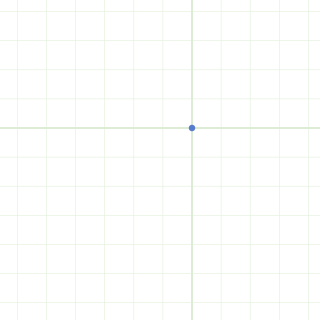

-   Open source library to scale Python code

-   Works with existing libraries like Pandas and Scikit-Learn

-   Can also parallelize pre-existing internal codebases


How do people use Dask?
-----------------------

1.  Drop-in API replacements for subsets of Numpy, Pandas, Scikit-Learn

    ```python
    import pandas as pd
    df = pd.read_csv('myfile.csv', parse_dates=['timestamp'])
    df.groupby('name').balance.mean()
    ```

2.  Low-level APIs to parallelize custom code

    ```python
    futures = client.map(train, data)

    async for future in as_completed(futures):
        result = await future
        if not done():
            future = client.submit(train, ...)

        ...
    ```


How do people use Dask?
-----------------------

1.  Drop-in API replacements for subsets of Numpy, Pandas, Scikit-Learn

    ```python
    import dask.dataframe as dd
    df = dd.read_csv('s3://.../*.csv', parse_dates=['timestamp'])
    df.groupby('name').balance.mean().compute()
    ```

2.  Low-level APIs to parallelize custom code

    ```python
    futures = client.map(train, data)

    async for future in as_completed(futures):
        result = await future
        if not done():
            future = client.submit(train, ...)

        ...
    ```


### Dask APIs help users construct task graphs

<hr>

### Dask schedulers execute task graphs on parallel hardware


### Parallel Dask Arrays

Leverage existing Numpy library for in-memory arrays


    import numpy as np
    x = np.random.random(size=(1000, 1000))
    y = x + x.T - x.mean(axis=0)

    import dask.array as da
    x = da.random.random(size=(10000, 10000), chunks=(1000, 1000))
    y = x + x.T - x.mean(axis=0)


### Parallel Dask Dataframes

Leverage existing Pandas library for in-memory dataframes


    import pandas as pd
    df = pd.read_csv('myfile.csv', parse_dates=['timestamp'])
    df.groupby(df.timestamp.dt.hour).value.mean()

    import dask.dataframe as dd
    df = dd.read_csv('hdfs://myfiles.*.csv', parse_dates=['timestamp'])
    df.groupby(df.timestamp.dt.hour).value.mean().compute()


### Fine Grained Python Code

    .

<hr>

    results = {}

    for a in A:
        for b in B:
            if a < b:
                results[a, b] = f(a, b)
            else:
                results[a, b] = g(a, b)

    .


### Fine Grained Python Code

    from dask import delayed, compute

<hr>

    results = {}

    for a in A:
        for b in B:
            if a < b:
                results[a, b] = delayed(f)(a, b)  # lazily construct graph
            else:
                results[a, b] = delayed(g)(a, b)  # without structure

    results = compute(results)  # trigger all computation


### Example custom graph built with dask.delayed


### Machine Learning

```python
pipe = Pipeline(steps=[('pca', PCA()),
                       ...,
                       ('logistic', LogisticRegression)])
grid = GridSearchCV(pipe, parameter_grid)
```

### Translate to task graph of normal Python calls


### Machine Learning

```python
pipe = Pipeline(steps=[('pca', PCA()),
                       ...,
                       ('logistic', LogisticRegression)])
grid = GridSearchCV(pipe, parameter_grid)
```

### Execute graphs efficiently on parallel hardware


### Dask Network


### Dask Network

Set up locally

    from dask.distributed import Client
    client = Client()  # set up local scheduler and workers

Set up on a cluster

    host1$ dask-scheduler
    Starting scheduler at 192.168.0.1:8786

    host2$ dask-worker 192.168.0.1:8786
    host3$ dask-worker 192.168.0.1:8786
    host4$ dask-worker 192.168.0.1:8786


### Use Cases


### People who want faster Pandas


### People who want faster Scikit-Learn

```python
pipe = Pipeline(steps=[('pca', PCA()),
                       ...,
                       ('logistic', LogisticRegression)])
grid = GridSearchCV(pipe, parameter_grid)
```


### Atmospheric and Oceanographic Science




### Atmospheric and Oceanographic Science




### Custom systems in Finance


### Data processing pipelines



*Image processing pipeline in Brookhaven Synchrotron*


### Realtime optimization algorithms




### Geospatial analysis


### How does Dask compare to Apache Spark?


-  Trust
    -  Spark is well established and trusted
    -  Dask is new, but part of the established PyData ecosystem
-  Framework vs Library
    -  Spark is an all-in-one framework
    -  Dask is a small part of the larger PyData ecosystem
-  JVM vs Python
    -  Spark is JVM based, with some support for Python and R
    -  Dask is nicer for Python users, but supports no one else
-  High vs Low level
    -  Spark works at a high level of Map / Shuffle / Reduce stages
    -  Dask thinks at a lower level of individual task scheduling
-  Applications
    -  Spark is focused on SQL and BI applications
    -  Dask is less focused, and better at complex situations


### Broadly

-  People choose Spark because ...
    -  Better at SQL-like computations
    -  Integrates with JVM infrastructure
    -  Well-known name
-  People choose Dask because
    -  It's lighter weight to adopt
    -  They like Python
    -  Their problems are too complex to fit into Spark


### Spark

<table>
<tr>
<td>Map</td>
<td>Shuffle</td>
<td>Reduce</td>
</tr>
<tr>
  <td>
    
  </td>
  <td>
    
  </td>
  <td>
    
  </td>
</tr>
</table>

### Dask


