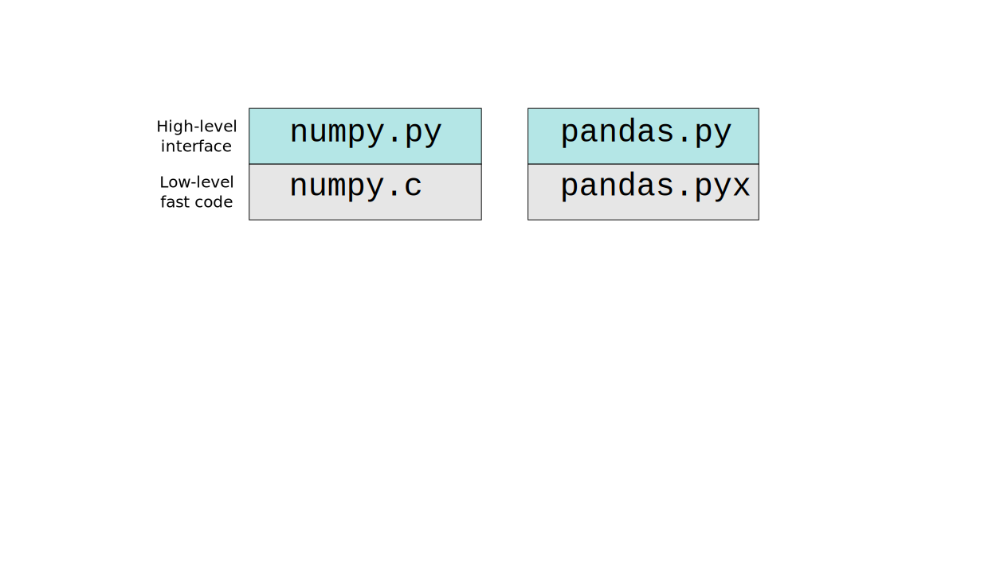
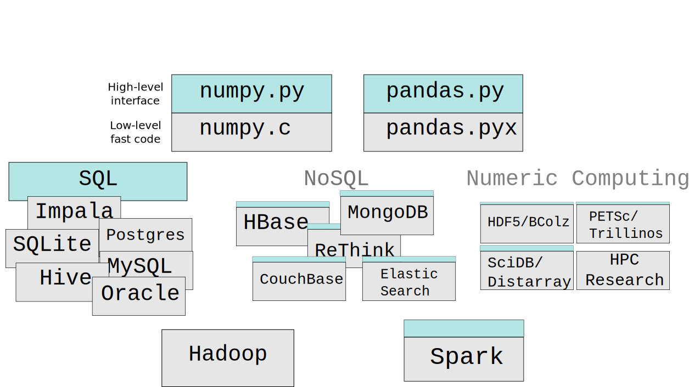
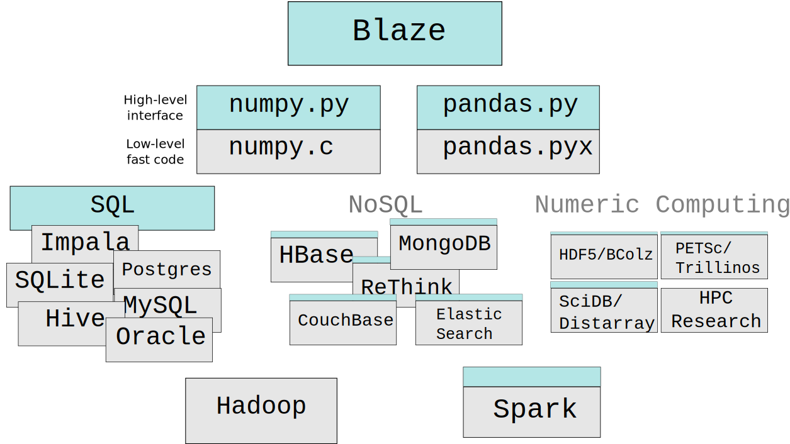

<object data="images/frontbackends-numpy-pandas.svg" type="image/svg+xml">
    
</object>

<object data="images/frontbackends-without-blaze.svg" type="image/svg+xml">
    
</object>

<object data="images/frontbackends-with-blaze.svg" type="image/svg+xml">
    
</object>
