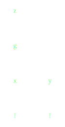
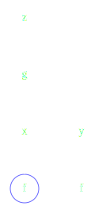
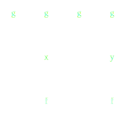
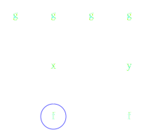
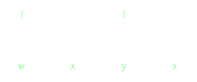
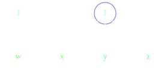
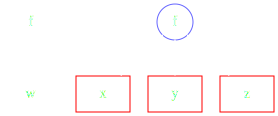

Dask: Parallel Programming in Python
------------------------------------


*Matthew Rocklin*

Anaconda Inc.


### Ecosystem


### Python has a mature analytics stack (Numpy, Pandas, ...)

<hr>

### But it is restricted to RAM and a single CPU

### How do we parallelize an ecosystem?


### Python is large and growing


### This is mostly due to computation


### This stack succeeds for a few reasons

1.  Intitutive interface
2.  Sophisticated algorithms
3.  Efficient compiled code
4.  Connected to native code (C/C++/Fortran/CUDA)

<hr>

### .


### This stack succeeds for a few reasons

1.  Intitutive interface
2.  Sophisticated algorithms
3.  Efficient compiled code
4.  Connected to native code (C/C++/Fortran/CUDA)

<hr>

### These are also challenges for parallelism


### Consider current options

-  **MPI**
    -   Simple interface, but challenging for non-experts
    -   Very flexible for sophisticated algorithms
    -   Integrates well with native code

        but not so well with business infrastructure
-  **Apache Spark**
    -   Intuitive interface
    -   Good at some algorithms (map, shuffle, reduce)

        but not others (random access, nearest neighbors, custom)
    -   Integrates well with JVM business infrastructure

        but not so well with native code

<hr>

### We would like to find something in the middle


### Dynamic Task Scheduling


-  Computes SVD of logical array composed of five in-memory arrays
-  Task graph of Python functions and objects
-  Each box is a numpy array
-  Each circle is a normal call to QR, MatMul, ...


### Dynamic Task Scheduling


-  Computes SVD of logical array composed of five in-memory arrays
-  Task graph of Python functions and objects
-  Each box is a numpy array
-  Each circle is a normal call to QR, MatMul, ...


### Task scheduling suffices to parallelize the Python ecosystem

<hr>

1.  Flexible enough to capture most algorithms
2.  Gives enough algorithmic freedom to library developers
3.  Keeps enough control on priority, networking, resilience to be robust


### But there is still a lot of work

<hr>

1.  Produce task graphs from high-level API

    ```python
    # Numpy Arrays
    x = x + x.T - x.mean(axis=0)

    # Pandas Dataframes
    df.groupby('name').balance.mean()

    # Scikit-Learn models
    RandomForest().fit(data, labels)

    ...
    ```

2.  Execute those task graphs in parallel


### Consume High Level User API

```python
pipe = Pipeline(steps=[('pca', PCA()),
                       ...,
                       ('logistic', LogisticRegression)])
grid = GridSearchCV(pipe, parameter_grid)
```

### Translate to task graph of normal Python calls


### Consume High Level User API

```python
pipe = Pipeline(steps=[('pca', PCA()),
                       ...,
                       ('logistic', LogisticRegression)])
grid = GridSearchCV(pipe, parameter_grid)
```

### Execute graphs efficiently on parallel hardware


-  Dynamic task scheduler for generic applications
-  Handles data locality, resilience, work stealing, etc..
-  Compute-agnostic within each task (black box execution)
-  Native Python library respecting Python protocols
-  Lightweight and well supported by industry and community


### Collections


### Dask enables parallel Python

<hr>

### ... originally designed to parallelize NumPy and Pandas

<hr>

### ... but also used today for arbitrary computations


### Dask.array


    import numpy as np
    x = np.random.random(...)
    y = x + x.T - x.mean(axis=0)

    import dask.array as da
    x = da.random.random(..., chunks=(1000, 1000))
    y = x + x.T - x.mean(axis=0)


### Dask.DataFrame


    import pandas as pd
    df = pd.read_csv('myfile.csv', parse_dates=['timestamp'])
    df.groupby(df.timestamp.dt.hour).value.mean()

    import dask.dataframe as dd
    df = dd.read_csv('hdfs://myfiles.*.csv', parse_dates=['timestamp'])
    df.groupby(df.timestamp.dt.hour).value.mean().compute()


### Fine Grained Python Code

    .

<hr>

    results = {}

    for a in A:
        for b in B:
            if a < b:
                results[a, b] = f(a, b)
            else:
                results[a, b] = g(a, b)

    .


### Fine Grained Python Code

    from dask import delayed, compute

<hr>

    results = {}

    for a in A:
        for b in B:
            if a < b:
                results[a, b] = delayed(f)(a, b)  # lazily construct graph
            else:
                results[a, b] = delayed(g)(a, b)  # without structure

    results = compute(results)  # trigger all computation


### Example custom graph built with dask.delayed


### Dask array graphs


### Dask APIs Produce Task Graphs

<hr>

### Dask Schedulers Execute Task Graphs


### 1D-Array


    >>> x = np.ones((15,))
    >>> x
    array([ 1., 1., 1., 1., 1., 1., 1., 1., 1., 1., 1., 1., 1., 1., 1.])

    >>> x = da.ones((15,), chunks=(5,))
    dask.array<ones, shape=(15,), dtype=float64, chunksize=(5,)>


### 1D-Array


    x = da.ones((15,), chunks=(5,))
    x.sum()


### ND-Array - Sum


    x = da.ones((15, 15), chunks=(5, 5))
    x.sum(axis=0)


### ND-Array - Transpose


    x = da.ones((15, 15), chunks=(5, 5))
    x + x.T


### ND-Array - Matrix Multiply


    x = da.ones((15, 15), chunks=(5, 5))
    x.dot(x.T + 1)


### ND-Array - Compound Operations


    x = da.ones((15, 15), chunks=(5, 5))
    x.dot(x.T + 1) - x.mean()


### ND-Array - Compound Operations


    import dask.array as da
    x = da.ones((15, 15), chunks=(5, 5))
    y = (x.dot(x.T + 1) - x.mean()).std()


### Schedulers


### Dask APIs Produce Task Graphs

<hr>

### Dask Schedulers Execute Task Graphs


### Dask.array/dataframe/delayed author task graphs

<hr>


<hr>

### Now we need to run them efficiently


### Dask.array/dataframe/delayed author task graphs

<hr>


<hr>

### Now we need to run them efficiently


-  Dynamic task scheduler for generic applications
-  Handles data locality, resilience, work stealing, etc..
-  With 10ms roundtrip latencies and 200us overheads
-  Native Python library respecting Python protocols
-  Lightweight and well supported


### Single Machine Scheduler

Optimized for larger-than-memory data

*   **Parallel CPU**: Uses multiple threads or processes
*   **Minimizes RAM**: Choose tasks to remove intermediate data
*   **Overhead:** ~50us per task
*   **Concise**: ~1000 LOC
*   **Real world workloads**: Under heavy load by many different projects


### Distributed Scheduler

*   **Centralized Coordination**: One scheduler coordinates many workers
*   **Distributed**: computation, storage, and network
*   **Dynamic**: Make decisions during computation
*   **Measured**: Gathers telemetry on task duration, memory, network, ...
*   **Data local**: Moves computation to correct worker
*   **Asynchronous**: Continuous non-blocking conversation

    All of the logic is hackable Python, separate from networking


### Distributed Network


### Distributed Network

Set up locally

    from dask.distributed import Client
    client = Client()  # set up local scheduler and workers

Set up on a cluster

    host1$ dask-scheduler
    Starting scheduler at 192.168.0.1:8786

    host2$ dask-worker 192.168.0.1:8786
    host3$ dask-worker 192.168.0.1:8786
    host4$ dask-worker 192.168.0.1:8786


### Distributed Scheduler


### Distributed Scheduler


### Distributed Scheduler


### Distributed Scheduler


### Distributed Scheduler


### Distributed Scheduler


### Distributed Scheduler


### Distributed Scheduler


### Distributed Scheduler


### Distributed Scheduler


### Distributed Scheduler


### Distributed Scheduler


### Distributed Scheduler


### Distributed Scheduler


### Distributed Scheduler


### All decisions are done in-the-small (almost)


### All decisions are done in constant time (almost)


### Task Scheduling


    x = f(1)
    y = f(2)
    z = g(x, y)


### Which function to run first?




### Prefer Tasks on Critical Path




### Which function to run first?




### Expose Parallelism




### Which function to run first?




### Release Data




### Release Data, free Memory




### Distributed Network


### Two Workers


### Two Workers


### Two Workers


### Two Workers


### Two Workers


### Data Locality


### Data Locality


### Data Locality


### .


### Minimize Communication


### Balance Computation and Communication


### .


### Work Steal


### Work Steal


### Intelligent scheduling requires measurement

*  Measure size of outputs in bytes (`__sizeof__`)
*  Measure process reported memory use
*  Measure computation time (EWMA, with restarts)
*  Measure communication time / network distance
*  Measure disk load time
*  ...


### Other Optimizations ...

*  Gracefully scale up or down based on load
*  Optionally compress messages based on small samples
*  Oversubscribe workers with many small tasks
*  Batch many-small-messages in 2ms windows
*  Spill unused data to disk
*  ...

<hr>

#### These optimizations suffice to make dask.array/dataframe fast
#### But they are not specific to arrays/dataframes
#### These optimizations apply to all situations, including novel ones


### Fine-grained scheduling requires constant-time decisions

*  Computational graphs scale out to 100,000s of tasks
*  We spend ~200us per task in the scheduler, 5000 tasks/s
*  Each task is ~10kB in RAM


### Conclusion


### Discussion starters

-   Dask is designed to be general purpose

    Does it fit your application?

-   Am I missing critical prior work on this topic?

-   ...


### Final Slide

-  Dask is ...
    -   High level APIs to build dynamic task graphs
    -   Dynamic distributed task scheduler for general applications
-  Learn more ...
    -   [dask.pydata.org](https://dask.pydata.org)
    -   [github.com/dask/dask](https://github.com/dask/dask)


### Apache Spark


### Comparison to Apache Spark

-  Trust
    -  Spark is well established and trusted
    -  Dask is new, but part of the established PyData ecosystem
-  Framework vs Library
    -  Spark is an all-in-one framework
    -  Dask is a small part of the larger PyData ecosystem
-  JVM vs Python
    -  Spark is JVM based, with support for Python and R
    -  Dask is nicer for Python users, but supports no one else
-  High vs Low level
    -  Spark works at a high level of Map / Shuffle / Reduce stages
    -  Dask thinks at a lower level of individual task scheduling
-  Applications
    -  Spark is focused on SQL and BI applications
    -  Dask is less focused, and better at complex situations


### People choose Dask for two reasons

1.  They like Python
2.  Their use case is too complex for Apache Spark


### Spark

<table>
<tr>
<td>Map</td>
<td>Shuffle</td>
<td>Reduce</td>
</tr>
<tr>
  <td>
    
  </td>
  <td>
    
  </td>
  <td>
    
  </td>
</tr>
</table>

### Dask


