Scaling Scientific Python
-------------------------


*Matthew Rocklin*

Anaconda Inc.


What to expect
--------------

1.  **Scaling Numpy**
    -  Complex datasets - *solved by XArray*
    -  Large datasets - *solved by Dask*
2.  **Distributed Systems**
    -  Dask networks
    -  HPC Deployments
    -  Cloud Deployments [pangeo.pydata.org](http://pangeo.pydata.org)
    -  JupyterHub + Dask
3.  **Lessons Learned**
    -  Data storage
    -  User environments
    -  Collaborators and people


### Problem: Our ability to produce datasets

<hr>

### Has outstripped our ability to analyze them


### The Numeric Python Ecosystem

-  Numpy, Pandas, Scikit-Learn, Matplotlib, ...

<hr>

### Serves Scientific Communities

-  Effiicient compiled code
-  Intuitive interfaces designed for non-experts
-  Thousands of libraries that work well together

<hr>

### ... but these don't scale out well


### Numpy is fast and intuitive

```python
>>> import numpy as np
>>> x = np.random.random((1000, 1000))      # Array of random data

>>> x[0, :5]                                # Access a few elements
array([0.90896491, 0.32975274, 0.19095781, 0.67890296, 0.33155882])
Wall time: 25.5 µs

>>> x.sum()                                 # Compute aggregations
500199.7715862236
Wall time: 633 µs

>>> (x + x.T - x.mean(axis=0)).std()        # Perform more complex operations
0.4083831772871384
Wall time: 30.2 ms
```


### Problem: Complex datasets break intuition

Real-world datasets contain several arrays with complex relationships.

```python
>>> import netCDF4
>>> data = netCDF4.Dataset('myfile.nc')
>>> list(data.variables)
['temperature',
 'pressure',
 'wind-velocity-x',
 'wind-velocity-y',
 'elevation',
 'latitude',
 'longitude',
 'time',
 'ensemble-id']

>>> data['temperature'][:] = data['temperature'][:, 1000:5000, 2000:6000]
>>> data['pressure'][:] = data['pressure'][:, 1000:5000, 2000:6000]
>>> ...
```

This burdens scientific users:

-  Track coordinates manually
-  Consistently transform many variables
-  Consistently operate across many files


### XArray: netCDF meets Pandas DataFrames


```python
>>> ds = xarray.open_dataset('myfile.nc')

# xarray style
>>> ds.sel(time='2018-01-08').max(dim='ensemble')

# numpy Style
>>> array[[0, 1, 2, 3], :, :].max(axis=2)
```

*Taken from Stephan Hoyer's [ECMWF talk](https://docs.google.com/presentation/d/16CMY3g_OYr6fQplUZIDqVtG-SKZqsG8Ckwoj2oOqepU/edit#slide=id.g2b68f9254d_1_27)*


### XArray: makes scalable data analysis easy

```python
import xarray
ds = xarray.open_mfdataset('all/your/data/*.nc')            # Open many files
climatology = ds.groupby('time.season').mean('time')        # Compute seasonal average
temperature_range = abs(climatology.air.sel(season='JJA')   # Compare seasons
                      - climatology.air.sel(season='DJF'))
temperature_range.plot()                                    # Visualize
```

<hr>

### Feels native for geoscience community

### But general purpose, and integrates with wider ecosystem


### Problem: Scale

Scientific Python was not designed to scale

```python
>>> import numpy as np
>>> x = np.random.random((1000, 1000))
.
```

-  Could work from disk, loading and processing data chunk-by-chunk
-  Could use distributed memory on clusters of computers


### Problem: Scale

Scientific Python was not designed to scale

```python
>>> import numpy as np
>>> x = np.random.random((100000, 100000))
MemoryError
```

-  Could work from disk, loading and processing data chunk-by-chunk
-  Could use distributed memory on clusters of computers


### Dask.array scales Numpy


```python
import numpy as np                          # NumPy Arrays
x = np.random.random((1000, 1000))
y = (x + x.T - x.mean(axis=0)).std()

import dask.array as da                     # Dask Arrays
x = da.random.random((10000, 10000), chunks=(1000, 1000)))
y = (x + x.T - x.mean(axis=0)).std().compute()
```


### 1D-Array

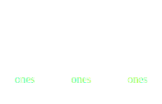

    >>> x = np.ones((15,))
    >>> x
    array([ 1., 1., 1., 1., 1., 1., 1., 1., 1., 1., 1., 1., 1., 1., 1.])

    >>> x = da.ones((15,), chunks=(5,))
    dask.array<ones, shape=(15,), dtype=float64, chunksize=(5,)>


### 1D-Array

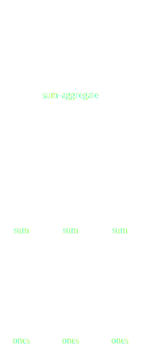

    x = da.ones((15,), chunks=(5,))
    x.sum()


### ND-Array - Sum

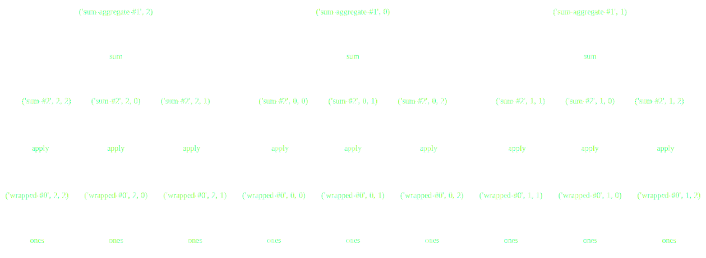

    x = da.ones((15, 15), chunks=(5, 5))
    x.sum(axis=0)


### ND-Array - Transpose

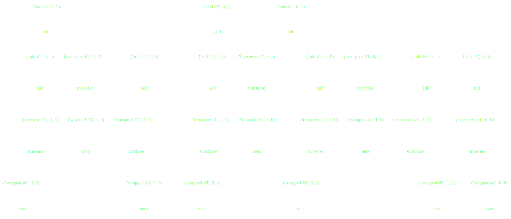

    x = da.ones((15, 15), chunks=(5, 5))
    x + x.T


### ND-Array - Matrix Multiply

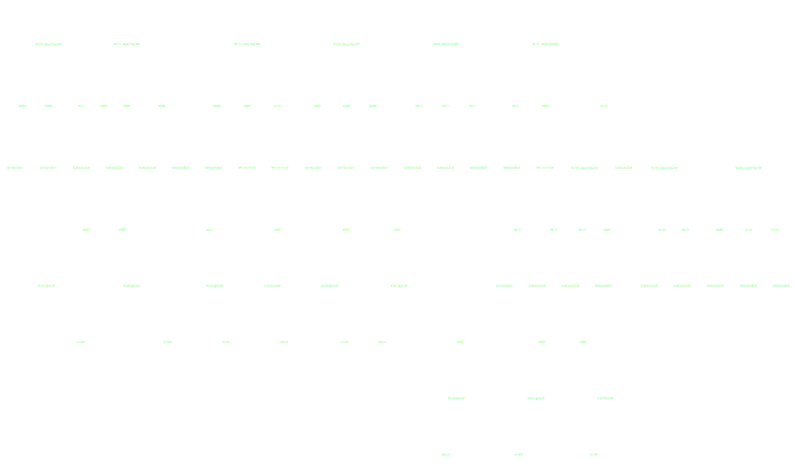

    x = da.ones((15, 15), chunks=(5, 5))
    x.dot(x.T + 1)


### ND-Array - Compound Operations

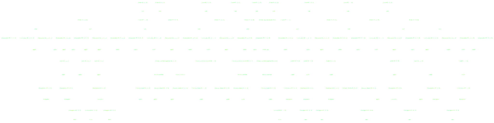

    x = da.ones((15, 15), chunks=(5, 5))
    x.dot(x.T + 1) - x.mean()


### ND-Array - Compound Operations

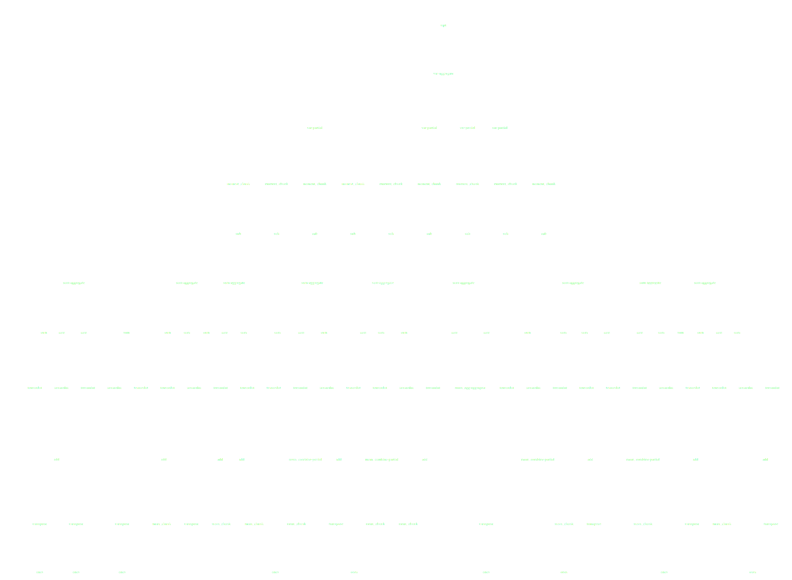

    import dask.array as da
    x = da.ones((15, 15), chunks=(5, 5))
    y = (x.dot(x.T + 1) - x.mean()).std()


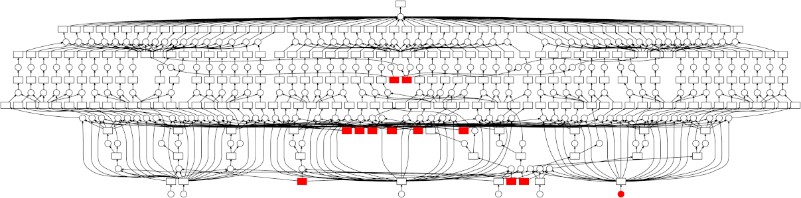

-  Parallel task scheduler for Python
-  APIs for Numpy, Pandas, SKLearn, ...
-  Developed by NumPy, Pandas, SKLearn, Jupyter communities
-  Light weight, well supported, BSD licensed


-  Parallel task scheduler for Python
-  APIs for Numpy, Pandas, SKLearn, ...
-  Developed by NumPy, Pandas, SKLearn, Jupyter communities
-  Light weight, well supported, BSD licensed


### Dask also parallelizes ...

-  Pandas
-  GeoPandas
-  Scikit-Image
-  Scikit-Learn
-  Generic Python code
-  Real-time futures
-  ...
-  Several private systems


### Distributed Systems


### Dask network

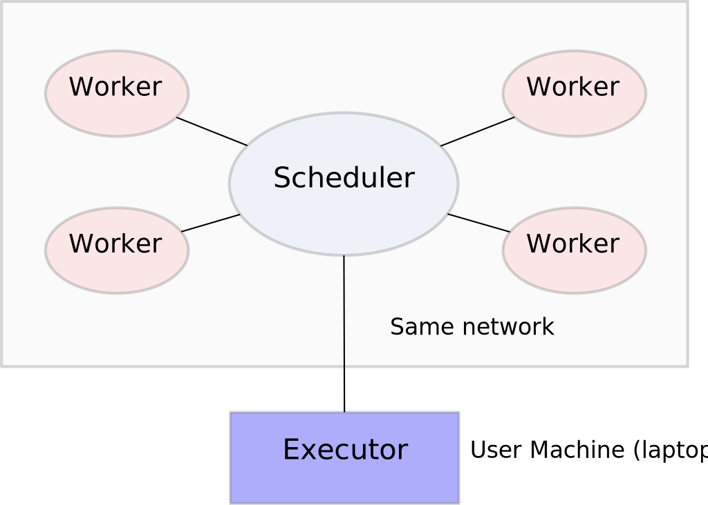

1.  **Scheduler**: coordinates everyone, does no actual work
2.  **Workers**: do work, store data, communicate peer-to-peer
3.  **Clients**: ask for work, share pointers to datasets


### Set things up by hand

```bash
user@host $ dask-scheduler                  # Launch scheduler on one machine
Scheduler running on 192.168.0.1:8786

user@host1$ dask-worker 192.168.0.1:8786    # Launch several workers
user@host2$ dask-worker 192.168.0.1:8786    # pointing them to the scheduler
user@host3$ dask-worker 192.168.0.1:8786
```

<hr>

```python
>>> from dask.distributed import Client
>>> client = Client('192.168.0.1:8786')     # Connect local process to scheduler
```

### But we usually do this with a resource manager


### Automated and commonly used on the following:

1.  HPC job schedulers
    -  PBS
    -  Grid Engine
    -  SLURM
    -  LSF
    -  Torque, condor, DRMAA-compliant system ...
2.  Ad-hoc clusters
    -  SSH
    -  Home grown job schedulers
3.  Loosely coupled job schedulers
    -  Yarn (Hadoop's default system)
    -  Mesos / Marathon
    -  **Kubernetes**

[dask.pydata.org/en/latest/setup.html](http://dask.pydata.org/en/latest/setup.html)


### This is easy for users

    $ pip install dask-jobqueue

```python
>>> from dask_joqqueue import PBSCluster
>>> cluster = PBSCluster(n_workers=20, project='my-project', ...)

>>> from dask.distributed import Client
>>> client = Client(cluster)
```


### This is easy for users

    $ pip install dask-jobqueue

```python
>>> from dask_joqqueue import SGECluster
>>> cluster = SGECluster(n_workers=20, project='my-project', ...)

>>> from dask.distributed import Client
>>> client = Client(cluster)
```


### This is easy for users

    $ pip install dask-kubernetes

```python
>>> from dask_kubernetes import KubeCluster
>>> cluster = KubeCluster(n_workers=20, namespace='my-namespace')

>>> from dask.distributed import Client
>>> client = Client(cluster)
```


### Adapt cluster size based on workload

    $ pip install dask-kubernetes

```python
>>> from dask_kubernetes import KubeCluster
>>> cluster = KubeCluster(namespace='my-namespace')
>>> cluster.adapt(minimum=5, maximum=100)  # dynamically scale between 5-100 workers

>>> from dask.distributed import Client
>>> client = Client(cluster)
```


### Example system

### [pangeo.pydata.org](http://pangeo.pydata.org)


### Infrastructure

-  Deployment
    -  Kubernetes, on Google, but would work anywhere
    -  JupyterLab for user environments
    -  JupyterHub for user management
    -  Use auto-scaling node pools to manage costs
-  Storage:
    -  HDF files + FUSE on cloud object store (like S3)
    -  Zarr (new format) on cloud object store directly


### JupyterHub and Dask on Kubernetes

User connects to JupyterHub

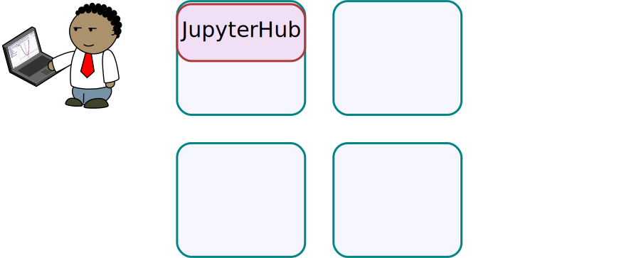


### JupyterHub and Dask on Kubernetes

JupyterHub launches notebook environment for User

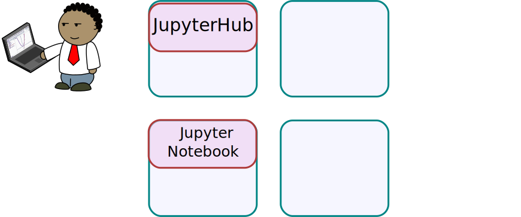


### JupyterHub and Dask on Kubernetes

User launches Dask from cloud environment

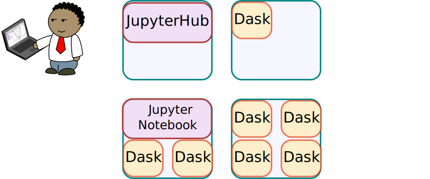


### JupyterHub and Dask on Kubernetes

Second user arrives and connects to JupyterHub

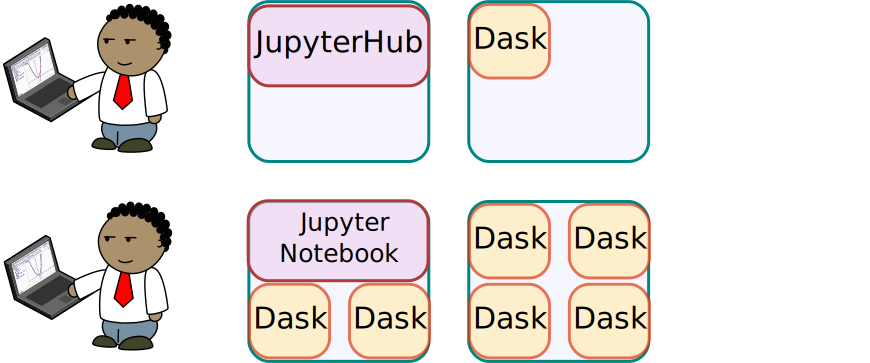


### JupyterHub and Dask on Kubernetes

JupyterHub launches second isolated cloud environment

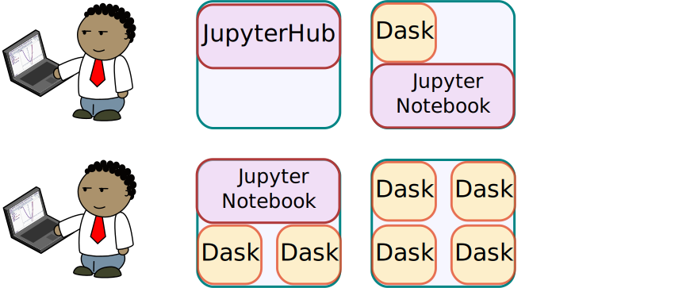


### JupyterHub and Dask on Kubernetes

Cluster scales out to accomodate new user

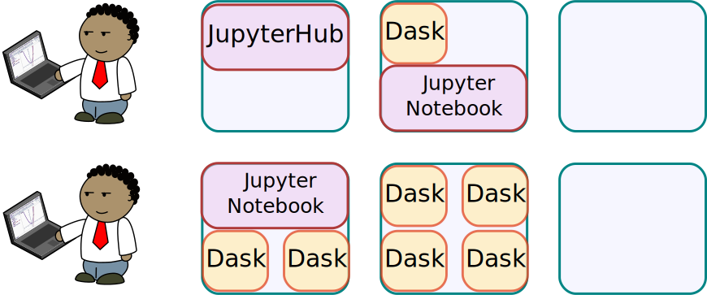


### JupyterHub and Dask on Kubernetes

New user also launches Dask

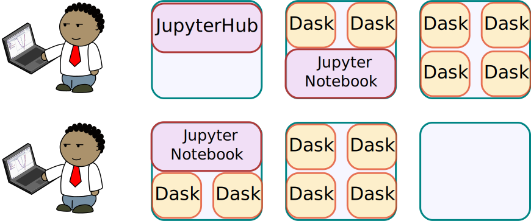


### JupyterHub and Dask on Kubernetes

First user goes home for the day

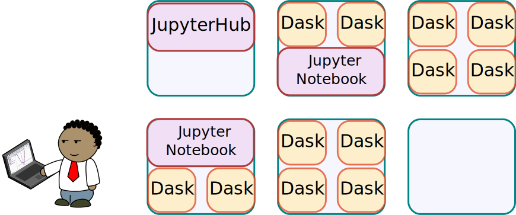


### JupyterHub and Dask on Kubernetes

User's cloud environment retires

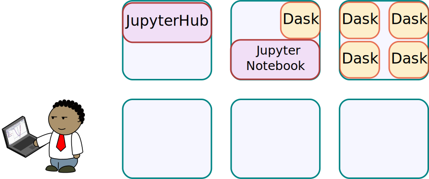


### JupyterHub and Dask on Kubernetes

Cluster scales down to reduce costs

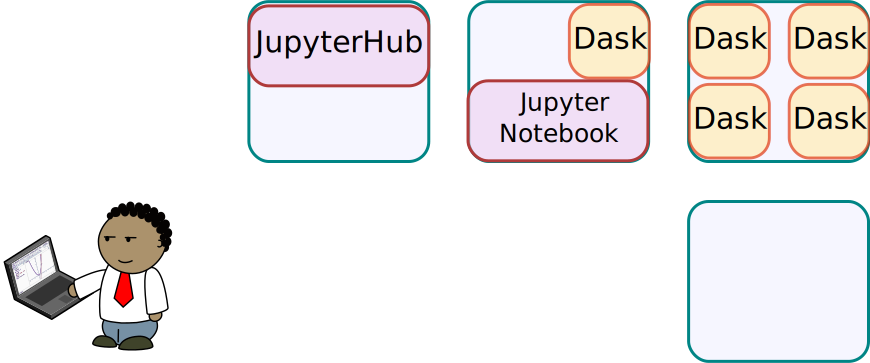


### Operationally we see...

1.  A few users on at a time
2.  One or two operating at scale

    ```
    $ kubectl get pods -n pangeo
    NAME                              READY     STATUS    RESTARTS   AGE
    jupyter-hendra-2dherviawan        1/1       Running   0          14m
    jupyter-philippjfr                1/1       Running   0          38m
    jupyter-rsignell-2dusgs           1/1       Running   0          55m
    jupyter-vincentschut              1/1       Running   0          5h
    jupyter-willirath                 1/1       Running   0          36m

    dask-philippjfr-403975b1-a4pg5p   1/1       Running   0          15m
    dask-philippjfr-403975b1-a6hhvl   1/1       Running   0          15m
    dask-philippjfr-403975b1-a882kj   1/1       Running   0          15m
    ...
    dask-philippjfr-403975b1-aztvqg   1/1       Running   0          15m
    dask-philippjfr-403975b1-a882kj   1/1       Running   0          15m

    hub-68b7fb696-jdfc8               1/1       Running   0          40m
    proxy-584cf885d7-xbns5            2/2       Running   0          40m
    ```


### Operationally we see...

Costs about $1 / hour with preemptible nodes

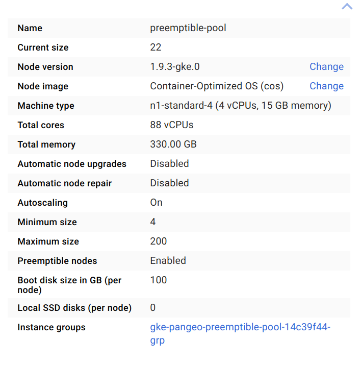


### Others have done this too

-   UK Met Office's JADE
-   USGS + HDF group collaboration on AWS
-   University of Washington on AWS
-   Someone is setting it up on Jetstream?


### You don't have to do it this way

### Life is simpler on traditional data centers

1.  You already have user management
2.  You already have billing/quotas
3.  You already have data access
4.  You already have local software environments
5.  You already have paid staff to troubleshoot


### Opportunities and Challenges

-  **Users**
    -  Opportunity: Lots of interest from different communities
    -  Challenge: Everyone has custom needs, libraries, etc..
-  **Data**
    -  Opportunity: Cloud storage increases access to smaller groups, automated services
    -  Challenge: Old formats might not work well (HDF/NetCDF in particular)
-  **Developers**
    -  Opportunity: Several organizations and individuals offering developer time
    -  Challenge: Community and maintenance strain as we grow quickly


### Come say hello!

-  [Mattia in Ocean Modeling](https://github.com/pangeo-data/pangeo/issues/151) 8 hours ago
-  [Alex in Microscopy](https://github.com/pangeo-data/pangeo/issues/144#issue-302951304)  6 days ago

<hr>

[github.com/pangeo-data/pangeo](https://github.com/pangeo-data/pangeo)


### Demo: Example with Microscopy


### Ways to get involved

1.  Try: [pangeo.pydata.org](http://pangeo.pydata.org) (but don't trust it)
    -  Break things (this is easy)
    -  Write example workflows on datasets
2.  Deploy: Dask/XArray on your own cluster
    -  [dask.pydata.org/en/latest/setup.html](https://dask.pydata.org/en/latest/setup.html)
    -  [pangeo-data.github.io/pangeo/](https://pangeo-data.github.io/pangeo/)
3.  Engage: [github.com/pangeo-data/pangeo/issues](https://github.com/pangeo-data/pangeo/issues)

    ... or report to upstream projects
4.  Contribute:
    -  Developer time
    -  Use
    -  Funding
    -  Datasets and workflows


### Some of the people and organizations responsible

-  Alistair Miles - Oxford - CGGH
-  Jacob Tomlinson - UK Met Informatics Lab
-  Joe Hamman - NCAR - NSF/Pangeo
-  Martin Durant - Anaconda
-  Matthew Pryor - UK Met CEDADev
-  Matthew Rocklin - Anaconda - NSF/Pangeo, Moore
-  Ryan Abernathy - Columbia - NSF/Pangeo
-  Stephan Hoyer - Google
-  Yuvi Panda - UC Berkeley / Jupyter - Moore
-  Dask, XArray, Jupyter, ... communities


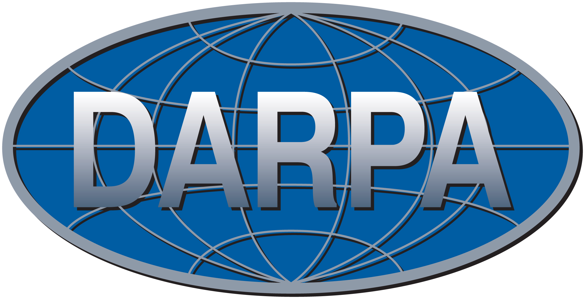


### Opportunity: Broad collaboration

*Logged in users in the last 48 hours*

-  **Yu Cheng**: Pysical oceanography in Miami, PhD student
-  **J Gerard**: Data engineer at Rhodium Group, Climate impact lab
-  **Nic Wayand**: University of Saskatchewan, Cold water lab, Postdoc
-  **Vincent Schut**: Satelligence, Netherlands
-  **Gregory R Lee**: Cincinnati Children's Hospital, Neuro-imaging
-  **Guillaume EB**: Distributed systems engineer, CNES
-  **M Hendra Herviawan**: Bandung, Indonesia.  Marketing and data analysis
-  **Marius van Niekerk**: Engineer at Flatiron Health

<hr>

*Excludes collaborators, excludes people about whom I could not find
affiliation*


### Challenge 1: Custom environments

*Everyone wants their own software*

-  Small-scale customizability
    -  JupyterLab: Users have a normal Linux environment
    -  JupyterHub: Users have a persistent cloud drive

-  Large-scale customizability options:
    -  Several independent deployments
    -  Curated set of Docker images per deployment
    -  Accept user-defined environments (like mybinder.org)


### Opportunity 2: Shared Data Storage

-   Organizations like NASA, NCAR host large datasets

    Both on cloud storage and traditional data centers

-   Increasing access enables new groups to do science cheaply

    -  Students internationally
    -  Smaller institutions
    -  Automated services and web applications

-   Python ecosystem has tools to read most data formats

    Once we give it access to bytes


### Challenge 2: It is hard to read HDF on the cloud

**Options**

-  Mimic normal file systems on cloud object stores (FUSE)
-  Teach HDF to work decently on cloud object stores
-  Invent new formats and standards (like Zarr)
-  Give our data to a company, let them handle it


### Custom user environments and cloud data storage

### are the two largest barriers to cloud adoption

