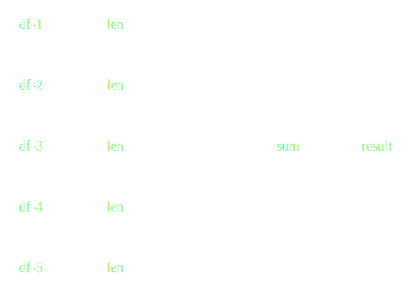

Flexible Parallelism with Dask
------------------------------

*Matthew Rocklin*

Continuum Analytics

### Python has a fast and pragmatic data science ecosystem

### ... restricted to a single core

### How do we parallelize an ecosystem?

*  **NumPy**: arrays
*  **Pandas**: tables
*  **Scikit Learn**: machine learning
*  **Statsmodels**: statistics
*  ...
*  ...
*  **GeoPandas**: geo-spatial
*  **Scikit-Image**: image analysis
*  **Scikit-Bio**: ...

### ... without rewriting everything

*  Parallel algorithms and user interfaces
*  Dynamic distributed task scheduling

### Familiar parallel collections

*  NumPy + dask = dask.array

        x.T - x.mean(axis=0)

*  Pandas + dask = dask.dataframe

        df.groupby(df.name).balance.mean()

*  Lists + dask = dask.bag

        b.map(json.loads).filter(...)

### Dynamic task scheduling

*  Execute graph of tasks on parallel hardware
*  Make central decisions at runtime
*  Asynchronously respond to changes

### Dask DataFrame

*  Borrows heavily from Pandas
    *  Composed of Pandas DataFrames
    *  Matches the Pandas interface
    *  Developed with Pandas developers
*  Accesses data from HDFS, S3, local disk
*  Fast, low latency
*  Responsive user interface

[Example notebook with NYC Taxi
data](https://gist.github.com/mrocklin/86764c5eaba5c23892430975ae3a983a#file-odsc-2016-dataframe-ipynb)

### From queries to task graphs

    >>> len(df)

*   Task scheduling is ubiquitous in parallel computing

    Examples: MapReduce, Spark, SQL, TensorFlow, Plasma

### Wide variety of algorithm types

<table>
<tr>
  <td>
    Map

    
  </td>
  <td>
    Shuffle

    
  </td>
  <td>
    Reduce

    
  </td>
</tr>
<tr>
  <td>
    Nearest Neighbor

    
  </td>
  <td>
    Cumulative reductions

    
  </td>
  <td>
    ... Unstructured

    
  </td>
</tr>
</table>

Dask Arrays
-----------

*  Combines NumPy with task scheduling
*  Coordinate many NumPy arrays into single logical Dask array
*  Blocked algorithms implement broad subset of Numpy

[Example notebook with weather
data](https://gist.github.com/mrocklin/86764c5eaba5c23892430975ae3a983a#file-odsc-2016-meteorology-ipynb)

### Dask was originally designed to be flexibile to support NumPy/Pandas

### But found it to be surprisingly valuable for general work

Task Scheduling
---------------

    x = f(1)
    y = f(2)
    z = g(x, y)

Where and when do we run tasks?

Task Scheduling
---------------

*   Task scheduling is ubiquitous in parallel computing

    Examples: MapReduce, Spark, SQL, TensorFlow, Plasma

*   But raw task scheduler is rarely exposed

    Exceptions: Make, Luigi, Airflow, Swift

### Task Scheduling API

    >>> from dask.distributed import Executor
    >>> e = Executor('scheduler-address')  # connect to cluster

    >>> x = e.submit(add, 1, 2)            # call add(1, 2) remotely
    >>> x                                  # immediately returns promise
    <Future: status=pending>

### Task Scheduling API

Call many times with for loops.

    >>> for i in ...                       # Use in complex loops
    ...     for j in ...
    ...         if ...
    ...             e.submit(func, ...)

Submit tasks on results of other tasks.

    >>> x = e.submit(add, 1, 2)            # submit single task to cluster
    >>> y = e.submit(double, x)            # submit task on previous result

[Example notebook submitting custom
tasks](https://gist.github.com/mrocklin/f57bc107a9eb5fe965175d4b507a1bf1#file-odsc-2016-custom-futures-ipynb)

### Setup

    user@host1:~$ dscheduler --port 8786

    user@host2:~$ dworker host1:8786

    user@host3:~$ dworker host1:8786

### Build graphs node by node with dask.delayed

    from dask import delayed

    @delayed
    def f(x):
        return ...

    @delayed
    def g(x, y):
        return ...

    x = f(1)
    y = f(2)
    z = g(x, y)

    z.compute()

[Example notebook with scikit
learn](https://gist.github.com/mrocklin/86764c5eaba5c23892430975ae3a983a#file-odsc-2016-sklearn-ipynb)

### Scheduling

*  Graph can grow or shrink at any time
*  Network can grow or shrink at any time
*  Serves around 5000 tasks per second
*  Communicates over TCP, ~3 memory copies
*  Aware of data locality and load balancing
*  All operations occur in linear time
*  Yarn, Docker, SGE/SLURM/Torque, SSH
*  New and evolving (both good and bad)

### Dask is not...

*  **A Database:**
    *  No query planner (only low-level optimizations)
    *  No shuffle (some groupbys and hash joins a problem)
*  **MPI:**
    *  Central dynamic scheduler
    *  100s of microseconds overhead per task

### Dask is in the middle

*  Managed parallelism
*  Somewhat flexibile algorithm abstraction

How dask is used in practice
----------------------------

*  Large arrays for climate and atmospheric science (HDF5 data)
*  Single machine lightweight PySpark clone for logs and JSON
*  Dataframes on piles of CSV data
*  Custom applications

*  Roughly equal mix of academic/research and corporate

Questions?
----------

*  [dask.pydata.org](http://dask.pydata.org/en/latest/),
   [distributed.readthedocs.org](http://distributed.readthedocs.org/en/latest/)
*  [gitter.im/dask/dask](http://gitter.im/dask/dask/),
   [youtube channel](https://www.youtube.com/playlist?list=PLRtz5iA93T4PQvWuoMnIyEIz1fXiJ5Pri)

[@mrocklin](http://twitter.com/mrocklin)

Start on a single machine

    $ conda/pip install dask

    >>> import dask.bag as db
    >>> db.read_text('/path/to/*.json.gz').filter(...)

### Extras

### Flexibility enables Sophisticated Algorithms

*  Parametrized machine learning pipeline

### Flexibility enables Sophisticated Algorithms

*  Embarrassingly parallel gridsearch

### Flexibility enables Sophisticated Algorithms

*  Efficient gridsearch

