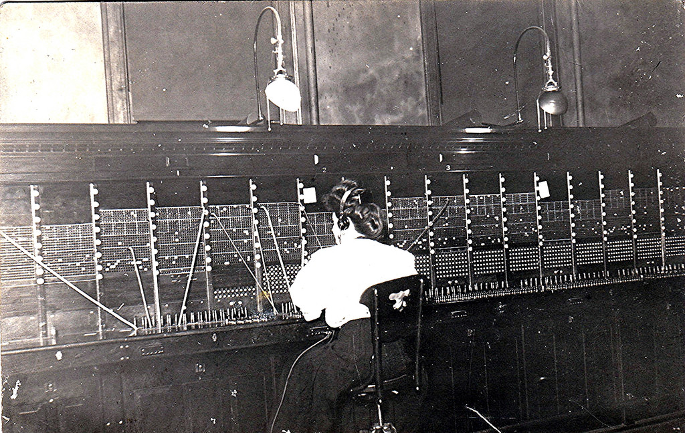
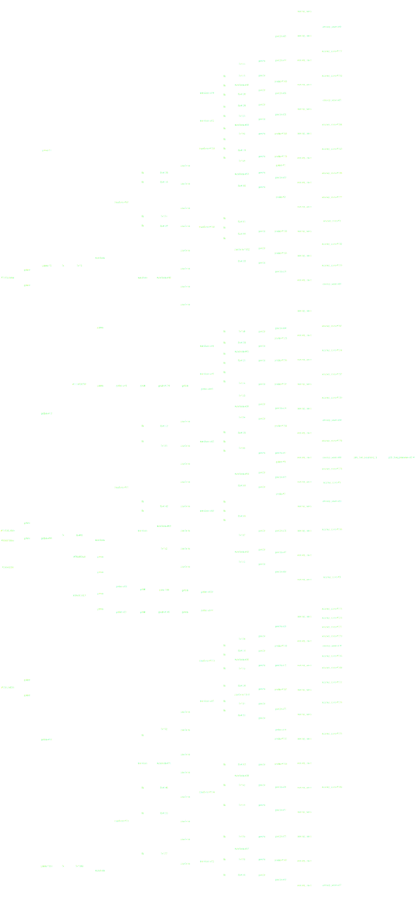

Parallelizing Python with Dask
------------------------------

*Matthew Rocklin*

Continuum Analytics

tl;dr
-----

Tools talk for Dask, a parallel computing library for Python

Advanced analytics through task scheduling

### Python ecosystem encompasses wealth of sophisticated, fast algorithms

### Confined to work in memory on a single core

### How do we parallelize an existing ecosystem of numeric software?

### Dask: Demonstration

Show off dask dataframes on an HDFS cluster

### `<opinion>` Big DataFrames are a distraction `</opinion>`

Task Scheduling
---------------

    x = f(1)
    y = f(2)
    z = g(x, y)

Where do we run tasks?  Choices affect performance and must be made quickly.

*Demonstration: small run tasks directly on cluster*

Task Scheduling
---------------

*   Task scheduling is ubiquitous in parallel computing

    Examples: MapReduce, Spark, SQL, TensorFlow, Plasma

*   But raw task scheduler is rarely exposed

    Exceptions: Make, Luigi, Airflow

### Data science is messy

### Analysts consume unbounded flexibility

Complex Operations
------------------

*  Parametrized machine learning pipeline

Complex Operations
------------------

*  Parametrized machine learning pipeline + gridsearch

Complex Operations
------------------

*  Parametrized machine learning pipeline + gridsearch

### Sophisticated algorithms defy structure

### Dask enables algorithms through raw task scheduling

Dask Arrays
-----------

*  Built on top of Dask
*  Coordinate many NumPy arrays into one logical Dask array
*  Blocked algorithms implement broad subset of Numpy

*  Strong user community in atmospheric sciences

*Demonstration: create task graphs with dask.array*

Hierarchy of parallel computing algorithms
------------------------------------------

### Embarassingly parallel map

### Shuffle / hash joins

### Otherwise Structured

### Unstructured

### Example with scikit learn?

Image with pipeline-gridsearch

Lessons learned
---------------

*   Task scheduling complements existing ecosystems well

    Users can handle more control if you give it to them

*   Move quickly by embracing existing projects and communities

How dask is used in practice
----------------------------

*  ND-Arrays in atmospheric sciences
*  Single machine lightweight pyspark clone
*  Custom applications
*  Lots of Dask.DataFrame questions on StackOverflow
*  About an equal mix of academic/research labs and private companies

Interfaces
----------

*  Dask.array (mimics NumPy)

        x.T - x.mean(axis=0)

*  Dask.bag (mimics map/filter/PySpark/PyToolz)

        text.map(json.loads).filter(...).frequencies()

*  Dask.dataframe (mimics Pandas)

        df.groupby(df.name).balance.mean()

*  Custom (wraps custom code)

        future = e.submit(function, *args)

        @dask.delayed
        def my_function(*args):
            ...
[dask.pydata.org](http://dask.pydata.org/en/latest/)

Before you parallelize
----------------------

*  formats, ...

Questions?
----------

*  Docs: [dask.pydata.org](http://dask.pydata.org/en/latest/)
*  Install: `conda/pip install dask distributed `
*  Play: `dec2 --keyname XXX --keypair XXX.pem`

Python
------

*  Fast, flexible, and friendly
*  Inherits speed and algorithms from C/Fortran legacy
*  Used to solve all sorts of non-standard problems
*  Easy for analysts to pick up

*  Not great for parallel computing
    *  MPI for hard/algorithmic science
    *  Spark/MR for straightforward data processing
    *  Not clear what to use for non-standard problems

### Wealth of sophisticated and tuned algorithms

### Confined to a single core

Hierarchy of parallel computing algorithms
------------------------------------------

### Embarassingly parallel map

### Shuffle / hash joins

### Otherwise Structured

### Unstructured

Task Scheduling
---------------

Like make

Basic task graph image

Many tasks to do
Tasks depend on each other
Workers accomplish tasks
Ability to move results between workers
Dynamic task scheduling -> we don't know much about our tasks
                           So we make decisions on the fly

Image of switchboard operator

There is a dynamic distributed task scheduler within all of the following
projects:

*  Any large SQL database (Impala, Presto, ...)
*  Hadoop MapReduce
*  Spark
*  TensorFlow
*  Plasma
*  ...

It's almost always hidden from the user.

Counter-examples include Airflow, Luigi, and the venerable Make, all of which
are well-loved by people on the ground.

Dask: Dynamic Task Scheduler
----------------------------

*  Exposes raw task scheduling
*  Python friendly
*  Optimized for computational performance  (1ms overhead)

Demonstration with dask.distributed

Original motivation: NDArrays
-----------------------------

The NumPy ndarray and Pandas dataframe back most the data science stack in
Python.  Wanted parallel versions of them.

Tried doing this in Spark; very hard to do well.  The data engineering
interface (map, groupby, join) didn't provide enough space for
non-data-engineering algorithms.

Also some impedance mismatch between data engineering stack and scientists.
Needed something more lightweight.

Demonstration with dask.array for algorithmic depth

DataFrames
----------

*  Uses pandas under the hood (didn't have to reinvent the wheel)
*  Copies pandas interface (easy to pick up)
*  Done in collaboration with Pandas devs

5k LOC

Machine Learning
----------------

??

Custom
------

But really, these are all built on top of Dask.

Most business use cases we see don't want a big array or a big dataframe and
all of the machine learning can easily be done on a single workstation.

By far the greatest novel value is exposing the ability to build things like
these in user space without restriction.

Scheduler Performance
---------------------

*  Low latency: 500us overhead, 10ms roundtrip
*  Peer-to-peer sharing: 50us overhead, 2 memcopy cost (decent on 10Gb and fast
   network)
*  Fully asynchronous: Submit jobs any time, including during other jobs
*  Resilient: Loss of workers or data handled by recomputation
*  Data local: Runs tasks where input data lives
*  Easy to set up: `pip install`able, deploy with SSH, YARN, SGE, etc..
*  Flexible: Many things I haven't mentioned
