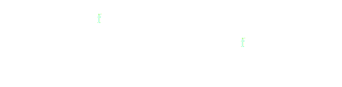

Parallelizing Python with Dask
------------------------------

*Matthew Rocklin*

Continuum Analytics

tl;dr
-----

Tools talk for Dask, a parallel computing library for Python

Flexible analytics through task scheduling

### Python ecosystem encompasses wealth of fast, sophisticated algorithms

### Confined to memory and a single core

### How do we parallelize an existing ecosystem of software?

*  Lists, map, filter, reduce, for loops
*  NumPy: n-dimensional arrays
*  Pandas: tabular computations
*  Scikit Learn: Machine learning
*  Statsmodels: statistical computations
*  gensim, nltk: text processing
*  ...
*  GeoPandas: ...
*  Scikit-Bio: ...
*  Scikit-Image: ...

### Wide variety of applications

### Wide variety of algorithms

### Algorithm Types

<table>
<tr>
  <td>
    Map

    
  </td>
  <td>
    Shuffle

    
  </td>
  <td>
    Reduce

    
  </td>
</tr>
<tr>
  <td>
    Nearest Neighbor

    
  </td>
  <td>
    Iterative reductions

    
  </td>
  <td>
    Unstructured

    
  </td>
</tr>
</table>

### Sophisticated algorithms take a wide variety of forms

### Dask for flexible parallel computing

*  Library for parallel computing
*  Complements the existing ecosystem (not a reinvention)
*  Works well on a single machine and a cluster
*  Two interfaces
    *  **High Level:** "Big data" NumPy and Pandas interfaces
    *  **Low Level:** Flexible task scheduling

        (like `make`, but interactive)

*Demonstrate dask.dataframe on a cluster*

### Dask Core

*  Dynamic asynchronous task scheduler
*  Scales up to a cluster and down to a laptop
*  Exposes scheduling internals to user

### Dask Collections

*  Dask.array (mimics NumPy)

        x.T - x.mean(axis=0)

*  Dask.bag (mimics map/filter/PySpark/PyToolz)

        read_text('s3://...').map(json.loads).filter(...)

*  Dask.dataframe (mimics Pandas)

        df.groupby(df.name).balance.mean()

Task Scheduling
---------------

    x = f(1)
    y = f(2)
    z = g(x, y)

Where and when do we run tasks?

Task Scheduling
---------------

*   Task scheduling is ubiquitous in parallel computing

    Examples: MapReduce, Spark, SQL, TensorFlow, Plasma

*   But raw task scheduler is rarely exposed

    Exceptions: Make, Luigi, Airflow

### Needed full flexibility to parallelize NumPy

### Found that analysts value flexibility for general computation

*Demonstration: small run tasks directly on cluster*

    # Minimal API
    e = Executor('scheduler-address')  # connect to cluster
    future = e.submit(function, *args, **kwargs)  # submit single task
    future = e.submit(function, future, future)   # submit dependent tasks
    data = e.gather(futures)                      # Gather data locally

    # Minimal API
    futures = e.map(function, sequence, **kwargs) # submit many tasks
    future = e.compute(collection)                # Submit full graph
    futures = e.scatter(data)                     # Scatter data out to cluster
    e.rebalance(futures)                          # Move data around
    e.replicate(futures)                          # Move data around
    e.cancel(futures)                             # Cancel tasks
    e.upload_file('myscript.py')                  # Send code or files

### Flexibility enables Sophisticated Algorithms

*  Parametrized machine learning pipeline

### Flexibility enables Sophisticated Algorithms

*  Embarrassingly parallel gridsearch

### Flexibility enables Sophisticated Algorithms

*  Efficient gridsearch

### Sophisticated algorithms defy structure

### Dask enables algorithms through raw task scheduling

Dask Collections
----------------

*  Dask.array (mimics NumPy)

        x.T - x.mean(axis=0)

*  Dask.bag (mimics map/filter/PySpark/PyToolz)

        read_text('s3://...').map(json.loads).filter(...)

*  Dask.dataframe (mimics Pandas)

        df.groupby(df.name).balance.mean()

*  Custom (wraps custom code)

        future = e.submit(function, *args)

        @dask.delayed
        def my_function(*args):
            ...

Dask Arrays
-----------

*  Combines NumPy with task scheduling
*  Coordinate many NumPy arrays into single logical Dask array
*  Blocked algorithms implement broad subset of Numpy

*Demonstration: create task graphs with dask.array*

### Examples

### Wrapping up

Dask is...
----------

*  **Familiar:** Implements parallel NumPy and Pandas objects
*  **Flexible:** for sophisticated and messy algorithms
*  **Fast:** Optimized for demanding numeric algorithms
*  **Scales up:** Runs resiliently on clusters of 100s of machines
*  **Scales down:** Pragmatic in a single process on a laptop
*  **Interactive:** Responsive and fast for interactive computing

Dask **complements** the rest of the numeric ecosystem.  It was developed with
NumPy, Pandas, and Scikit-Learn developers.

Dask is not...
----------------

*  **A Database:**
    *  No query planner (scheduler has only low-level information)
    *  No shuffle (some groupbys and hash joins a problem)
*  **MPI:**
    *  Central dynamic scheduler
    *  100s of microseconds overhead per task

How dask is used in practice
----------------------------

*  Large arrays for climate and atmospheric science (HDF5 data)
*  Single machine lightweight PySpark clone for logs and JSON
*  Dataframes on piles of CSV data
*  Custom applications

*  Roughly equal mix of academic/research and corporate

Lessons learned
---------------

*   Task scheduling complements existing ecosystems well

    Users can handle more control if you give it to them

*   Move quickly by embracing existing projects and communities

*   Wide variety of parallel computing problems out there

Precursors to Parallelism
-------------------------

*  Consider the following approaches first:
    1.  Use better algorithms
    2.  Try C/Cython/Numba
    3.  Store data in efficient formats
    4.  Subsample
*  If you have to parallelize:
    1.  Start with a Laptop (4 cores, 16GB RAM, 1TB disk)
    2.  Then a Workstation (24 cores, 1 TB RAM)
    3.  Finally scale out to a cluster

Questions?
----------

### [dask.pydata.org](http://dask.pydata.org/en/latest/)

Start on a single machine

    $ pip install dask

    >>> import dask.bag as db
    >>> db.read_text('/path/to/*.json.gz').filter(...)

Start a cluster on EC2

    $ pip install dask distributed dec2
    $ dec2 --keyname mrocklin
           --keypair ~/.ssh/keypair.pem
           --count 20 --type m4.2xlarge
