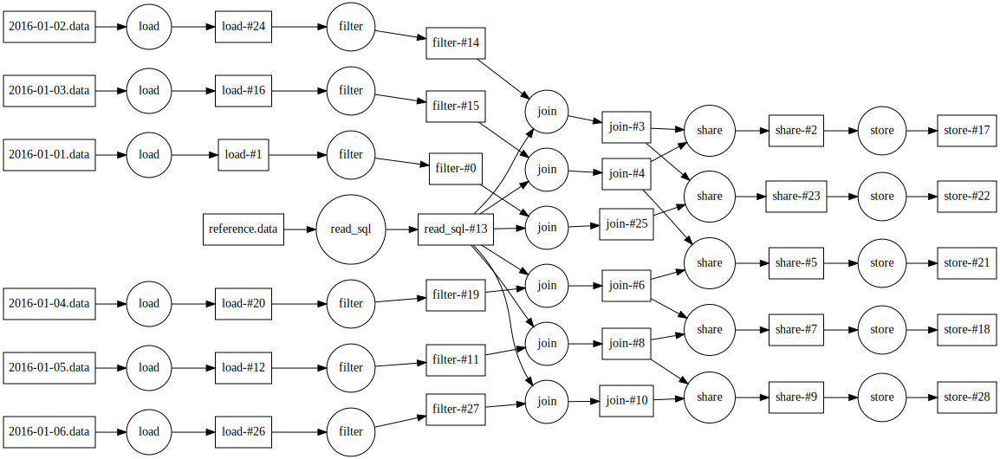
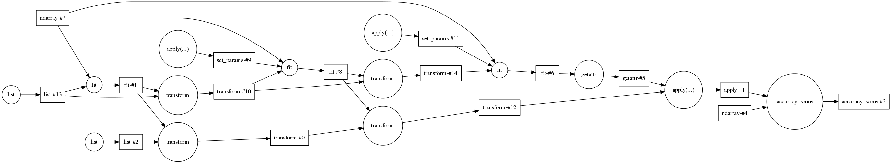
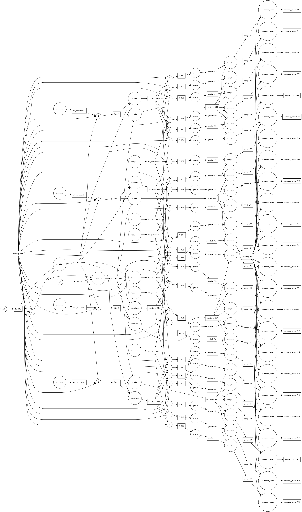

dask + distributed
------------------

*Matthew Rocklin*

Continuum Analytics

* .
    *  Task Scheduling (like Make/Luigi)
    *  Parallel Algorithms (for numpy/pandas/sklearn)
    *  Schedulers
    *  *Chat*
* .
    *  Distributed scheduling
    *  Novelty
    *  Future work
    *  *Chat*

### How do we extend the Numeric Python ecosystem

### to parallel and larger than memory execution?

### Task Scheduling

### Machine learning pipeline

### Machine learning pipeline + gridsearch

### Two problems

1.  How do users construct task graphs?
2.  How do computers execute task graphs?

### Task Scheduling

*  Supports complex algorithms
*  Widespread tools and intuition
    * Make
    * Luigi
*  But mostly known for high-latency bulk operations
*  Also proved out in new numeric libraries

### Algorithms

### or how do users make complex task graphs?

### Problem: Sum a trillion element array with your laptop

### Solution: Break array into small blocks. Use NumPy on each block.

### Blocked Algorithms for Data Science

    x = h5py.File('myfile.hdf5')['/x']          # Trillion element array on disk

    sums = []
    for i in range(1000000):                    # One million times
        chunk = x[1000000*i: 1000000*(i+1)]     # Pull out chunk
        sums.append(np.sum(chunk))              # Sum chunk

    total = sum(sums)                           # Sum intermediate sums

### Blocked algorithms for Data Science

Consider matrix multiply:

Blocked matrix algorithms look like their in-memory equivalents.

### Example use case: Meteorology

    >>> x.shape
    (1464, 721, 1440)
    >>> imshow(x[::4].mean(axis=0) - x[2::4].mean(axis=0), cmap='RdBu_r')

### Collections

Dask contains high-level interfaces that mimic successful PyData projects

*  NumPy: dask.array

        x.dot(y.T).mean(axis=0)

*  Python iterators: dask.bag

        b.map(json.loads).filter(lambda d: d['name'] == 'Alice').count()

*  Pandas: dask.dataframe

        df = dd.read_csv('data/2015-*-*.csv')
        df.groupby(df.timestamp.day).volume.mean()

*  Custom: dask.imperative

        [ ... for i in ... ]

*  ...

### Scheduling

### Two problems

1.  How do users construct task graphs?
2.  How do computers execute task graphs?

### Dask provides

1.  Parallel algorithms with data science APIs
2.  Task schedulers to execute those algorithms

### Scheduling Performance

1. Single Machine
    *  One millisecond overhead per task
    *  Parallel by threads or processes
    *  Aggressively remove intermediate results
2. Distributed Machine
    *  Workers communicate over sockets
    *  Central control, distributed load
    *  Data locality
    *  Resilient to worker failure
    *  Asynchronous and responsive API

### Distributed Scheduler

### Setup distributed locally

    $ pip install distributed
    $ dscheduler                    # terminal 1
    $ dworker 127.0.0.1:8786        # terminal 2
    $ dworker 127.0.0.1:8786        # terminal 3

    >>> from distributed import Executor
    >>> e = Executor('127.0.0.1:8786')
    >>> future = e.submit(lambda x: 2 * x, 10)
    >>> future.result()
    20

### Distributed Scheduler

*   **Event driven:** responds to and recovers from stimuli
*   **Centralized control:** sophisticated scheduler, dumb workers
*   **Low latency:** operations run in linear time, 1ms overhead
*   **Asynchronous:** user API rarely blocks
*   **Lightweight:** Very fast, very easy to setup

### Novel Strengths and Weaknesses

*  Novel Strengths
    *  **Lower level, modular:** Enables users to author complex algorithms
    *  **Snappy:** Reactive and low latency
    *  **Lightweight:** Trivial setup, scales up and down
    *  **PyData Synergy:** Python library, buy-in from key developers
*  Weaknesses
    *  **Lower level, modular:** Less integrated
    *  **New:** Lacks surrounding tooling, third-party blogposts, etc.
    *  **Hard to set expectations:** The Pandas legacy is difficult to fulfill

### Future plans

*  Immediate
    *  Introspection: web-UI, notebook widgets, etc.
    *  Deployment: Mesos/Yarn/SLURM/Torque
    *  Algorithms: GLM and optimization
*  Big ideas
    *  Multi-user collaboration
    *  Multi-language support
    *  Institutional scale deployment and 24/7 operation
    *  Application domains
