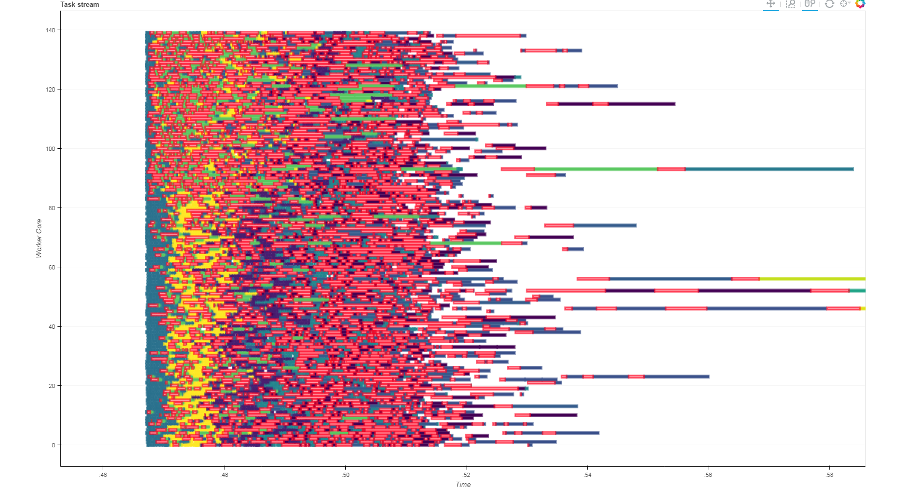

Visualizing Parallel Computations in Dask
-----------------------------------------

*Matthew Rocklin*

Continuum Analytics

### What to expect

* **Dask**: Distributed computing for Python
* **Diagnostics** for parallel computing
* **Bokeh**: Interactive visualizations
* **Jupyter Lab**: Interactive development environment

### Parallel algorithms and distributed performance is hard

### Visualization drives development and elevates conversation

### Dask

*   Parallel computing library for Python
*   Dynamic low-latency task scheduler
*   Parallel arrays, dataframes, etc. built on top
*   On a single machine, or a cluster
*   New, and growing rapidly
*   Complements **PyData** ecosystem (NumPy, Pandas, SKLearn)

### Notebook Demo

### Visualization builds intuition

### Image Pipeline at Brookhaven

*Credit: [Dan Allan](https://github.com/danielballan)*

*   **Visualization** ...

    *   Builds intuition around parallel algorithms
    *   Pleases users with feedback

*   **But distributed computing is more complex**

    *   Information scattered throughout the cluster
    *   Communication costs, serialization, disk reads, etc..
    *   Different workers with different data, load, and capabilities
    *   Asynchronous execution

### Example Plots

*   Resource load (CPU/Memory)
*   Network / Disk load, possibly between machines
*   Progress of tasks on the system
*   Distribution of tasks on the system
*   When every task finishes and on what machine
*   When errors happen and why
*   Backlog of tasks on every worker
*   Distribution of memory use by worker, by task, etc..
*   Addresses of workers, access to logs, etc..

*   **What Dask needed:**

    *   Customized / Bespoke Visuals
    *   Responsive real-time streaming updates
    *   Powerful client-side rendering (10k-100k elements)
    *   Easy to develop for non-web developers

*   **Bokeh**

    *   Python library for interactive visualizations on the web
    *   Use in a notebook, embed in static HTML, or use with Bokeh Server...  [example](http://bokeh.pydata.org/en/latest/docs/gallery/periodic.html)

*   **Bokeh Server**

    *   Bokeh Server maintains shared state between the Python server and web
        client

### Setup Data Source

    from bokeh.models import ColumnDataSource
    tasks = ColumnDataSource({'start': [], 'stop': [], 'color': [],
                              'worker': [], 'name': []})

### Construct Plot around Data Source

    from bokeh.plotting import figure
    plot = figure(title='Task Stream')
    plot.rect(source=tasks, x='start', y='stop', color='color', y='worker')
    plot.text(source=tasks, x='start', y='stop', text='name')

### Push to Data Source on Server

    while True:
        collect_diagnostics_data()
        tasks.update({'start': [...], 'stop': [...], 'color': [...],
                      'worker': [...], 'name': [...]})

.

About 700 lines of Python

### Cluster Demonstration

### Benefits

*   Users understand and optimize performance
*   Developers understand and optimize performance
*   Engages users (reduces anxiety)
*   Elevates conversation with developers
*   Extensible (few hours)

### User - Developer Communication

*   **Q**: *I tried to do ______ ______ ______ and it was slow.  Why?*
*   **A**: *I have no idea.*

### User - Developer Communication

*   **Q**: *I tried a groupby/aggregation with many groups and it was slow.
    Here is a picture:*

*   Communication heavy (lots of red)
*   Stragglers at the end of the computation (lots of white)
*   Thrashing communication on some nodes (upper left)

### Not Enough Screen Space

*   Jupyter Lab

    *  Interactive Development Environment
    *  Combines Notebook, Console, Editor, Plotting interface in one
    *  Also pluggable for extensions

*   JupyterLab + Dask + Bokeh

    *  Custom extension for Dask diagnostics
    *  Took about a week to learn and integrate
    *  Mostly cleaning up things in Bokeh
    *  Time to add new plots is now a few hours

*Credit: Work by [Luke Canavan](https://github.com/canavandl)*

### Final Thoughts

*   **Dask provides parallelism for Python**
    *   Parallel NumPy, Pandas, Scikit-Learn, etc. at scale
    *   Built on an computational task scheduler
*   **Visualization enhances computational systems**
    *   Builds intuition for parallel algorithms
    *   Comforts users with feedback
    *   Alerts developers to performance problems
    *   Elevates level of conversation

### Other talks about Dask

*   [SciPy - July, 2016](https://www.youtube.com/watch?v=PAGjm4BMKlk):

    Overview, custom algorithms, some machine learning

*   [PyData DC - October 2016](https://www.youtube.com/watch?v=EEfI-11itn0):

    Fine-grained parallelism, scheduling motivation and heuristics

*   Plotcon - November, 2016:

    Visualization of distributed systems

*I recently tweeted these slides under [@mrocklin](https://twitter.com/mrocklin)*

### Acknowledgements

*   Bokeh: [bokeh.pydata.org](http://bokeh.pydata.org/en/latest/)
*   JupyterLab: [github.com/jupyterlab](https://github.com/jupyterlab/jupyterlab)
*   Dask: [dask.pydata.org](http://dask.pydata.org/en/latest/)

### Questions?

