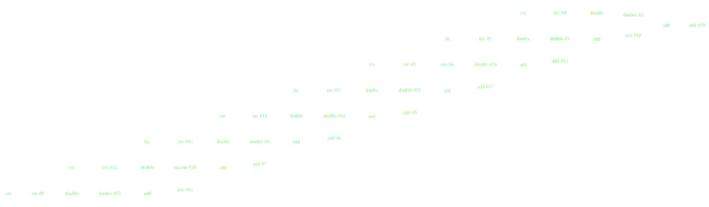
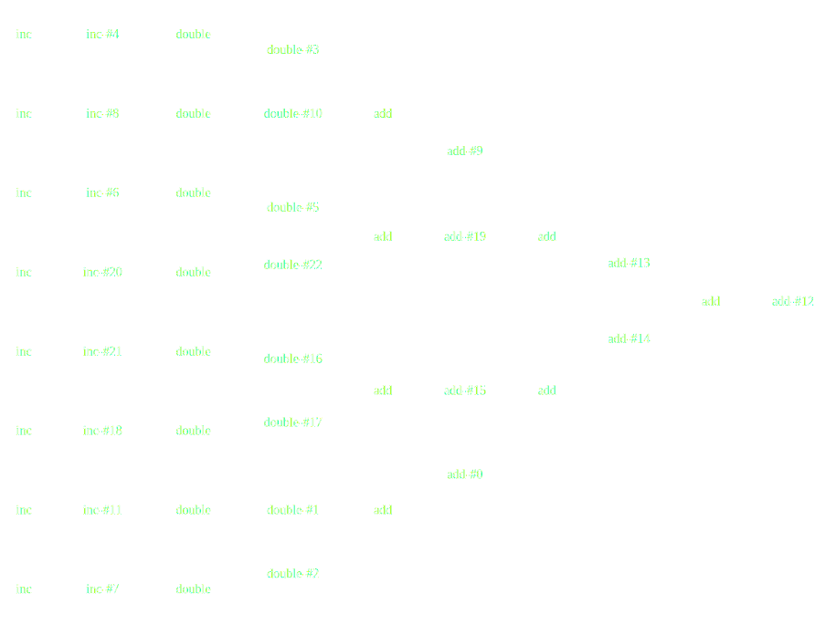

Visualizing Parallel Computations in Dask
-----------------------------------------

*Matthew Rocklin*

Continuum Analytics

### Disclaimer:  I know very little about visualization

### Parallel algorithms and distributed optimization is hard

### Visualization drives development and elevates conversation

*  **PyData**

    *  Fast and intuitive libraries like NumPy, Pandas, and Scikit-Learn
    *  Running at near-optimal machine performance
    *  On a single core and in RAM

*  **Dask**

    *  Parallel and distributed computing library
    *  Complements existing PyData ecosystem
    *  Acheives performance through flexible algorithms and smart scheduling

*   **Visualization/interaction tools today**

    *   Graphviz / Text
    *   Bokeh Server
    *   Jupyter Lab

### Notebook Demo

### Visualization builds intuition

### Visualization builds intuition

### Image Pipeline at Brookhaven

*Credit: [Dan Allan](https://github.com/danielballan)*

*   **Visualization** ...

    *   Builds intuition around parallel algorithms
    *   Relaxes user anxiety with feedback

*   **But distributed computing is more complex**

    *   Information scattered throughout the cluster
    *   Communication costs, serialization, disk reads, etc..
    *   Different workers with different data, load, and capabilities
    *   Asynchronous execution

*   **What Dask needed:**

    *   Customized / Bespoke Visuals
    *   Responsive real-time streaming updates
    *   Powerful client-side rendering (10-100,000 rectangles)
    *   Easy to develop for non-web developers

*   **Bokeh**

    *   *Bokeh is a Python interactive visualization library that targets modern web browsers*
    *   Use in a notebook, embed in static HTML, or use with Bokeh Server...

*   **Bokeh Server**

    *   Bokeh Server maintains shared state between the Python server and web
        client

### Data Setup

    from bokeh.models import ColumnDataSource
    tasks = ColumnDataSource({'start': [], 'stop': [], 'color': [],
                              'core-id': [], 'name': []})

### Translate Data to Plot

    from bokeh.plotting import figure
    plot = figure(title='Task Stream')
    plot.rect(source=tasks, x='start', y='stop', color='color', y='core-id')
    plot.text(source=tasks, x='start', y='stop', text='name')

### Update on Server

    while True:
        collect_data()
        tasks.update({'start': [...], 'stop': [...], 'color': [...],
                      'core-id': [...], 'name': [...]})

.

About 700 lines of Python code

*   Jupyter Lab

    *  Interactive Development Environment
    *  Combines Notebook, Console, Editor, Plotting interface in one
    *  Also pluggable for extensions

*   JupyterLab + Dask + Bokeh

    *  Custom extension for Dask diagnostics
    *  Took about a week to learn and integrate
    *  Mostly cleaning up things in Bokeh
    *  Time to add new plots is now a few hours

*Credit: Work by [Luke Canavan](https://github.com/canavandl)*

### Final Thoughts

*   **Dask provides parallelism for Python**
    *   Parallel NumPy, Pandas, Scikit-Learn, etc. at scale
    *   Built on an computational task scheduler
*   **Visualization enhances larger computational systems**
    *   Builds intuition for parallel algorithms
    *   Comforts users with feedback
    *   Alerts developers to performance problems
    *   Elevates level of conversation

### Other talks about Dask

*   [SciPy - July, 2016](https://www.youtube.com/watch?v=PAGjm4BMKlk):

    Overview, custom algorithms, some machine learning

*   [PyData DC - October 2016](https://www.youtube.com/watch?v=EEfI-11itn0):

    Fine-grained parallelism, scheduling motivation and heuristics

*   Plotcon - November, 2016:

    Visualization of distributed systems

*I recently tweeted these slides under [@mrocklin](https://twitter.com/mrocklin)*

### Acknowledgements

*   Bokeh: [bokeh.pydata.org](http://bokeh.pydata.org/en/latest/)
*   JupyterLab: [github.com/jupyterlab](https://github.com/jupyterlab/jupyterlab)
*   Dask: [dask.pydata.org](http://dask.pydata.org/en/latest/)

### Questions?

### Algorithm flexibility

### Map/Shuffle/Reduce (Hadoop/Spark)

<table>
<tr>
  <td>
    
  </td>
  <td>
    
  </td>
  <td>
    
  </td>
</tr>
</table>

#### Dask

