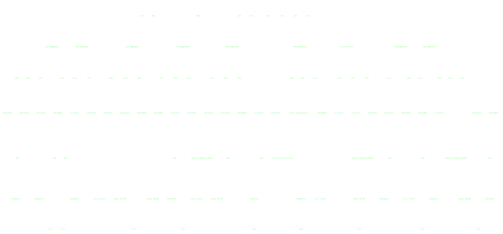

Dask: Parallel Programming in Python
------------------------------------

*Matthew Rocklin*

Continuum Analytics

### We have a strong analytics ecosystem (numpy, pandas)

### that is mostly restricted to a single core and RAM

### How do we scale an ecosystem?

### With thousands of packages, and custom algorithms

### High quality and useful algorithms (e.g. scikit-image)

    skimage.feature.canny(im, sigma=3)

### Broad coverage in niche corners (e.g. scikit-allel)

*Example taken from scikit-allel webpage*

### In this talk we build a distributed system for Python

### Using existing libraries

Outline
-------

-  **Parallel Algorithms**: Examples of array algorithms
-  **Survey of Systems**: Look at Spark, Airflow, etc..
-  **Internals**: How Dask works
-  **Ecosystem**: Python's strengths and weaknesses for parallelism

But first, some flashy examples...

### Dask enables parallel Python

### ... originally designed to parallelize NumPy and Pandas

### ... but also used today for arbitrary computations

### Dask.array

    # NumPy code
    import numpy as np
    x = np.random.random((1000, 1000))
    u, s, v = np.linalg.svd(x.dot(x.T))

    # Dask.array code
    import dask.array as da
    x = da.random.random((100000, 100000), chunks=(1000, 1000))
    u, s, v = da.linalg.svd(x.dot(x.T))

### Dask.DataFrame

    import pandas as pd
    df = pd.read_csv('myfile.csv', parse_dates=['timestamp'])
    df.groupby(df.timestamp.dt.hour).value.mean()

    import dask.dataframe as dd
    df = dd.read_csv('hdfs://myfiles.*.csv', parse_dates=['timestamp'])
    df.groupby(df.timestamp.dt.hour).value.mean()

### Fine Grained Python Code

    .

    results = {}

    for a in A:
        for b in B:
            if a < b:
                results[a, b] = f(a, b)
            else:
                results[a, b] = g(a, b)

    .

### Fine Grained Python Code

    from dask import delayed, compute

    results = {}

    for a in A:
        for b in B:
            if a < b:
                results[a, b] = delayed(f)(a, b)  # lazily construct graph
            else:
                results[a, b] = delayed(g)(a, b)  # without structure

    results = compute(results)  # trigger all computation

### Fine Grained Python Code

    e = concurrent.futures.ThreadPoolExecutor()

    results = {}

    for a in A:
        for b in B:
            if a < b:
                results[a, b] = e.submit(f, a, b)  # submit work asynchronously
            else:
                results[a, b] = e.submit(g, a, b)  # submit work asynchronously

    results = {k: v.result() for k, v in results.items()} # block until finished

### Dask APIs Produce Task Graphs

### Dask Schedulers Execute Task Graphs

### 1D-Array

    >>> np.ones((15,))
    array([ 1., 1., 1., 1., 1., 1., 1., 1., 1., 1., 1., 1., 1., 1., 1.])

    >>> x = da.ones((15,), chunks=(5,))

### 1D-Array

    x = da.ones((15,), chunks=(5,))
    x.sum()

### ND-Array - Sum

    x = da.ones((15, 15), chunks=(5, 5))
    x.sum(axis=0)

### ND-Array - Transpose

    x = da.ones((15, 15), chunks=(5, 5))
    x + x.T

### ND-Array - Matrix Multiply

    x = da.ones((15, 15), chunks=(5, 5))
    x.dot(x.T + 1)

### ND-Array - Compound Operations

    x = da.ones((15, 15), chunks=(5, 5))
    x.dot(x.T + 1) - x.mean()

### ND-Array - Compound Operations

    import dask.array as da
    x = da.ones((15, 15), chunks=(5, 5))
    y = (x.dot(x.T + 1) - x.mean()).std()

### Dask.array/dataframe/delayed author task graphs

### Now we need to run them efficiently

### Dask.array/dataframe/delayed author task graphs

### Now we need to run them efficiently

### Dask APIs Produce Task Graphs

### Dask Schedulers Execute Task Graphs

### Parallel Python Computing Options

-  Embarrassingly parallel systems (multiprocessing, joblib)
-  Big Data collections (MapReduce, Spark)
-  Task schedulers (Airflow, Luigi, Celery)

### Embarrassingly parallel systems

    # Sequential Code
    data = [...]
    output = map(func, data)

    # Parallel Code
    from multiprocessing import Pool
    pool = Pool()

    output = pool.map(func, data)

-   Pros
    -   Easy to install and use in the common case
    -   Lightweight dependency
-   Cons
    -  Data interchange cost
    -  Not able to handle complex computations

### Big Data collections

    from pyspark import SparkContext
    sc = SparkContext('local[4]')

    rdd = sc.parallelize(data)
    rdd.groupBy(keyFunc).count()

    df = spark.read_json(...)
    df.groupBy('name').aggregate({'value': 'sum'})

-   Pros
    -   More complex set of operations
    -   Scales nicely
    -   Well trusted by enterprise
-   Cons
    -  Heavyweight and JVM focused
    -  Not able to handle complex computations

### This is what I mean by complex

### Spark does the following well

<table>
<tr>
  <td>
    
  </td>
  <td>
    
  </td>
  <td>
    
  </td>
</tr>
</table>

### Task Schedulers (Airflow, Luigi, Celery, ...)

-  Pros
    -  Handle arbitrarily complex task graphs
    -  Python Native
-  Cons
    -  No inter-worker storage or data interchange
    -  Long latencies (relatively)
    -  Not designed for computational loads

### Want a task scheduler (like Airflow, Luigi)

### Built for scaling computational loads (like Spark, Flink)

## Dask's Schedulers

-  Dynamic task scheduler with data dependencies
-  Handles data locality, resilience, work stealing, etc..
-  With 10ms roundtrip latencies and 200us overheads
-  Native Python library and APIs
-  Lightweight and well supported

### Dask supports Pythonic APIs

-  NumPy/Pandas/SKLearn protocols and APIs
-  PEP 3148 concurrent.futures
-  async/await
-  Joblib

### Dask is lightweight

-  Single-machine scheduler runs on stdlib only
-  Distributed scheduler is a Tornado TCP application
-  Pure Python 2.7+ or 3.4+

### Single Machine Scheduler

Optimized for larger-than-memory use.

*   **Parallel CPU**: Uses multiple threads or processes
*   **Minimizes RAM**: Choose tasks to remove intermediates
*   **Low overhead:** ~100us per task
*   **Concise**: ~1000 LOC
*   **Real world workloads**: Under heavy load by many different projects

### Distributed Scheduler

*   **Distributed**: One scheduler coordinates many workers
*   **Data local**: Moves computation to correct worker
*   **Asynchronous**: Continuous non-blocking conversation
*   **Multi-user**: Several users share the same system
*   **HDFS Aware**: Works well with HDFS, S3, YARN, etc..
*   **Solidly supports**: dask.array, dask.dataframe, dask.bag, dask.delayed,
    concurrent.futures, ...
*   **Less Concise**: ~5000 LOC Tornado TCP application

    All of the logic is hackable Python, separate from Tornado

### Distributed Network

### Distributed Network

Or use it on your laptop

    $ pip/conda install dask distributed

Set up locally

    from dask.distributed import Client
    client = Client()  # set up local scheduler and workers

Lightweight

    In [3]: %time client = Client(processes=False)  # use local threads
    CPU times: user 44 ms, sys: 0 ns, total: 44 ms
    Wall time: 43.6 ms

### Distributed Scheduler

### Distributed Scheduler

### Distributed Scheduler

### Distributed Scheduler

### Distributed Scheduler

### Distributed Scheduler

### Distributed Scheduler

### Distributed Scheduler

### Distributed Scheduler

### Distributed Scheduler

### Distributed Scheduler

### Distributed Scheduler

### Distributed Scheduler

### Distributed Scheduler

### Distributed Scheduler

### High level overview

-  Dask is a **low level** task scheduler
    -  Determines when and where to call Python functions
    -  Works with any Python functions on any Python objects
    -  Handles data dependencies, locality, data movement, etc..
-  **High level** APIs built on top
    -  Dask.array = dask + numpy
    -  Dask.dataframe = dask + pandas
    -  Machine learning, lists, real time, and others
    -  Maybe good for your work as well?

## Ecosystem

### The Python ecosystem is ideal for parallel computation

### Combines strong analytics with strong networking

### Python's Strengths and Weaknesses

*From a parallel data analytics point of view*

-  **Strengths**
    -  Strong algorithmic tradition
    -  Battle hardened C/Fortran/LLVM/CUDA codes
    -  Strong and active networking and concurrency stack
    -  Standard language in research groups, teaching, etc.
-  **Weaknesses**
    -  Slow?  Interpreted
    -  GIL (fixed in numeric ecosystem)
    -  Packaging (fixed by better pip, conda, docker)
    -  Lack of a distributed computing ecosystem

### Global Interpreter Lock

-   Stops two Python threads from running Python code at the same time
-   Numeric libraries don't call Python code.

    They call C/Fortran/LLVM/CUDA.
-   *The GIL is not a problem for the numeric Python ecosystem*

### Packaging / Deployment

-   Python packaging is better than it used to be.
    -  Pip improvements and Wheels
    -  Conda binaries and environments, dependency resolution
-   Containers becoming standard in deployment.  Also driven by Node, Go, etc.
-   Deployment solutions increasingly not tied to computational systems

    Can leverage existing work with Yarn, Mesos, Kubernetes, etc..

### Strong Algorithmic Tradition

-   High quality and useful algorithms (scikit-image)

        skimage.feature.canny(im, sigma=3)

-   Broad coverage throughout science (scikit-allel) (genetics)

*Example taken from scikit-allel webpage*

### Battle hardened C/Fortran/LLVM/CUDA codes

    In [1]: import numpy as np

    In [2]: x = np.random.random((1000, 1000))

    In [3]: %time _ = x.dot(x)  # roughly a billion calculations
    CPU times: user 76 ms, sys: 0 ns, total: 76 ms
    Wall time: 76.9 ms

    In [4]: %time _ = x.dot(x.T)
    CPU times: user 36 ms, sys: 4 ms, total: 40 ms
    Wall time: 36.9 ms

    In [5]: %time for i in range(1000000000): 1.0 * 2.3
    CPU times: user 37.5 s, sys: 4 ms, total: 37.5 s
    Wall time: 37.7 s

For numeric computations, Python libraries run at bare-metal speeds

### Strong networking and concurrency stack

-  Sensible concurrency model

        @tornado.gen.coroutine
        def execute_task(self, task):
            data = yield gather_data_from_peers(dependencies[task])
            result = yield executor.submit(run, task, data)  # run on thread
            yield self.report_to_scheduler({'operation': 'task-complete',
                                            'task': task})

-  Performance oriented

    

    *From:
    [https://magic.io/blog/uvloop-blazing-fast-python-networking/](https://magic.io/blog/uvloop-blazing-fast-python-networking/)*

### Strong networking and concurrency stack

-  Sensible concurrency model

        .
        async def execute_task(self, task):
            data = await gather_data_from_peers(dependencies[task])
            result = await executor.submit(run, task, data)  # run on thread
            await self.report_to_scheduler({'operation': 'task-complete',
                                            'task': task})

-  Performance oriented

    

    *From:
    [https://magic.io/blog/uvloop-blazing-fast-python-networking/](https://magic.io/blog/uvloop-blazing-fast-python-networking/)*

### Python has an excellent analytics stack and community

### Python has an excellent networking stack and community

### Dask can be small and lightweight

### Most of the hard problems were already solved

## Engagement

-  Developers
    -  ~150 contributors total (counting all subprojects)
    -  ~10 part time developers, about half at Continuum
    -  Core developers from Pandas, NumPy, SKLearn, Jupyter, ...
-  Funding agencies
    -  Government (DAPRA, NASA, Army Engineers, UK Met, ...)
    -  Moore Foundation Data Driven Discovery
    -  Companies who fund directly (largely finance)
    -  Institutions who use and contribute code/bug reports (maybe yours?)
    -  Continuum Analytics
    -  Strong developer community (maybe you?)

### Final Slide.  Questions?

-  Dask is designed to scale the existing ecosystem
-  Dask integrates existing libraries and APIs to do this cheaply
-  Docs: [dask.pydata.org](https://dask.pydata.org/en/latest/) --
   Github: [github.com/dask](https://github.com/dask)
-  You can set it up right now during questions:

        $ pip/conda install dask distributed
        $ ipython

        >>> from dask.distributed import Client
        >>> client = Client()  # starts a "cluster" on your laptop

        >>> futures = client.map(lambda x: x + 1, range(1000))
        >>> total = client.submit(sum, futures)
        >>> total.result()

