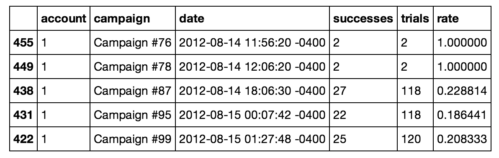
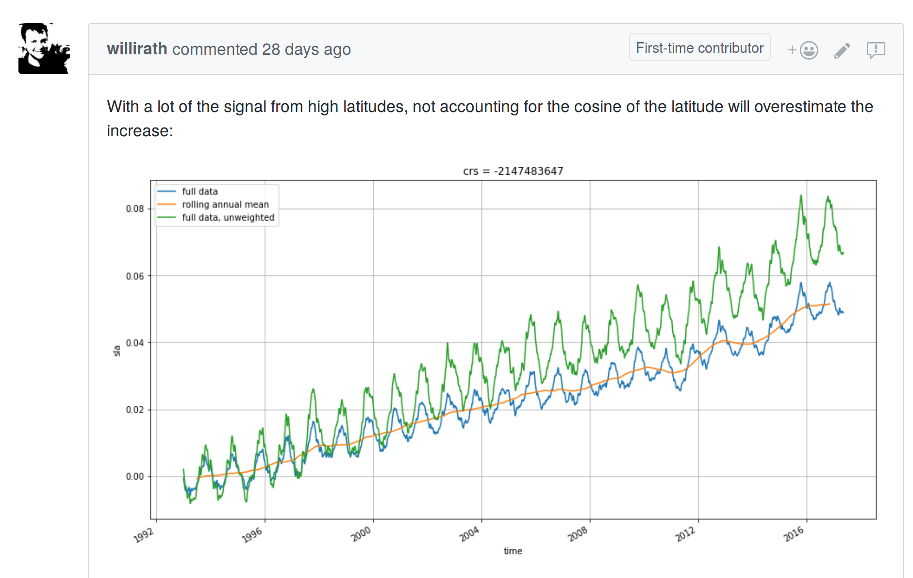
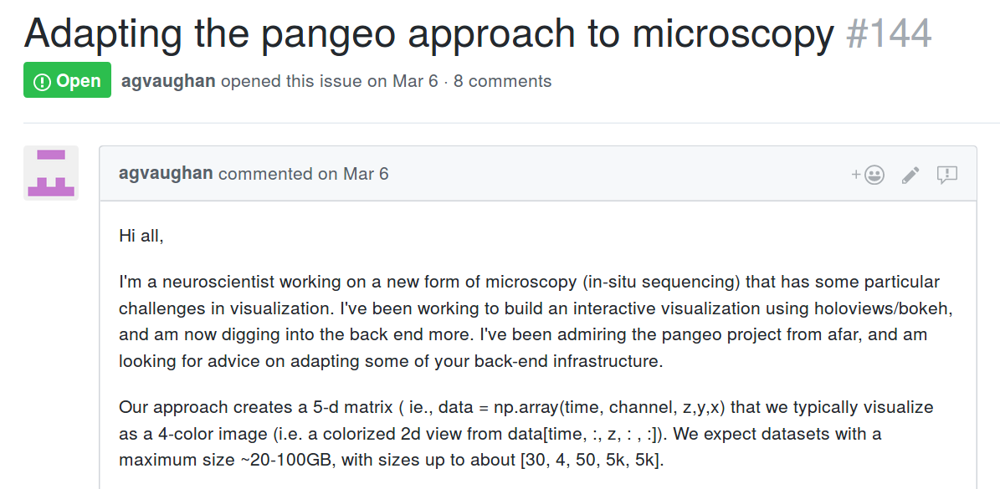
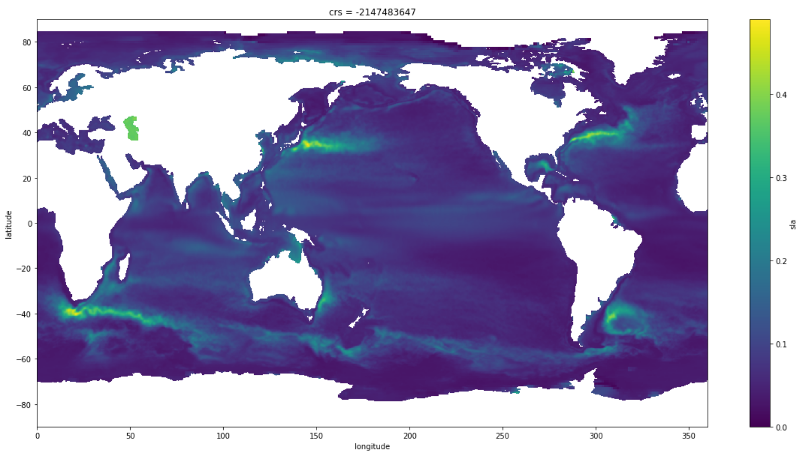

Enabling Climate Science at Scale
---------------------------------


*Matthew Rocklin*

Anaconda Inc.


### This talk is about using Python tools

<hr>

### To do atmospheric and oceanographic science

<hr>

### Goals

1.  Provide context for how atmospheric scientists use Python
2.  Inform other scientific domains about specific tools
3.  Encourage the non-science Python community to help

    (Science needs non-science skills!)

4.  Also learn a little bit about the Earth's oceans


### We Measure the Earth


### We Measure the Earth

1.  Satellite imagery
    -  Cameras in space
    -  Other things in space (radio, lidar, ...)
2.  ...
3.  Simulations
    -  Mathematical models
    -  High performance super-computers
    -  Simulate the world in-silico


### First we Measure the Earth

<hr>

### Then scientists then analyze this data with Python


### Demonstration Analysis

### Measure sea surface temperature


### We just used these tools

-  **Jupyter Notebook**: Interact with Python through a web browser
-  **NetCDF / XArray**: Store and compute on collections of multi-dimensional arrays
-  **Numpy + Pandas**: Efficiently perform actual computations
-  **Matplotlib**: Visualize results

*This works pretty well up to 100GB or so on personal computers*


### Jupyter Notebooks

-  Code interactively

    Need to iterate quickly.  Scientists don't know what they're looking for
-  Integrate many kinds of content:
    -  Code and results
    -  Markdown prose
    -  Output images

    Transitions smoothly from workspace to reproducible report
-  Runs in a web browser


### Jupyter Notebooks

-  Code interactively

    Need to iterate quickly.  Scientists don't know what they're looking for
-  Integrate many kinds of content:
    -  Code and results
    -  Markdown prose
    -  Output images

    Transitions smoothly from workspace to reproducible report
-  Runs in a web browser (this will be key later)


### NetCDF / XArray, related grids of data


```python
# xarray style
>>> ds.sel(time='2018-01-08').max(dim='ensemble')

# numpy Style
>>> array[[0, 1, 2, 3], :, :].max(axis=2)
```

Uses Numpy and Pandas internally for computation


### Numpy


-  Restricted to gridded homogenously typed data
-  Gives the speed of C/Fortran
-  With all the friendliness of Python
-  And without all the for-loops


### Compare against Pandas Dataframe



A linear sequence of records, like SQL, MongoDB, ...

Not efficient for gridded data


### These tools allow scientists to rapidly analyze critical data

<hr>

### Leading to faster insight with less effort


Challenges
----------

1.  Data Scale
    -  NASA plans to dump 100's of petabytes of images onto the cloud
    -  Simulations dump petabytes on every run
2.  Human Scale
    -  More researchers are adopting these techniques across domains
    -  Average technical proficiency is *decreasing*
    -  They aren't taught to manage parallel and distributed systems


Scalable Demo
-------------

<iframe width="560" height="315"
src="https://www.youtube.com/embed/rSOJKbfNBNk?ecver=1" frameborder="0"
gesture="media" allow="encrypted-media" allowfullscreen></iframe>


### You can do this too

<hr>

### Visit [pangeo.pydata.org](http://pangeo.pydata.org)


### New tools we just used

1.  **JupyterLab**: Notebook, and editor, and file browser, and terminal, and ...
2.  **JupyterHub**: Provide Jupyter Server, authenticate, manage users
3.  **Dask**: Scale XArray/Numpy/Pandas computations across a cluster
4.  **Kubernetes**: Manage and provide machines


### 1: JupyterLab

-  "The next iteration of the Jupyter Notebook"
-  ... with a file browser
-  ... and a text editor
-  ... and a terminal
-  ... and maps and more (fully extensible)

This environment is critical when running on a remote system


### 2: JupyterHub

*Slides from Carol Willing*


-  Library for parallel programming
-  Designed to scale data libraries like Numpy, Pandas, Scikit-Learn
-  Native Python library respecting Python protocols
-  We use a subproject, dask.array


### Dask.array coordiantes many Numpy arrays


### Operations create graphs of many Numpy functions


See [PyCon 2017 talk](https://youtu.be/RA_2qdipVng)


### Dask.array coordiantes many Numpy arrays


### Dask executes those graphs on parallel hardware


See [PyCon 2017 talk](https://youtu.be/RA_2qdipVng)


### 4: Kubernetes manages resources for distributed systems

### Like JupyterHub and Dask


### JupyterHub and Dask on Kubernetes

User connects to JupyterHub


### JupyterHub and Dask on Kubernetes

JupyterHub launches notebook environment for User


### JupyterHub and Dask on Kubernetes

User launches Dask from cloud environment


### JupyterHub and Dask on Kubernetes

Second user arrives and connects to JupyterHub


### JupyterHub and Dask on Kubernetes

JupyterHub launches second isolated cloud environment


### JupyterHub and Dask on Kubernetes

Cluster scales out to accomodate new user


### JupyterHub and Dask on Kubernetes

New user also launches Dask


### JupyterHub and Dask on Kubernetes

First user goes home for the day


### JupyterHub and Dask on Kubernetes

User's cloud environment retires


### JupyterHub and Dask on Kubernetes

Cluster scales down to reduce costs


### We've run this service continuously for a few months

1.  Science users can scale up to 1000-core clusters
2.  It has been pretty cheap so far (~$1000)
3.  No dedicated support staff


### Community

-  This started with an NSF grant for three institutions
    1.  Columbia University
    2.  National Center of Atmospheric Research (NCAR)
    3.  Anaconda Inc.
-  Rapidly expanded to other agencies
    -  UK Met Office
    -  USGS
    -  NASA
    -  Several universities and international agencies
    -  ...


### Success!

<hr>

### People regularly log in analyze terabyte datasets

### Including non-experts


### Success!

<hr>

### People discuss science, without discussing scale




### Success!

<hr>

### No full-time staff to monitor and maintain cluster

### Thanks JupyterHub and Kubernetes


### Success!

<hr>

### Transfer impact to other domains!




### Challenges Today

1.  Too many scientists, not enough technical diversity
2.  Cloud native data storage formats for multi-dimensional arrays
3.  Manage software environments between different research groups
4.  Increasing impact across scientific domains


### Questions?



### Participate

Issue Tracker: [github.com/pangeo-data/pangeo](https://github.com/pangeo-data/pangeo)
