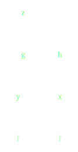
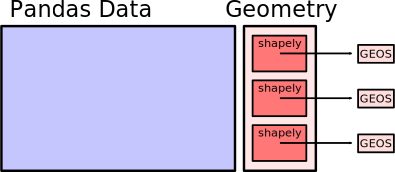
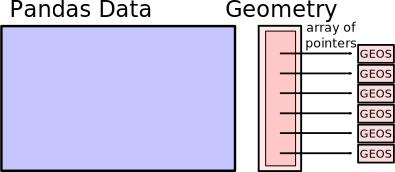
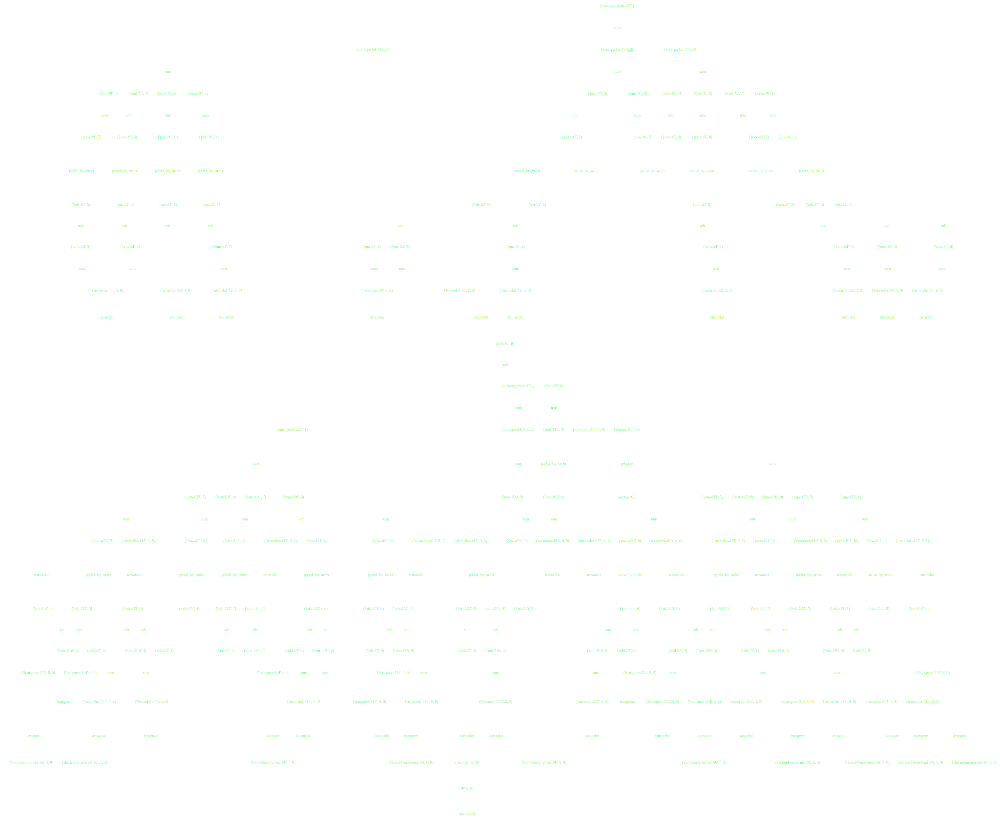
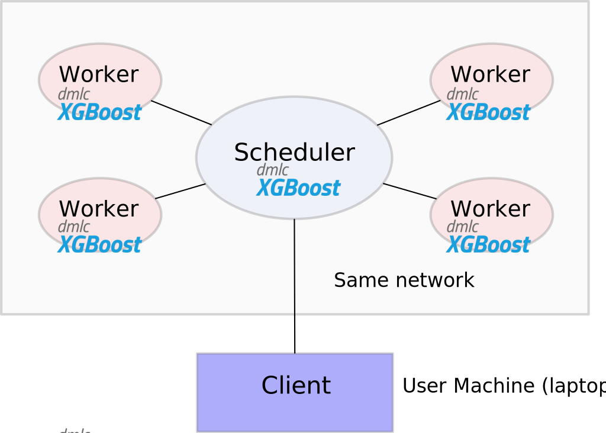
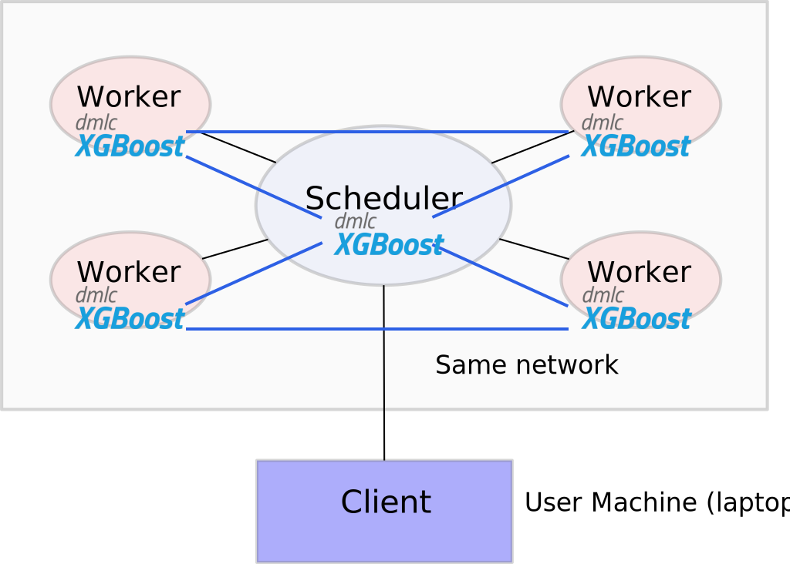
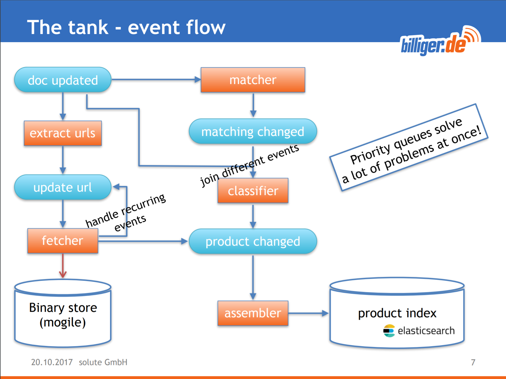

Parallelism in Python, and Dask
-------------------------------


*Matthew Rocklin*

Anaconda Inc.


### Python has a mature analytics stack (Numpy, Pandas, ...)

<hr>

### Restricted to in-memory and single-core processing

### How do we parallelize an ecosystem?


### TODO: add Jake's scipy stack slide


### Parallel programming paradigms in Python

-  **Embarrassingly parallel:** multiprocessing, joblib
-  **Big Data collections:** MapReduce, Flink, Spark, SQL
-  **Task schedulers:**  Airflow, Luigi, Make
-  ... many more paradigms


### map

```python
# Sequential
output = []
for x in data:
    y = func(x)
    output.append(y)

# Sequential
output = map(func, data)

# Parallel
import multiprocessing
pool = multiprocessing.Pool()

output = pool.map(func, data)
```

-  Apply a function in parallel across a list
-  Simple to use, solves the common case


### Big Data collections

    # RDDs
    from pyspark import SparkContext
    sc = SparkContext('...')

    rdd = sc.parallelize(data)
    rdd.map(json.loads).filter(...).groupBy(...).count()

    # DataFrames
    from pyspark.sql import SparkSession
    spark = SparkSession.builder.master(...).getOrCreate()

    df = spark.read_json(...)
    df.groupBy('name').aggregate({'value': 'sum'})

-  Provide high-level set of operations
    -  **Spark** -- `map, filter, groupby, join`
    -  **SQL** -- `SELECT * FROM table WHERE x > 0`
    -  **Linear Algebra** --  `X'*X\y`

-  Manages parallelism for you
-  Scales to a cluster


### Task Schedulers (Airflow, Luigi, Celery, ...)

-  Define a graph of Python functions
-  With data dependencies between them
-  Task scheduler runs functions on parallel hardware




### Task Schedulers (Airflow, Luigi, Celery, ...)

-  Define a graph of Python functions
-  With data dependencies between them
-  Task scheduler runs functions on parallel hardware


-  **Multiprocessing**
    -   *Pro*: Easy to install and use in the common case

        *Pro*: Lightweight dependency
    -   *Con*: Data interchange cost

        *Con*: Not able to handle dependencies


-  **Spark**
    -   *Pro*: Larger set of operations (map, groupby, join, ...)

        *Pro*: Scales nicely on clusters

        *Pro*: Mature and well trusted by enterprise
    -   *Con*: Heavyweight

        *Con*: JVM focused (debugging, performance costs, ...)

        *Con*: Not able to handle complex computations


### This is what I mean by complex


```python
(x.dot(x.T + 1) - x.mean()).std()
```

### Spark does the following well

<table width="100%">
<tr>
  <td>
    
  </td>
  <td>
    
  </td>
  <td>
    
  </td>
</tr>
</table>


-  **Airflow/Celery**:
    -  *Pros*
        -  Handle arbitrarily complex task graphs
        -  Python Native
    -  *Cons*
        -  No inter-worker storage or data interchange
        -  Long latencies (relatively)
        -  Not designed for computational loads
        -  Not designed for user interaction


### Multiprocessing

```python
pool = multiprocessing.Pool()
output = pool.map(func, data)  # Parallel
```

### Concurrent.futures (simple)

```python
from concurrent.futures import ThreadPoolExecutor

executor = ThreadPoolExecutor()
output = executor.map(func, data)  # Parallel
```


### Concurrent.futures (complex)

    .
    .
    .
    results = []
    for x in L1:
        for y in L2:
            if x < y:
                z = f(x, y)
            else:
                z = g(x, y)
            results.append(z)

    .

-  Futures provide complete flexibility in parallel execution
-  Common API implemented across many implementations

.

.


### Concurrent.futures (complex)

    from concurrent.futures import ThreadPoolExecutor
    executor = ThreadPoolExecutor(8)
    .
    futures = []
    for x in L1:
        for y in L2:
            if x < y:
                future = executor.submit(f, x, y)
            else:
                future = executor.submit(g, x, y)
            futures.append(z)

    results = [future.result() for future in futures]

-  Futures provide complete flexibility in parallel execution
-  Common API implemented across many implementations

.

.


### Concurrent.futures (complex)

    from concurrent.futures import ProcessPoolExecutor
    executor = ProcessPoolExecutor(8)
    .
    futures = []
    for x in L1:
        for y in L2:
            if x < y:
                future = executor.submit(f, x, y)
            else:
                future = executor.submit(g, x, y)
            futures.append(z)

    results = [future.result() for future in futures]

-  Futures provide complete flexibility in parallel execution
-  Common API implemented across many implementations

.

.


### Concurrent.futures (complex)

    from concurrent.futures import ProcessPoolExecutor
    executor = ProcessPoolExecutor(8)
    .
    futures = []
    for x in L1:
        for y in L2:
            if x < y:
                future = executor.submit(f, x, y)
            else:
                future = executor.submit(g, x, y)
            futures.append(z)

    results = [future.result() for future in futures]

-   Pros
    -  Flexible for complex situations
    -  Lightweight (in standard library)
    -  Mulitple implementations (threads, processes, ...)
-   Cons
    -  Does not scale


### To parallelize the PyData Stack we want the following

-  Lightweight dependence of multiprocessing
-  Scalability of Spark/Flink/Databases
-  Airflow/Celery's complex dependency handling


-  Designed to parallelize the Python ecosystem
    -  Flexible task scheduler
    -  Familiar APIs for Python users
    -  Co-developed with Pandas/SKLearn/Jupyter teams
-  Scales
    -  From multicore laptops to 1000-node clusters
    -  Resilient, responsive, and real-time


-  Kind of like Airflow/Celery
-  But designed for efficient computation
-  With nice APIs (like Pandas) on top

.

.

.


-  High level: Scalable versions of ...
    -  Numpy
    -  Pandas
    -  Scikit-learn
    -  Concurrent.futures
    -  ...
-  Low Level:
    -  Executes many Python functions in parallel
    -  Tracks dependencies between functions
    -  Handles data movement, worker failure, ...


### Task Graphs


```python
x = f(1)
y = f(2)
z = g(x, y)
_ = h(x)
```


### Task Graphs: SVD


```python
u, s, v = svd(x)
```


### Task Graphs: Pipelined Grid Search


```python
pipe = Pipeline(steps=[('pca', PCA()),
                       ...,
                       ('logistic', LogisticRegression)])
grid = GridSearchCV(pipe, parameter_grid)
```


### Task Graphs: Pipelined Grid Search


```python
pipe = Pipeline(steps=[('pca', PCA()),
                       ...,
                       ('logistic', LogisticRegression)])
grid = GridSearchCV(pipe, parameter_grid)
```


### Example with concurrent.futures


### We build high-level libraries on top

-   Dask.array = Dask + NumPy
-   Dask.dataframe = Dask + Pandas
-   ... (you can build your own)


### Dask.array


    import numpy as np
    x = np.random.random(...)
    u, s, v = np.linalg.svd(x.dot(x.T))

    import dask.array as da
    x = da.random.random(..., chunks=(1000, 1000))
    u, s, v = da.linalg.svd(x.dot(x.T))


### Dask.DataFrame


    import pandas as pd
    df = pd.read_csv('myfile.csv', parse_dates=['timestamp'])
    df.groupby(df.timestamp.dt.hour).value.mean()

    import dask.dataframe as dd
    df = dd.read_csv('hdfs://myfiles.*.csv', parse_dates=['timestamp'])
    df.groupby(df.timestamp.dt.hour).value.mean()


### 1D-Array


    >>> x = np.ones((15,))
    >>> x
    array([ 1., 1., 1., 1., 1., 1., 1., 1., 1., 1., 1., 1., 1., 1., 1.])

    >>> x = da.ones((15,), chunks=(5,))
    dask.array<ones, shape=(15,), dtype=float64, chunksize=(5,)>


### 1D-Array


    x = da.ones((15,), chunks=(5,))
    x.sum()


### ND-Array - Sum


    x = da.ones((15, 15), chunks=(5, 5))
    x.sum(axis=0)


### ND-Array - Transpose


    x = da.ones((15, 15), chunks=(5, 5))
    x + x.T


### ND-Array - Matrix Multiply


    x = da.ones((15, 15), chunks=(5, 5))
    x.dot(x.T + 1)


### ND-Array - Compound Operations


    x = da.ones((15, 15), chunks=(5, 5))
    x.dot(x.T + 1) - x.mean()


### ND-Array - Compound Operations


    import dask.array as da
    x = da.ones((15, 15), chunks=(5, 5))
    y = (x.dot(x.T + 1) - x.mean()).std()


### Example with dask.dataframes


### Python for distributed computing

*  Strengths

    -   Strong single-core analytics stack

        NumPy, SciPy, Pandas, Scikit-*

        Also compression, storage, data access, ...

    -   Strong networking/concurrency stack

        Twisted, Tornado, Asyncio, gevent, async-await, ...

    -   Intuitive, easy to use, and broadly adopted

*   Weaknesses

    -   Deployment, compilation, dependencies (no Java JARs)

        Solvable with Docker, Conda, ...

    -   Global Interpreter Lock

        Solvable with C/C++/Cython, NumPy, Pandas, Numba, ...

    -   Lack of tight integration with existing Big Data systems

        Hard to deploy on YARN, access HDFS, ...


### Ongoing Projects with Dask

### .


### Ongoing Projects with Dask

### *you may not want to use these in production*


### Dask Interfaces

-  **Mature, dependable**
    -  Dask.array: Numpy arrays
    -  Dask.dataframe: Pandas Dataframes
    -  Dask.delayed: Decorator syntax for manual task graph construction
    -  Concurrent.futures: Futures
-  **New work** (unstable API)
    -  Dask-GeoPandas: geospatial analytics
    -  Dask-ML: Machine learning
    -  Streamz: real-time continuous processing


### GeoPandas

[geopandas.org](http://geopandas.org/)


### GeoPandas

Pandas and GeoSpatial data (points, lines, polygons)

```python
geopandas.read_file('nyc-taxi-zones.shp')
         .to_crs({'init' :'epsg:4326'})
         .plot(column='borough', categorical=True)
```


### GeoPandas

Pandas and GeoSpatial data (points, lines, polygons)

```python
df = geopandas.sjoin(taxi_rides, zones, op='within')
```


### GeoPandas

-  Wraps OSGeo C++ library in Python
-  Currently quite slow




### GeoPandas + Cython

-  Wraps OSGeo C++ library in Python
-  Rewriting in Cython




### GeoPandas + Dask

-  Partition data into geospatial regions
-  Gives an extra 2-3x on a laptop
-  Enables scaling across a cluster


### GeoPandas Status

<div class="columns">

<div class="column">
<ul><li>Cython (current focus)
<ul>
  <li> Available now in geopandas-cython branch </li>
  <li> Requires Pandas 0.21.0 (pre-release)</li>
  <li> Needs users to identify issues </li>
</ul></li>
<li>Dask (waiting until Cython is finished)
<ul>
  <li> Hard algorithms implemented (spatial join)</li>
  <li> Easy algorithms still missing</li>
  <li> Need to improve distributed serialization, data ingesion, ...</li>
</ul></li>
</ul>
TODO: add links
</div>

<div class="column">

</div>
</div>


### Machine Learning

[dask-ml.readthedocs.io](http://dask-ml.readthedocs.io/)


### ML: We have a few options ...

1.  Accelerate Scikit-Learn directly

    ```python
    pipe = Pipeline(steps=[('pca', PCA()),
                           ('logistic', LogisticRegression)])
    grid = GridSearchCV(pipe, parameter_grid)
    ```

2.  Build well-known algorithms with Dask.array

    ```python
    eXbeta = da.exp(X.dot(beta))
    gradient = X.T.dot(eXbeta / (eXbeta + 1) - y)
    ...
    ```

3.  Support and deploy other distributed systems

    

4.  Build custom algorithms with concurrent.futures, dask.delayed, ...


### ML: We have a few options ...

1.  Accelerate Scikit-Learn directly

    ```python
    pipe = Pipeline(steps=[('pca', PCA()),
                           ('logistic', LogisticRegression)])
    grid = GridSearchCV(pipe, parameter_grid)
    ```

2.  Build well-known algorithms with Dask.array

    ```python
    eXbeta = da.exp(X.dot(beta))
    gradient = X.T.dot(eXbeta / (eXbeta + 1) - y)
    ...
    ```

3.  Support and deploy other distributed systems side-by-side

    

4.  Build custom algorithms with concurrent.futures, dask.delayed, ...


### Accelerate Scikit-Learn directly with Joblib

-  Scikit-Learn uses [Joblib](https://pythonhosted.org/joblib/) for parallelism
-  Joblib now supports swapping backends
-  Can replace the normal thread pool with Dask

```python
from sklearn.model_selection import GridSearchCV
.
.

est = GridSearchCV(...)  # this could be any joblib-parallelized estimator

est.fit(X, y)  # uses a thread pool
```


### Accelerate Scikit-Learn directly with Joblib

-  Scikit-Learn uses [Joblib](https://pythonhosted.org/joblib/) for parallelism
-  Joblib now supports swapping backends
-  Can replace the normal thread pool with Dask

```python
from sklearn.model_selection import GridSearchCV
from sklearn.externals.joblib import parallel_backend
import dask_ml.joblib

est = GridSearchCV(...)  # this could be any joblib-parallelized estimator
with parallel_backend('dask.distributed', scheduler_host='...'):
    est.fit(X, y)  # uses Dask
```


### Accelerate Scikit-Learn directly with Joblib

-  Good:
    -  model selection (grid search)
    -  embarrassingly parallel computations (random forests)
-  Bad:
    -  Training large data
    -  Still some backends baked into Scikit-Learn
-  Status:
    - Works well now
    - Will extend to new algorithms as Joblib evolves


### Optimization Algorithms with Dask Array

Implement optimization algorithms with NumPy syntax

<div class="columns">
  <div class="column">
    <pre>
    Xbeta = X.dot(beta_hat)
    func = ((y - Xbeta)\*\*2).sum()
    gradient = 2 \* X.T.dot(Xbeta - y)

    beta_hat = beta_hat - step_size \* gradient
    new_func = ((y - X.dot(beta_hat)) \*\* 2).sum()
    </pre>

    <p> Dask.array provides scalable algorithms </p>
    <p> Easy for mathematical programmers </p>
  </div>

  <div class="column">
    
  </div>
</div>


### Optimization Algorithms with Dask Array

```python
>>> from dask_ml.estimators import LogisticRegression
>>> from dask_ml.datasets import make_classification
>>> X, y = make_classification()
>>> lr = LogisticRegression()
>>> lr.fit(X, y)
>>> lr
LogisticRegression(abstol=0.0001, fit_intercept=True, lamduh=1.0,
                   max_iter=100, over_relax=1, regularizer='l2', reltol=0.01,
                                      rho=1, solver='admm', tol=0.0001)
```

-  Combine the following:
    -  Optimization algorithms with Dask.array
    -  Regularizers (L1, L2, ElasticNet, ...)
    -  Generalized Linear Model families
-  Get:
    -  Linear Regression
    -  Logistic Regression
    -  Poisson Regression
    -  ...


### Optimization Algorithms with Dask Array

-  Good:
    -  Train large datasets
    -  Extensible to new regularization methods, link functions
    -  Supports SKLearn API
-  Bad:
    -  Not as efficient as SKLearn on single machines
-  Status:
    -  Good to go
    -  Needs benchmarking on real problems


### Deploy Other Services with Dask

<div class="columns">
  <div class="column">
  <ul>
    <li>Other distributed machine learning systems exist</li>
    <li>Dask can deploy these and serve data</li>
  <ul>
  <pre>
  import dask.dataframe as dd
  df = dd.read_parquet('s3://...')

  # Split into training and testing data
  train, test = df.random_split([0.8, 0.2])

  # Separate labels from data
  train_labels = train.x > 0
  test_labels = test.x > 0

  del train['x']  # remove informative column from data
  del test['x']  # remove informative column from data

  .
  .

  .
  .

  .
  </pre>
  </div>

  <div class="column">
    
  </div>
</div>


### Deploy Other Services with Dask

<div class="columns">
  <div class="column">
  <ul>
    <li>Other distributed machine learning systems exist</li>
    <li>Dask can deploy these and serve data</li>
  <ul>
  <pre>
  import dask.dataframe as dd
  df = dd.read_parquet('s3://...')

  # Split into training and testing data
  train, test = df.random_split([0.8, 0.2])

  # Separate labels from data
  train_labels = train.x > 0
  test_labels = test.x > 0

  del train['x']  # remove informative column from data
  del test['x']  # remove informative column from data

  .
  .

  .
  .

  .
  </pre>
  </div>

  <div class="column">
    
  </div>
</div>


### Deploy Other Services with Dask

<div class="columns">
  <div class="column">
  <ul>
    <li>Other distributed machine learning systems exist</li>
    <li>Dask can deploy these and serve data</li>
  <ul>
  <pre>
  import dask.dataframe as dd
  df = dd.read_parquet('s3://...')

  # Split into training and testing data
  train, test = df.random_split([0.8, 0.2])

  # Separate labels from data
  train_labels = train.x > 0
  test_labels = test.x > 0

  del train['x']  # remove informative column from data
  del test['x']  # remove informative column from data

  .
  .

  .
  .

  .
  </pre>
  </div>
  <div class="column">
    
  </div>
</div>


### Deploy Other Services with Dask

<div class="columns">
  <div class="column">
  <ul>
    <li>Other distributed machine learning systems exist</li>
    <li>Dask can deploy these and serve data</li>
  <ul>
  <pre>
  import dask.dataframe as dd
  df = dd.read_parquet('s3://...')

  # Split into training and testing data
  train, test = df.random_split([0.8, 0.2])

  # Separate labels from data
  train_labels = train.x > 0
  test_labels = test.x > 0

  del train['x']  # remove informative column from data
  del test['x']  # remove informative column from data

  # from xgboost import XGBRegressor  # change import
  from dask_ml.xgboost import XGBRegressor

  est = XGBRegressor(...)
  est.fit(train, train_labels)

  prediction = est.predict(test)
  </pre>
  </div>
  <div class="column">
    
  </div>
</div>


### Deploy Other Services with Dask

-  Good
    -  Works with XGBoost
    -  Works with TensorFlow
    -  Handles administrative setup
    -  Delivers distributed data
    -  Doesn't reinvent anything unnecessarily
-  Bad
    -  You still need to understand XGBoost
    -  You still need to understand TensorFlow
    -  Requires that the service plays nicely with Python
-  Status
    -  Very small projects
    -  Not heavily used, so expect some friction


### Machine Learning Overview

-  Dask enable parallel machine learning
    -  Uses existing technologies like SKLearn, XGBoost
    -  Implements new algorithms when necessary
-  Highly collaborative
-  Maintain familiar Scikit-Learn APIs
-  See blogposts by [Tom Augspurger](https://tomaugspurger.github.io/)
    -  [Overview](https://tomaugspurger.github.io/scalable-ml-01.html)
    -  [Incremental Learning](https://tomaugspurger.github.io/scalable-ml-02.html)
    -  ...
-  And [Jim Crist](http://jcrist.github.io/)
    -  [Grid Search](http://jcrist.github.io/introducing-dask-searchcv.html)
-  And [Chris White](https://github.com/moody-marlin/)
    -  [Convex Optimization](https://matthewrocklin.com/blog/work/2017/03/22/dask-glm-1)
    -  [Asynchronous Algorithms](http://matthewrocklin.com/blog/work/2017/04/19/dask-glm-2)


### Real-time systems

[streamz.readthedocs.org](http://streamz.readthedocs.io/en/latest/)


### Real-time systems

### (disclaimer, this is *very* new)

Sometimes we have continuous datasets.  How do we handle them?

-  **Python:** Iterators / generators
-  **JVM tools:** Streaming systems like Flink, Akka, Spark Streaming
-  **Reactive** systems like ReactiveX / RxPy
-  **Custom:** Threads, queues, maybe Rabbit/ZeroMQ/Redis





### Micro-project: Streamz

-  Streamz.core
    -  Implements standard pipeline primitives
    -  Handles branching, joining, ...
    -  Handles processing time management (with Tornado)
    -  Handles back pressure
-  Streamz.dataframes: Pandas-like API
-  Streamz.dask: Parallel implementation with Dask


### Example with streaming dataframes


### Real-time systems

-  Good
    -  Small hackable codebase
    -  Scales down well
    -  Works with other async technologies
    -  Can scale with Dask
-  Bad
    -  Very young
    -  Many missing features
-  Status
    -  Please come develop
    -  Please don't use in production

