Dask: Fine Grained Task Parallelism
-----------------------------------

*Matthew Rocklin*

Continuum Analytics

### Dask provides parallelism

### ... originally designed for NumPy and Pandas

### ... but used today for arbitrary computations

### Recent talks

*   SciPy - July, 2016:

    Dask.delayed, some machine learning

*  PyGotham - August 2016:

    Build DataFrame computations

*  *PyData DC - October 2016 (this talk!)*:

    Fine-grained parallelism, motivation and performance

### In the beginning, there was NumPy ...

### And it was good (except in parallel or out of RAM)

### NumPy

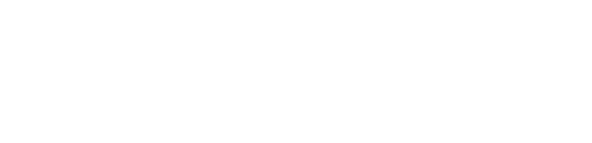

### Dask.Array

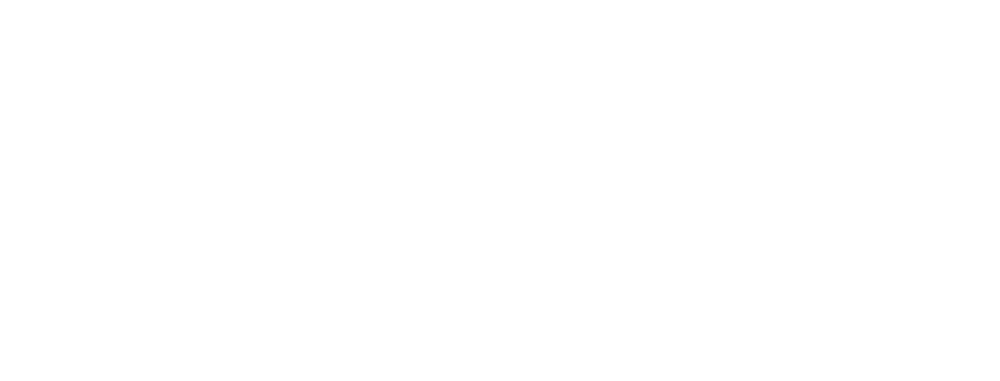

### Pandas

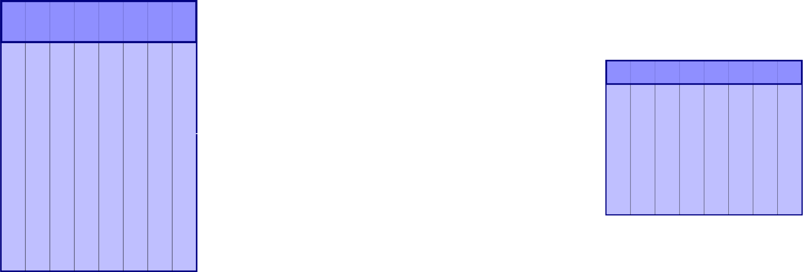

### Dask.DataFrame

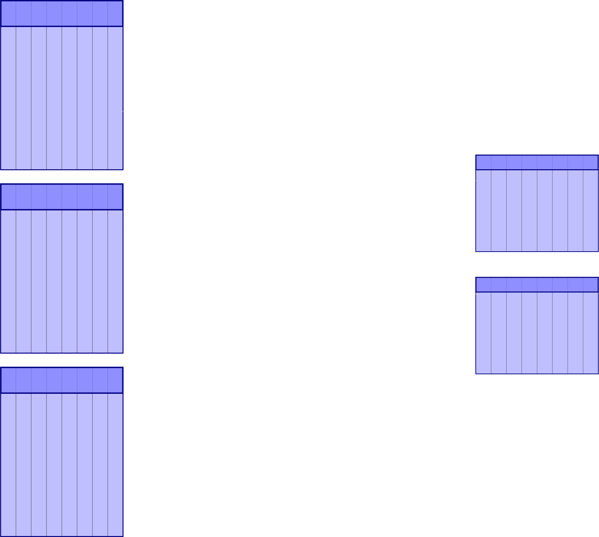

### Many problems don't fit

### into a "big array" or "big dataframe"

### Python

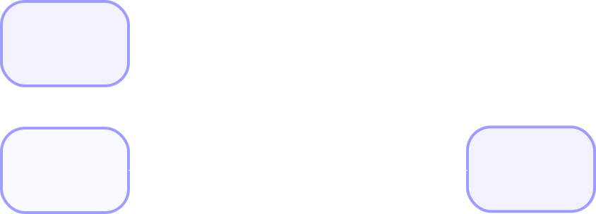

### Dask

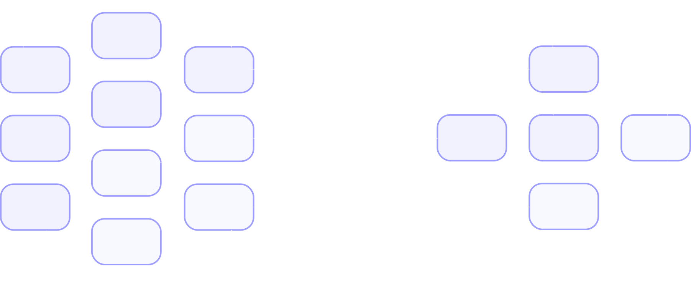

### This flexibility is novel and liberating

### It's also tricky to do well

    results = {}

    for a in A:
        for b in B:
            if a < b:
                results[a, b] = f(a, b)
            else:
                results[a, b] = g(a, b)

### High Level Parallelism

**Spark**

    outputs = collection.filter(predicate)
                        .groupby(key)
                        .map(function)

**SQL**

    SELECT city, sum(population)
    WHERE population > 1000000
    GROUP BY city

**Matrices**

    solve(A.dot(A.T), x)

### Map - Shuffle - Reduce

<table>
<tr>
  <td>
    
  </td>
  <td>
    
  </td>
  <td>
    
  </td>
</tr>
</table>

### Some Parallel Problems are Messy

    results = {}

    for a in A:
        for b in B:
            if a < b:
                results[a, b] = f(a, b)
            else:
                results[a, b] = g(a, b)

### TimeSeries - Resample

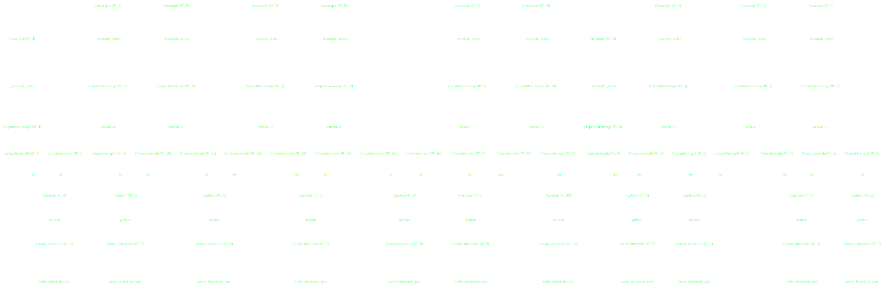

    df.value.resample('1w').mean()

### TimeSeries - Rolling

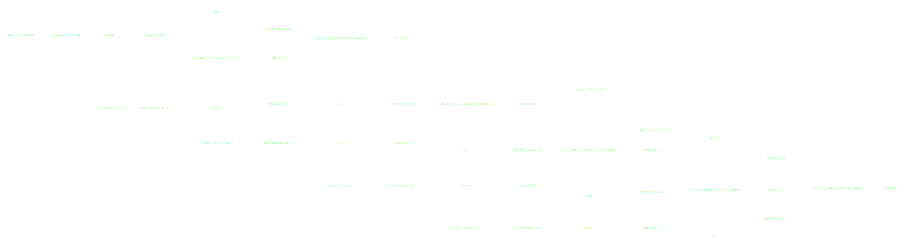

    df.value.rolling(100).mean()

### Stable SVD

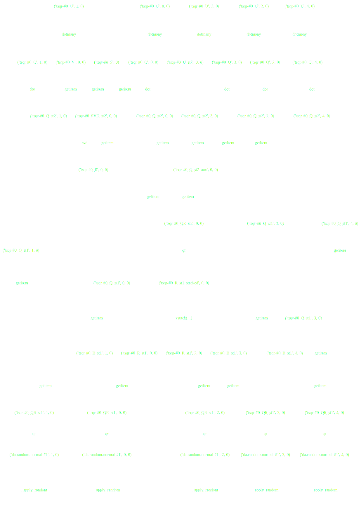

    u, s, v = da.linalg.svd(x)

### Approximate SVD

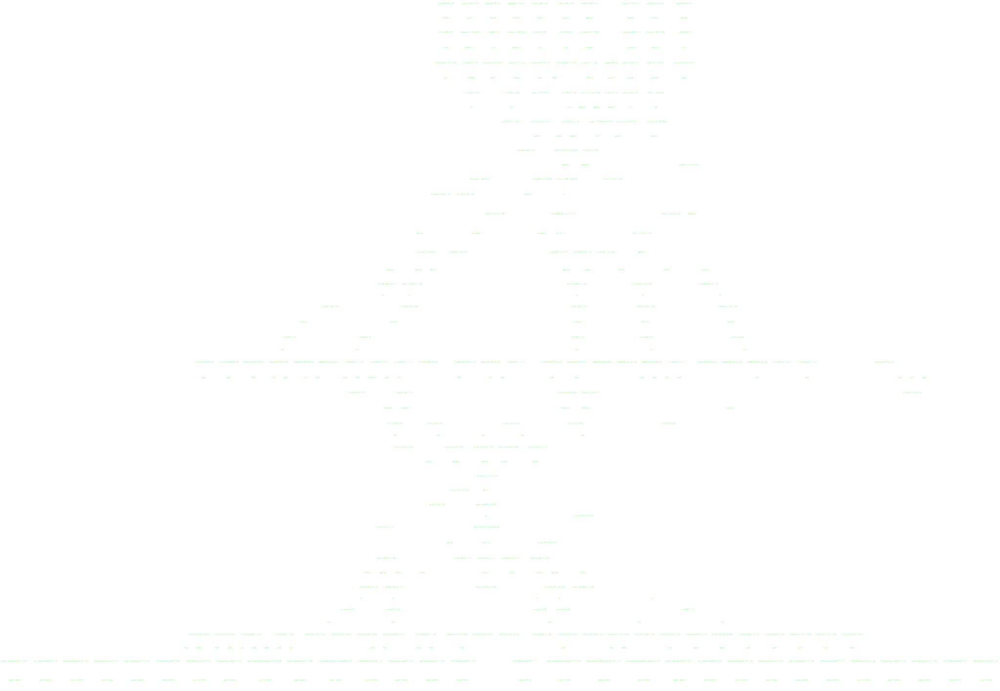

    u, s, v = da.linalg.svd_compressed(x, k=1)

### Dask executes arbitrary graphs in parallel

### Flexibility enables custom applications and efficiency

### We've seen graphs like this before: Luigi

http://luigi.readthedocs.io/en/stable/

### We've seen graphs like this before: Airflow

https://github.com/apache/incubator-airflow

### Messy Parallelism

    .

    results = {}

    for a in A:
        for b in B:
            if a < b:
                results[a, b] = f(a, b)
            else:
                results[a, b] = g(a, b)

    .

### Messy Parallelism

    from dask import delayed, compute

    results = {}

    for a in A:
        for b in B:
            if a < b:
                results[a, b] = delayed(f)(a, b)  # lazily construct graph
            else:
                results[a, b] = delayed(g)(a, b)  # without structure

    results = compute(delayed(results))  # trigger all computation

### Custom Script

    filenames = ['mydata-%d.dat' % i for i in range(10)]
    data = [load(fn) for fn in filenames]

    reference = load_from_sql('sql://mytable')
    processed = [process(d, reference) for d in data]

    rolled = []
    for i in range(len(processed) - 2):
        a = processed[i]
        b = processed[i + 1]
        c = processed[i + 2]
        r = roll(a, b, c)
        rolled.append(r)

    compared = []
    for i in range(20):
        a = random.choice(rolled)
        b = random.choice(rolled)
        c = compare(a, b)
        compared.append(c)

    best = reduction(compared)

### Custom Script

    from dask import delayed

    load = delayed(load)
    load_from_sql = delayed(load_from_sql)
    process = delayed(process)
    roll = delayed(roll)
    compare = delayed(compare)
    reduction = delayed(reduction)

Dask.delayed converts function calls to lazily executed tasks in a graph.

Inputs to the function become graph dependencies.

### Custom Script

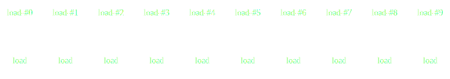

    data = [load(fn) for fn in filenames]

### Custom Script

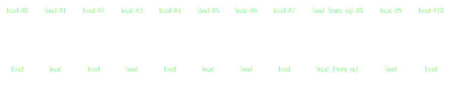

    reference = load_from_sql('sql://mytable')

### Custom Script

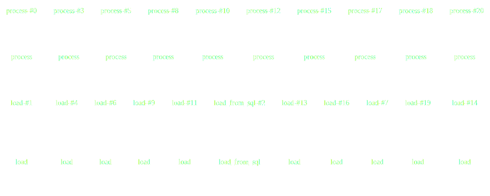

    processed = [process(d, reference) for d in data]

### Custom Script

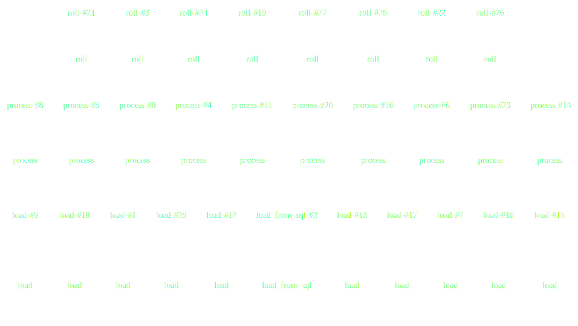

    rolled = []
    for i in range(len(processed) - 2):
        a = processed[i]
        b = processed[i + 1]
        c = processed[i + 2]
        r = roll(a, b, c)
        rolled.append(r)

### Custom Script

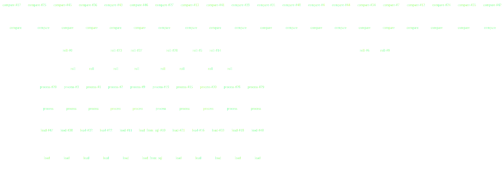

    compared = []
    for i in range(20):
        a = random.choice(rolled)
        b = random.choice(rolled)
        c = compare(a, b)
        compared.append(c)

### Custom Script

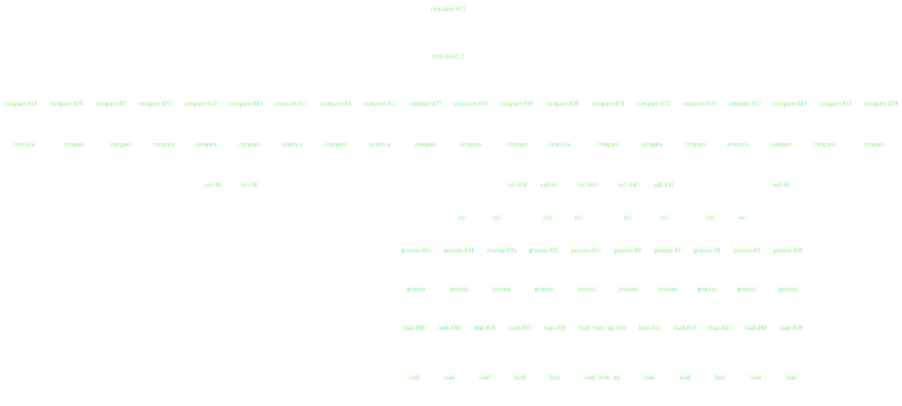

    best = reduction(compared)

### Custom Script

    filenames = ['mydata-%d.dat' % i for i in range(10)]
    data = [load(fn) for fn in filenames]

    reference = load_from_sql('sql://mytable')
    processed = [process(d, reference) for d in data]

    rolled = []
    for i in range(len(processed) - 2):
        a = processed[i]
        b = processed[i + 1]
        c = processed[i + 2]
        r = roll(a, b, c)
        rolled.append(r)

    compared = []
    for i in range(20):
        a = random.choice(rolled)
        b = random.choice(rolled)
        c = compare(a, b)
        compared.append(c)

    best = reduction(compared)

### Dask.array/dataframe/delayed author task graphs

### Now we need to run them efficiently

### Dask.array/dataframe/delayed author task graphs

### Now we need to run them efficiently

### Task Scheduling

    x = f(1)
    y = f(2)
    z = g(x, y)

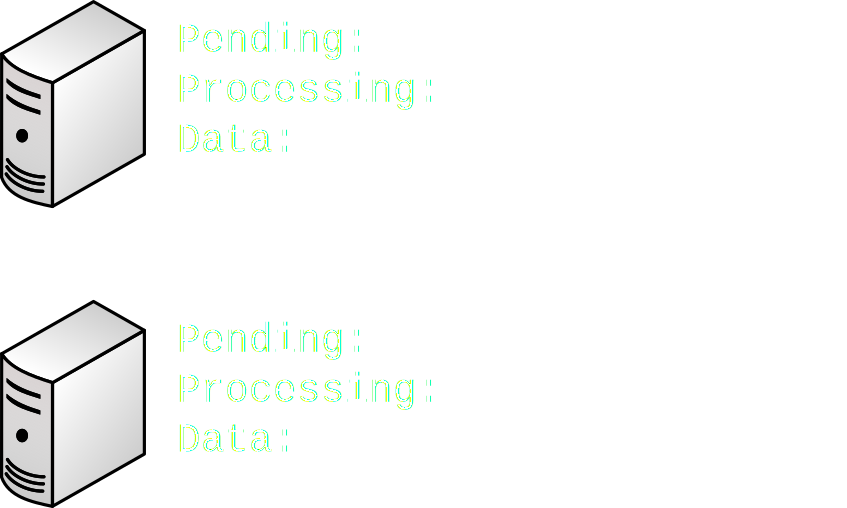

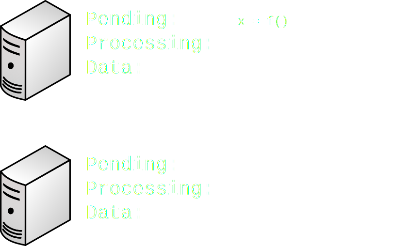

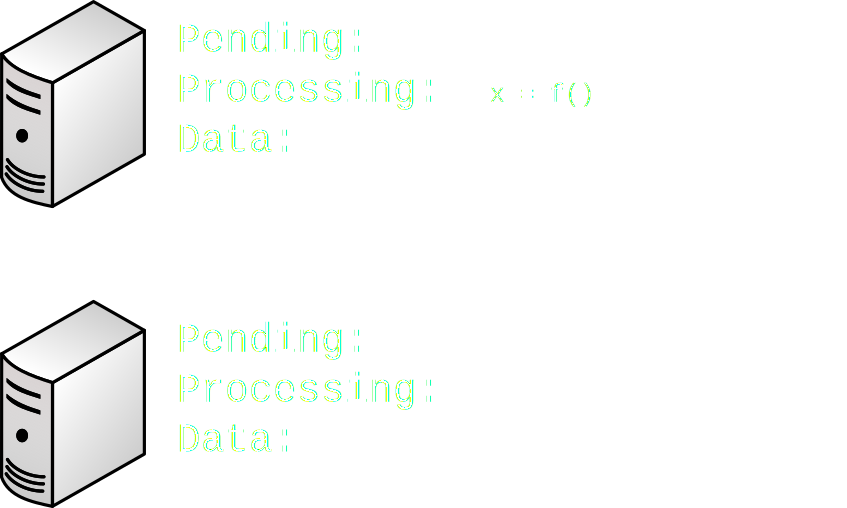

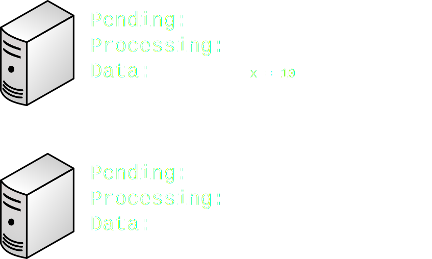

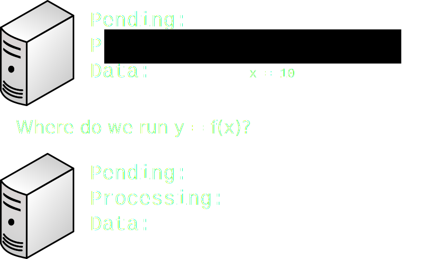

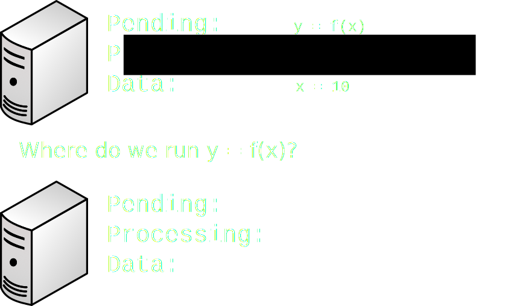

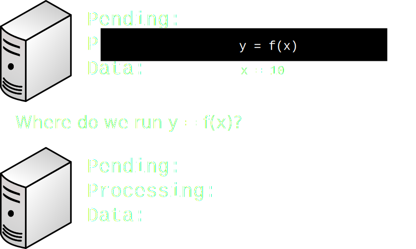

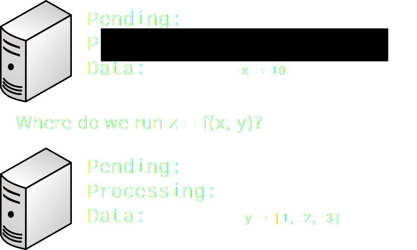

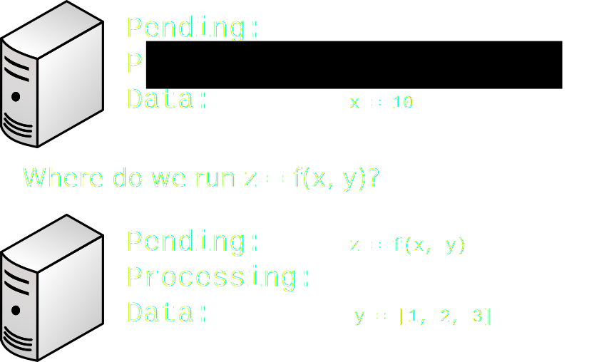

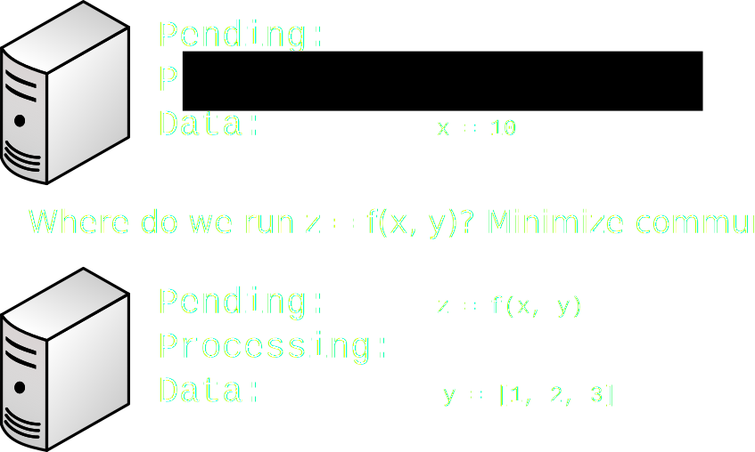

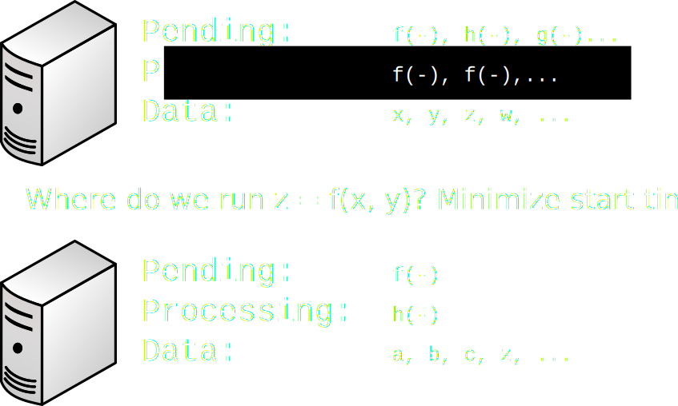

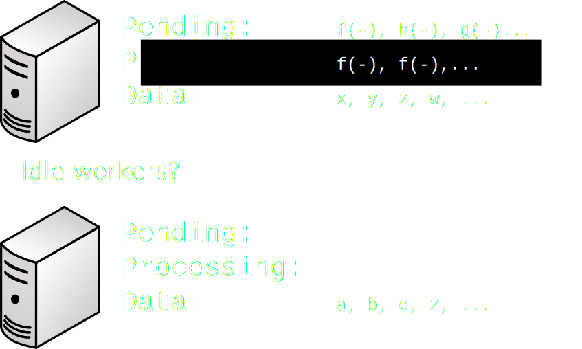

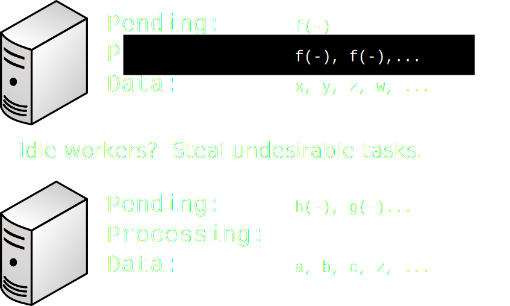

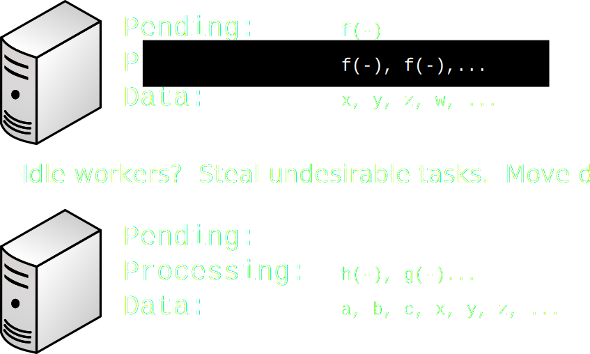

### Intelligent scheduling requires measurement

*  Size of outputs with `__sizeof__` protocol
*  Computation time (EWMA, with restarts)
*  Communication time
*  Disk load time
*  Process reported memory use
*  ...

### Fine-grained scheduling requires constant-time decisions

*  Computational graphs scale out to 100,000s of tasks
*  We spend ~200us per task in the scheduler
*  And ~1-10kB in RAM

### Solution

*  Heavily indexed Pure Python data structures.
*  No classes, just bytestrings and dicts/sets/deques.

### How does Dask compare to Airflow/Luigi?

### How does Dask compare to Spark?

### <strike>The best</strike> An interesting combination of both worlds!

### Airflow/Luigi

*  Dask communicates between workers, manages data
*  Dask operates at interactive/computational timescales (ms)
*  Dask scales out to large graphs

*  Airflow/Luigi have connectors with Hive, MapReduce, etc..
*  Airflow has cron-like ability "Run this every day"
*  Airflow/Luigi have policies for retry-on-fail, etc..

### Spark

*  Dask computes arbitrary graphs well
*  Dask is optimized for Python experience

*  Spark computes SQL-like computations well
*  Spark is optimized for Scala (though supports Python, R, etc..)
*  Spark is more established in the business community

### Acknowledgements

*  Countless open source developers
*  SciPy developer community
*  Continuum Analytics
*  XData Program from DARPA

### Questions?

