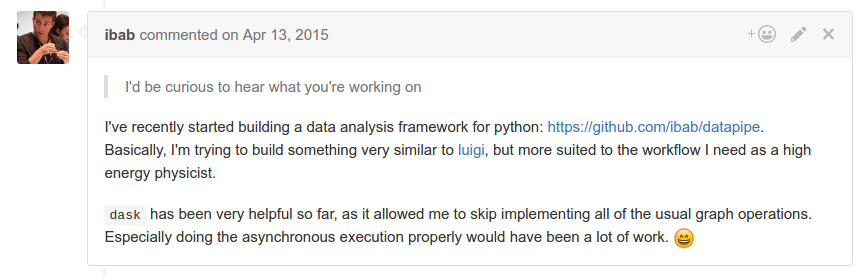

Dask: Fine Grained Task Parallelism
-----------------------------------

*Matthew Rocklin*

Continuum Analytics

### Dask provides parallelism

### ... originally designed for NumPy and Pandas

### ... but used today for arbitrary computations

### Recent talks

*   SciPy - July, 2016:

    Dask.delayed, some machine learning

*  PyGotham - August 2016:

    Build DataFrame computations

*  PyData DC - October 2016:

    Fine-grained parallelism, motivation and performance

### NumPy

### Dask.Array

### Pandas

### Dask.DataFrame

### Many problems don't fit

### into a "big array" or "big dataframe"

### Python

### Dask

### This flexibility is novel and liberating

### It's also tricky to do well

### High Level Parallelism

**Spark**

    outputs = collection.filter(predicate)
                        .groupby(key)
                        .map(function)

**SQL**

    SELECT city, sum(value)
    WHERE value > 0
    GROUP BY city

**Matrices**

    solve(A.dot(A.T), x)

### Map - Shuffle - Reduce

<table>
<tr>
  <td>
    
  </td>
  <td>
    
  </td>
  <td>
    
  </td>
</tr>
</table>

### Other Patterns

<table>
<tr>
  <td>
    
  </td>
  <td>
    
  </td>
  <td>
    
  </td>
</tr>
</table>

### Messy Parallelism

    .

    results = {}

    for a in A:
        for b in B:
            if a < b:
                results[a, b] = f(a, b)
            else:
                results[a, b] = g(a, b)

    .

### Messy Parallelism

    from dask import delayed, compute

    results = {}

    for a in A:
        for b in B:
            if a < b:
                results[a, b] = delayed(f)(a, b)  # lazily construct graph
            else:
                results[a, b] = delayed(g)(a, b)  # without structure

    results = compute(delayed(results))  # trigger all computation

### Custom Script

    data = [load(fn) for fn in filenames]

### Custom Script

    reference = load_from_sql('sql://mytable')

### Custom Script

    processed = [process(d, reference) for d in data]

### Custom Script

    rolled = []
    for i in range(len(processed) - 2):
        a = processed[i]
        b = processed[i + 1]
        c = processed[i + 2]
        r = roll(a, b, c)
        rolled.append(r)

### Custom Script

    compared = []
    for i in range(20):
        a = random.choice(rolled)
        b = random.choice(rolled)
        c = compare(a, b)
        compared.append(c)

### Custom Script

    best = reduction(compared)

### Custom Script

    filenames = ['mydata-%d.dat' % i for i in range(10)]
    data = [load(fn) for fn in filenames]

    reference = load_from_sql('sql://mytable')
    processed = [process(d, reference) for d in data]

    rolled = []
    for i in range(len(processed) - 2):
        a = processed[i]
        b = processed[i + 1]
        c = processed[i + 2]
        r = roll(a, b, c)
        rolled.append(r)

    compared = []
    for i in range(20):
        a = random.choice(rolled)
        b = random.choice(rolled)
        c = compare(a, b)
        compared.append(c)

    best = reduction(compared)

### But first!  A flashy demo!

### Dask was designed for NumPy and Pandas

### However, the lower-level parts solve messier problems

### Dask.array/dataframe/delayed author task graphs

### Now we need to run them efficiently

### Dask.array/dataframe/delayed author task graphs

### Now we need to run them efficiently

### Task Scheduling

    x = f(1)
    y = f(2)
    z = g(x, y)

### Dask schedulers target different architectures

### Easy swapping enables scaling up *and down*

### Single Machine Scheduler

Stable for a year or so.  Optimized for larger-than-memory use.

*   **Parallel CPU**: Uses multiple threads or processes
*   **Minimizes RAM**: Choose tasks to remove intermediates
*   **Low overhead:** ~100us per task
*   **Concise**: ~600 LOC, stable for ~12 months
*   **Real world workloads**: dask.array, xarray, dask.dataframe, dask.bag,
    Custom projects with dask.delayed

### Distributed Scheduler

### Distributed Scheduler

### Distributed Scheduler

### Distributed Scheduler

### Distributed Scheduler

### Distributed Scheduler

### Distributed Scheduler

### Distributed Scheduler

### Distributed Scheduler

### Distributed Scheduler

### Distributed Scheduler

### Distributed Scheduler

### Distributed Scheduler

### Distributed Scheduler

### Distributed Scheduler

### Distributed Scheduler

*   **Distributed**: One scheduler coordinates many workers
*   **Data local**: Moves computation to correct worker
*   **Asynchronous**: Continuous non-blocking conversation
*   **Multi-user**: Several users share the same system
*   **HDFS Aware**: Works well with HDFS, S3, YARN, etc..
*   **Solidly supports**: dask.array, dask.dataframe, dask.bag, dask.delayed,
    concurrent.futures, ...
*   **Less Concise**: ~3000 LOC Tornado TCP application

    But all of the logic is hackable Python

### Easy to get started

    $ conda install dask distributed
    $ pip install dask[complete] distributed --upgrade

    >>> from dask.distributed import Executor
    >>> e = Executor()  # sets up local cluster

    $ dask-scheduler

    $ dask-worker scheduler-hostname:8786
    $ dask-worker scheduler-hostname:8786

### Easy to get started

    $ conda install dask distributed -c conda-forge
    $ pip install dask[complete] distributed --upgrade

    >>> from dask.distributed import Executor
    >>> e = Executor()  # sets up local cluster

    $ dask-scheduler

    $ dask-worker scheduler-hostname:8786
    $ dask-worker scheduler-hostname:8786

### Examples

### Concluding thoughts

### Dask provides parallel NumPy and Pandas

### ... and it parallelizes custom algorithms

### ... on single machines or clusters

### Schedulers are common, but hidden

*   Task scheduling is ubiquitous in parallel computing

    Examples: MapReduce, Spark, SQL, TensorFlow, Plasma

*   But raw task scheduler is rarely exposed

    Exceptions: Make, Luigi, Airflow

### Don't Parallelize if you don't have to

*  But I need speed ...
    *  Profile first
    *  Use C/Cython/Numba/Julia/...
    *  Use better algorithms, sample
*  But I need to scale ...
    *  Profile first
    *  Use better data structures, sample, stream
*  Yes, but I actually really need to ...
    *  Start with your laptop and concurrent.futures
    *  Then, move up to a heavy workstation
    *  Then, very reluctantly, move to a cluster

### Acknowledgements

*  Countless open source developers
*  SciPy developer community
*  Continuum Analytics
*  XData Program from DARPA

### Questions?

### Q: How does Dask differ from Spark?

*  Spark is great
    *  ETL + Database operations
    *  SQL-like streaming
    *  Spark 2.0 is decently fast
    *  Integrate with Java infrastructure
*  Dask is great
    *  Tight integration with NumPy, Pandas, Toolz, SKLearn, ...
    *  Ad-hoc parallelism for custom algorithms
    *  Easy deployment on clusters or laptops
    *  Complement the existing SciPy ecosystem (Dask is lean)
*  Both are great
    *  Similar network designs and scalability limits
    *  Decent Python APIs

### Schedulers are common, but hidden

*   Task scheduling is ubiquitous in parallel computing

    Examples: MapReduce, Spark, SQL, TensorFlow, Plasma

*   But raw task scheduler is rarely exposed

    Exceptions: Make, Luigi, Airflow

### Other Parallel Libraries

*  System
    *  threading, multiprocessing, concurrent.futures
    *  mpi4py, socket/zmq
*  MRJob, PySpark, Some SQL Databases, ...
*  Joblib, IPython Parallel,  ...
*  BLAS, Elemental, ...
*  <strike>Asyncio/Tornado</strike>
