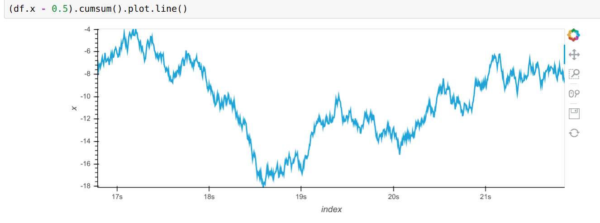
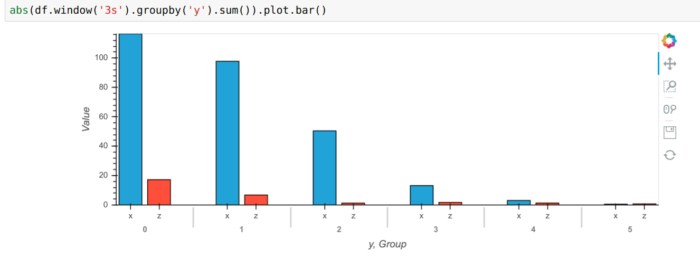
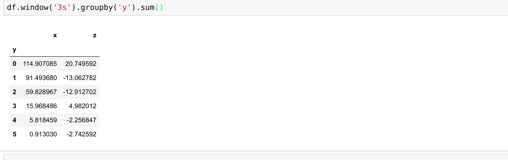
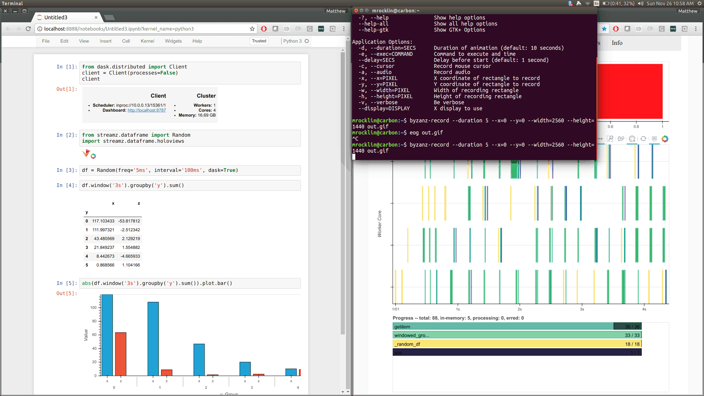

Streaming Processing
--------------------


What is streaming processing
----------------------------


Options today
-------------


Examples
--------


What did we just see?
---------------------

1.  Streamz.core
    1.  map, accumulate
    2.  time management and back pressure
    3.  Jupyter notebook integration
2.  Streamz.dataframe
    1.  Stream of Pandas dataframes
    2.  With pandas API
    3.  Plotting integration with Holoviews/Bokeh
3.  Streamz.dask
    1.  Full implemenation of Streamz.core on top of Dask
    2.  Adds millisecond overhead and 10-20ms latency
    3.  Scales


Map / Accumulate
----------------


Branching / Joining
-------------------


Time and Back Pressure
----------------------


```python
stream.map(func).sink(write_to_database)

stream.emit(value)
```


Time and Back Pressure
----------------------


```python
stream.map(func).sink(write_to_database)

stream.emit(value)  # sources block until sinks ready
```


Time and Back Pressure
----------------------


```python
stream.map(func).sink(write_to_database)

await stream.emit(value)  # sources block until sinks ready
```


Time and Back Pressure
----------------------


```python
stream.map(func).sink(write_to_database)

await stream.emit(value)  # sources block until sinks ready
```


DataFrames
----------

-  Passing Pandas dataframes through streamz is a common case
-  Can map/accumulate Pandas functions on normal Streams
-  The streamz.dataframe module provides syntactic sugar

<hr>

### Core Streams: map

```python
from streamz import Stream
stream = Stream()

def query(df):
    return df[df.name == 'Alice']

def add_x(acc, new):
    return acc + new.x.sum()

stream.map(query).accumulate(add_x)
```

<hr>

### Streaming DataFrames

```python
from streamz.dataframe import DataFrame

sdf = DataFrame(stream=stream,
                example=pd.DataFrame({'name': [], 'x': [], 'y': []}))

sdf[sdf.name == 'Alice'].x.sum()
```


Dataframe Plotting
------------------

-  Copies Pandas `.plot` interface
-  Currently using Bokeh + Holoviews  (thanks Philipp Rudiger!)






Jupyter Notebook Integration
----------------------------

-  Uses IPython widgets
-  Pleasant for demonstration and exploration
-  Has some performance penalty
-  Rate limited at 500ms for visual sanity




Streaming DataFrams with Dask
-----------------------------


### Dask is known for ...

1.  Parallelizing NumPy
2.  Parallelizing Pandas
3.  Parallelizing parts of Scikit-Learn
4.  Parallelizing concurrent.futures

### Dask is used for ...

-  Parallelizing custom internal systems


### Drop-in Dask-powered stream replacement

### In about 200 lines of code

### Scales down to multi-core. Scales up to clusters.


Using streamz.dask
------------------

```python
from dask.distributed import Client
client = Client()  # create or connect to Dask cluster
```

```python
dask_stream = local_stream.scatter()  # convert to Dask stream
local_stream = dask_stream.gather()   # convert to local stream
```


Using streamz.dask
------------------

<a href="images/streamz-dask.gif"></a>
