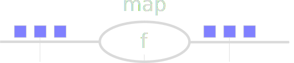

Streaming Processing with Dask
------------------------------


*Matthew Rocklin*

Anaconda Inc. (*formerly Continuum Analytics*)


Streaming Processing
--------------------


*Matthew Rocklin*

Anaconda Inc. (*formerly Continuum Analytics*)


### Streaming processing is ...

TODO

### Applications

TODO


What we'll see today
--------------------

1.  **Streamz.core**
    1.  map, accumulate
    2.  time management and back pressure
    3.  Jupyter notebook integration
2.  **Streamz.dataframe**
    1.  Stream of Pandas dataframes
    2.  With pandas API
    3.  Plotting integration with Holoviews/Bokeh
3.  **Streamz.dask**
    1.  Full implemenation of Streamz.core on top of Dask
    2.  Adds millisecond overhead and 10-20ms latency
    3.  Scales


<hr>


### Branching


<hr>

### Joining


Time and Back Pressure
----------------------


```python
# Later stages in a pipeline might be slow (like writing to a database)
stream.map(f).combine_latest(other).accumulate(h).map(write_to_database)

for element in data:      # user pushes data into stream
    stream.emit(element)  # needs to be told to slow down
```


Time and Back Pressure
----------------------


```python
# Later stages in a pipeline might be slow (like writing to a database)
stream.map(f).combine_latest(other).accumulate(h).map(write_to_database)

for element in data:      # user pushes data into stream
    stream.emit(element)  # needs to be told to slow down
```


Time and Back Pressure
----------------------


```python
# Later stages in a pipeline might be slow (like writing to a database)
stream.map(f).combine_latest(other).accumulate(h).map(write_to_database)

for element in data:      # user pushes data into stream
    stream.emit(element)  # needs to be told to slow down
```


Time and Back Pressure
----------------------


```python
# Later stages in a pipeline might be slow (like writing to a database)
stream.map(f).combine_latest(other).accumulate(h).map(write_to_database)

for element in data:            # user pushes data into stream
    await stream.emit(element)  # needs to be told to slow down
```


Time and Back Pressure
----------------------


```python
# Later stages in a pipeline might be slow (like writing to a database)
stream...buffer(100)...rate_limit('5ms')...map(write_to_database)

for element in data:            # user pushes data into stream
    await stream.emit(element)  # needs to be told to slow down
```


Streams are easy to build
-------------------------

```python
@Stream.register_api()
class map(Stream):
    """ Apply a function to every element in the stream """
    def __init__(self, upstream, func, *args, **kwargs):
        self.func = func
        # this is one of a few stream specific kwargs
        stream_name = kwargs.pop('stream_name', None)
        self.kwargs = kwargs
        self.args = args

        Stream.__init__(self, upstream, stream_name=stream_name)

    def update(self, x, who=None):
        result = self.func(x, *self.args, **self.kwargs)

        return self._emit(result)
```


Streams are easy to build
-------------------------

```python
@Stream.register_api()
class filter(Stream):
    """ Only pass through elements that satisfy the predicate """
    def __init__(self, upstream, predicate, **kwargs):
        if predicate is None:
            predicate = _truthy
        self.predicate = predicate

        Stream.__init__(self, upstream, **kwargs)

    def update(self, x, who=None):
        if self.predicate(x):
            return self._emit(x)
```


Streams are easy to build
-------------------------

```python
@Stream.register_api()
class rate_limit(Stream):
    """ Limit the flow of data """
    _graphviz_shape = 'octagon'

    def __init__(self, upstream, interval, **kwargs):
        self.interval = convert_interval(interval)
        self.next = 0

        Stream.__init__(self, upstream, **kwargs)

    @gen.coroutine
    def update(self, x, who=None):
        now = time()
        old_next = self.next
        self.next = max(now, self.next) + self.interval
        if now < old_next:
            yield gen.sleep(old_next - now)
        yield self._emit(x)
```

Use Tornado coroutines for time-dependent operations


Streams are easy to build
-------------------------

```python
@Stream.register_api()
class rate_limit(Stream):
    """ Limit the flow of data """
    _graphviz_shape = 'octagon'

    def __init__(self, upstream, interval, **kwargs):
        self.interval = convert_interval(interval)
        self.next = 0

        Stream.__init__(self, upstream, **kwargs)

    .
    async def update(self, x, who=None):
        now = time()
        old_next = self.next
        self.next = max(now, self.next) + self.interval
        if now < old_next:
            await gen.sleep(old_next - now)
        await self._emit(x)
```

Or use async-await syntax if you prefer


## DataFrames


DataFrames
----------

-  Passing Pandas dataframes through streamz is a common case
-  Can map/accumulate Pandas functions on normal Streams
-  Or use streamz.dataframe module for syntactic sugar

```python
from streamz import Stream
stream = Stream()

def query(df):
    return df[df.name == 'Alice']

def add_x(acc, new):
    return acc + new.x.sum()

stream.map(query).accumulate(add_x)  # like df[df.name == 'Alice'].x.sum()
```


DataFrames
----------

-  Passing Pandas dataframes through streamz is a common case
-  Can map/accumulate Pandas functions on normal Streams
-  Or use streamz.dataframe module for syntactic sugar

```python
from streamz.dataframe import DataFrame

df = DataFrame(stream=stream,
               example=pd.DataFrame({'name': [], 'x': [], 'y': []}))

df[df.name == 'Alice'].x.sum()
.
.
.
.
```


DataFrames
----------

-  Passing Pandas dataframes through streamz is a common case
-  Can map/accumulate Pandas functions on normal Streams
-  Or use streamz.dataframe module for syntactic sugar

```python
from streamz.dataframe import DataFrame

sdf = DataFrame(stream=stream,
                example=pd.DataFrame({'name': [], 'x': [], 'y': []}))

sdf.window('60s').groupby('name').x.var()
```


Dataframe Plotting
------------------

-  Copies Pandas `.plot` interface
-  Currently using Bokeh + Holoviews  (thanks Philipp Rudiger!)


Jupyter Notebook Integration
----------------------------

-  Uses IPython widgets
-  Pleasant for demonstration and exploration
-  Has some performance penalty
-  Rate limited at 500ms for visual sanity


Streaming DataFrams with Dask
-----------------------------


### Dask is known for ...

1.  Parallelizing NumPy
2.  Parallelizing Pandas
3.  Parallelizing parts of Scikit-Learn
4.  Scaling concurrent.futures

### Dask is used for ...

-  Parallelizing custom internal systems

    *Can we parallelize streamz?*

```python
from streamz import Stream
```


### Dask is known for ...

1.  Parallelizing NumPy
2.  Parallelizing Pandas
3.  Parallelizing parts of Scikit-Learn
4.  Scaling concurrent.futures

### Dask is used for ...

-  Parallelizing custom internal systems

    *Can we parallelize streamz?*

```python
from streamz.dask import DaskStream
```


### DaskStream is a drop-in replacement for Stream

### Scales down to multi-core. Scales up to clusters.

<hr>

### Written in around 200 lines of code


Using streamz.dask
------------------

```python


a = Stream()
b = Stream()

a2 = a.map(parse).rate_limit('10ms')
b2 = b.map(load_from_file).map(process)
c = combine_latest(a2, b2).accumulate(...).map(write_to_database).map(log)
```




Using streamz.dask
------------------

```python
from dask.distributed import Client
client = Client()  # create or connect to Dask cluster

a = Stream()
b = Stream()

a2 = a.map(parse).scatter().rate_limit('10ms')
b2 = b.scatter().map(load_from_file).map(process)
c = combine_latest(a2, b2).accumulate(...).map(write_to_database).buffer(100).gather().map(log)
```


Using streamz.dask
------------------

<a href="images/streamz-dask.gif"></a>

-  Dask scheduler handles 1000's of tasks per second
-  Adds 10-20ms roundtrip latency
