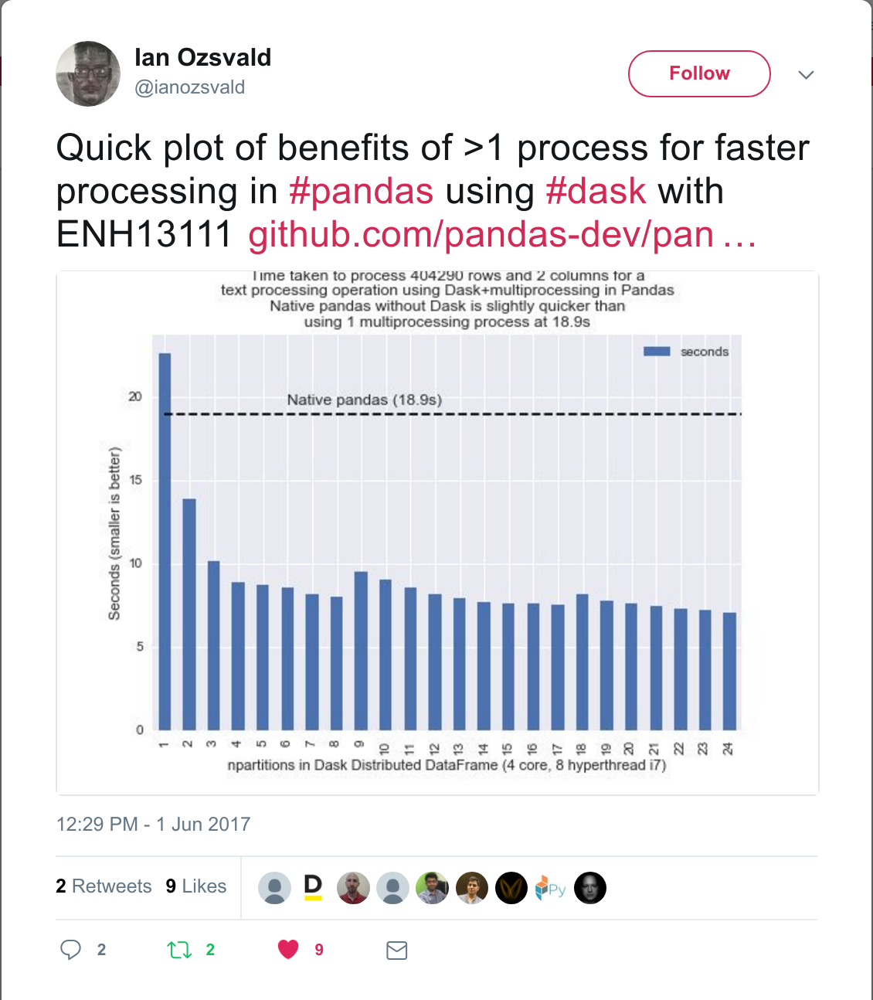
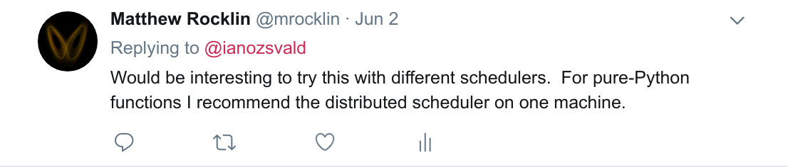
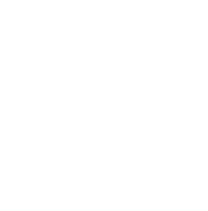
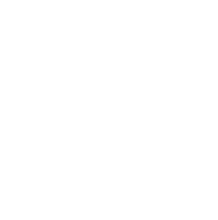
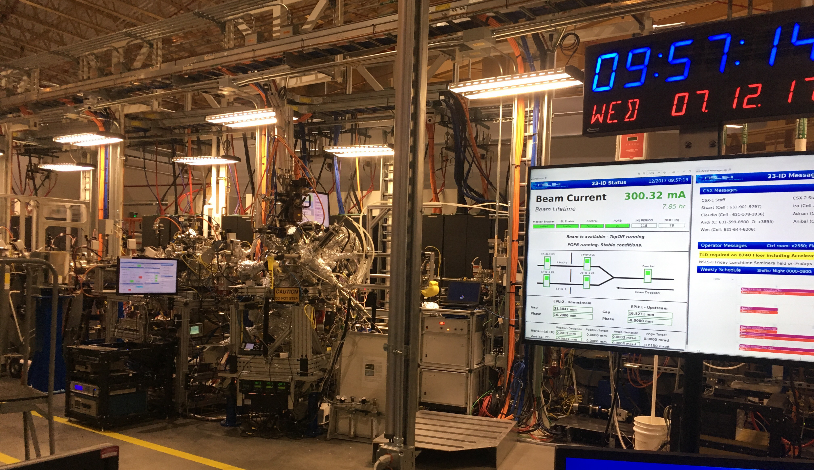
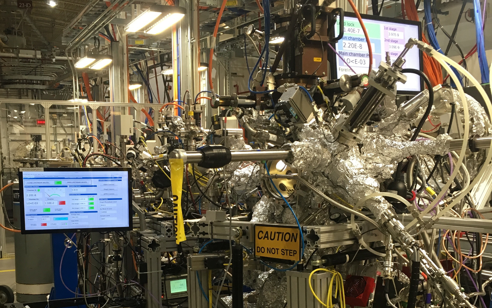
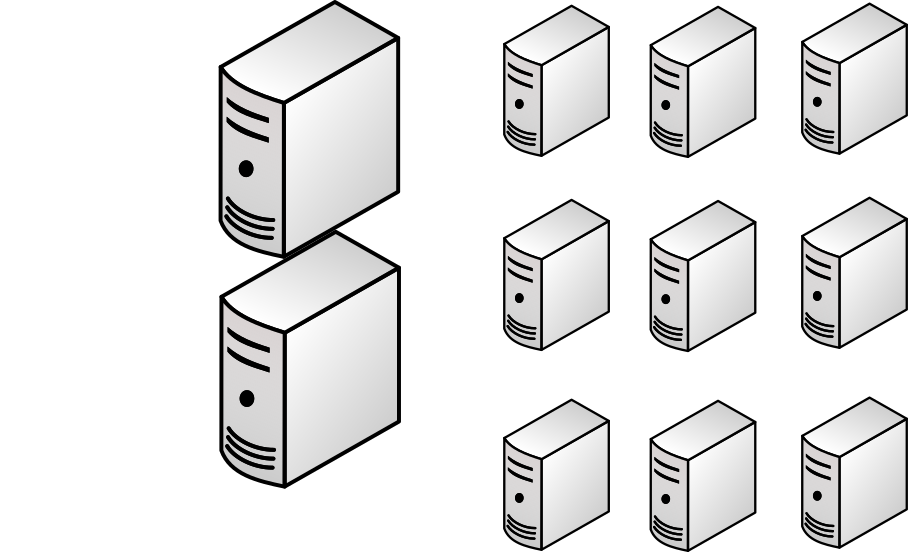
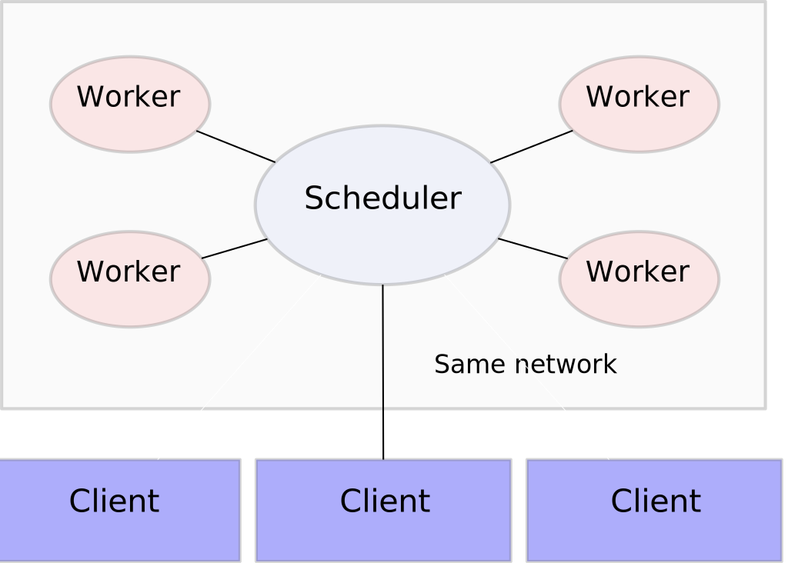
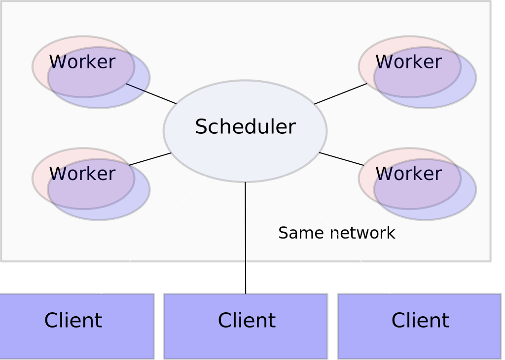

Dask: Advanced Techniques
-------------------------


*Matthew Rocklin*

Continuum Analytics


Seven tricks you didn't know about Dask that will shock you!
------------------------------------------------------------


*Matthew Rocklin*

Continuum Analytics


1.  **Objectives**:
    1.  Push existing users to use dask.distributed scheduler
    2.  Learn advanced task-scheduling features
    3.  Point new developers to contribution opportunities
2.  **Not going to** explain Dask at a high level

    See [PyCon 2017 talk](https://www.youtube.com/watch?v=RA_2qdipVng&t=1s) instead


### Consider using the dask.distributed scheduler

#### Even on a single machine

1.  Start advanced scheduler on your local machine:
    1.  Get diagnostics
    2.  Get new features (more about this throughout the talk)
    3.  Scale out if necessary
    4.  Almost always more efficient than multiprocessing scheduler
2.  It's lightweight

    Worker setup, task submission, result retrieval, shutdown:

    ```python
    In [3]: %%time
       ...: with Client(processes=False) as client:
       ...:     future = client.submit(lambda x: x + 1, 10)
       ...:     print(future.result())
       ...:
    11
    CPU times: user 28 ms, sys: 4 ms, total: 32 ms
    Wall time: 39.3 ms
    ```


### Centralized scheduler, distributed workers








### Lesson: If you use dask.dataframe/bag/delayed

### Try dask.distributed for possibly better performance

### (and fancy plots!)

<hr>

### XArray users may want to stay with the original scheduler, unless you have a cluster

### (which you probably do!)


## Lesson: Tweeting benchmarks is a good way to get priority support

<hr>

## It's cheaper than paying Continuum


## But this talk isn't about array, bags, or dataframes

<hr>

## It's about new things


## Motivating Science Example


### Image processing pipeline (with hardware)



### (this is a synchrotron)


### Image processing pipeline (with hardware)



### (this is a synchrotron)








### Image processing pipeline

1.  Observe images from physical detectors
2.  Process these images with skimage and custom functions
3.  Store results and intermediates to a database

<hr>


<hr>

### Not big datasets, but fast and real time

### Beam scientists observe progress and twiddle knobs


### Computation

1.  Have two workstations on site
2.  Have several other machines in a nearby data center
3.  Pipeline structure changes rapidly (weekly basis)



TODO image of non-trivial processing pipeline


### Lets build this system with Dask

<hr>

### First we need to learn some new features

1. [Concurrent.futures](https://docs.python.org/3/library/concurrent.futures.html) interface
2.  Changing computational graphs on-the-fly
3.  Multi-client workloads (tasks submitting tasks)
4.  Worker coordination primitives (queues, shared variables)


### Futures interface

<div class="row">
<div class="col-xs-6">
<pre><code data-trim>
>>> from dask.distributed import Client
>>> client = Client()
</code></pre>
</div>
<div class="col-xs-6">
<p align="left">Start a local cluster</p>
</div>
</div>

<hr>

<div class="row">
<div class="col-xs-6">
<pre><code data-trim>
>>> future = client.submit(add, 1, 2)  # add(1, 2) remotely
>>> future
&lt;Future: status: pending, key: add-c3cae4a08c3bbbbd&gt;
</code></pre>
</div>
<div class="col-xs-6">
<p align="left">Submit a single task to run in the background</p>

<p align="left">Worker runs <tt>add(1, 2)</tt>, stores result in its local
memory</p>
</div>
</div>

<hr>

<div class="row">
<div class="col-xs-6">
<pre><code data-trim>
>>> future
&lt;Future: status: finished, type: int, key: add-c3cae4a08c3bbbbd&gt;
</code></pre>
</div>
<div class="col-xs-6">
<p align="left">Learn about status asynchronously</p>
</div>
</div>

<hr>

<div class="row">
<div class="col-xs-6">
<pre><code data-trim>
>>> future.result()
3
</code></pre>
</div>
<div class="col-xs-6">
<p align="left">Block and gather result</p>
</div>
</div>


### Track dependencies

<div class="row">
<div class="col-xs-6">
<pre><code data-trim>
>>> a = client.submit(f, 1)
>>> b = client.submit(f, 2)
>>> c = client.submit(g, a, b)  # submit task on futures
</code></pre>
</div>
<div class="col-xs-6">
Submit functions on futures to create dependencies
</div>
</div>


### This is just as flexible as dask.delayed

<hr>

### But now we can control it on-the-fly


### Track computations real-time

<div class="row">
<div class="col-xs-6">
<pre><code data-trim>
>>> futures = [client.submit(f, x) for x in L]
>>> futures
[&lt;Future: status: pending, key: f-1&gt;
 &lt;Future: status: finished, key: f-2&gt;
 &lt;Future: status: finished, key: f-3&gt;
 &lt;Future: status: erred, key: f-4&gt;
 &lt;Future: status: pending, key: f-5&gt;
 &lt;Future: status: pending, key: f-6&gt;]
</code></pre>
</div>
<div class="col-xs-6">
Updates happen in the background
</div>
</div>

<hr>

### Manipulate computations on-the-fly

<div class="row">
<div class="col-xs-6">
<pre><code data-trim>
>>> finished = [future for future in futures
...             if future.status == 'finished']

>>> results = client.gather(finished)
>>> new_futures = [client.submit(g, x) for x in ...]
</code></pre>
</div>
<div class="col-xs-6">
Submit new tasks during execution
</div>
</div>


### Convenient methods exist to support asynchronous workloads

<div class="row">
<div class="col-xs-6">
<pre><code data-trim>
    from dask.distributed import as_completed

future = [client.submit(func, *args) for x in L]

iterator = as_completed(futures)

best = 0
for future in iterator:
    result = future.result()
    best = max(best, result)
    if best > 100:  # good enough, quit early
        break

client.cancel(iterator.futures)  # cancel the rest
.
</code></pre>
</div>
<div class="col-xs-6">
<p align="left">Iterate over futures as they complete</p>
</div>
</div>


### Convenient methods exist to support asynchronous workloads

<div class="row">
<div class="col-xs-6">
<pre><code data-trim>
    from dask.distributed import as_completed

future = [client.submit(func, *args) for x in L]

iterator = as_completed(futures)

total = 0
for future in iterator:
    result = future.result()
    total += result
    if result > 10:
        a = client.submit(func, ...)  # submit more work
        b = client.submit(func, ...)  # submit more work
        iterator.add(a)  # add to iterator
        iterator.add(b)  # add to iterator
</code></pre>
</div>
<div class="col-xs-6">
<p align="left">Continue to add more tasks</p>
</div>
</div>


### Convenient methods exist to support asynchronous workloads

<div class="row">
<div class="col-xs-8">
<pre><code data-trim>
    def rosenbrock(point):
        """Compute the rosenbrock function and return the point and result"""
        time.sleep(0.1)
        score = (1 - point[0])**2 + 2 * (point[1] - point[0]**2)**2
        return point, score

    scale = 5                  # Intial random perturbation scale
    best_point = (0, 0)        # Initial guess
    best_score = float('inf')  # Best score so far
</code></pre>
</div>
<div class="col-xs-4">


<p><i>sorry for the jet colormap</i></p>

</div>
</div>

<hr>

<div class="row">
<div class="col-xs-8">
<pre><code data-trim>
futures = [client.submit(rosenbrock, point) for point in initial]
iterator = as_completed(futures)
</code></pre>
</div>
<div class="col-xs-4">
<p align="left">Start a few tasks running, iterate over them as they complete</p>

</div>
</div>

<hr>

<div class="row">
<div class="col-xs-8">
<pre><code data-trim>
for res in iterator:
    point, score = res.result()
    if score < best_score:
        best_score = score
        best_point = point

    x, y = best_point
    new_point = client.submit(rosenbrock, (x + random.uniform(-scale, scale),
                                           y + random.uniform(-scale, scale)))
    iterator.add(new_point)  # Start tracking new task as well

    scale *= 0.99

    if scale < 0.001:
        break
</code></pre>
</div>
<div class="col-xs-4">
<p align="left">Search around best point found so far</p>

<p align="left">For a more serious project, see <a href="https://github.com/eriknw/dask-patternsearch">dask-patternsearch</a> by Erik Welch.</p>
</div>
</div>


### Submit tasks from tasks


### Submit tasks from tasks




### Submit tasks from tasks




### Submit tasks from tasks

<div class="row">
<div class="col-xs-8">
<pre><code data-trim>
    from dask.distributed import get_client, get_worker, secede, fire_and_forget

def func(...):
    client = get_client()
    futures = [client.submit(...) for ...]

futures = client.submit(func, ...)

.
.
</code></pre>
</div>
<div class="col-xs-4">
<p align="left">Tasks can get their own client<p>
<p align="left">Remote client controls cluster</p>
<p align="left">Task-on-worker can do anything you can do locally</p>
</div>
</div>

### Small change to API, but enables very complex workflows


### Submit tasks from tasks

<div class="row">
<div class="col-xs-8">
<pre><code data-trim>
def fib(n):
    if n == 0 or n == 1:
        return n
    else:
        client = get_client()
        a = client.submit(fib, n - 1)
        b = client.submit(fib, n - 2)
        return a.result() + b.result()

future = client.submit(fib, 1000)
</code></pre>
</div>
<div class="col-xs-4">
<p align="left">Workers can start up a client<p>
<p align="left">Tasks can submit more tasks</p>
<p align="left">Can do anything you can do locally</p>
</div>
</div>

### Small change to API, but enables very complex workflows


### Multi-client coordination

When you have multiple clients, they sometimes want to talk to each other

<hr>

<div class="row">
<div class="col-xs-6">
<pre><code data-trim>
from dask.distributed import Queue
q = Queue()

q.put(123)
x = q.get()
</code></pre>
</div>
<div class="col-xs-6">
<p align="left">Multi-producer/consumer queue</p>
<p align="left">Send along small data or futures</p>
</div>
</div>

<hr>

<div class="row">
<div class="col-xs-6">
<pre><code data-trim>
from dask.distributed import Variable
v = Variable()

v.set(123)
x = v.get()
</code></pre>
</div>
<div class="col-xs-6">
<p align="left">Global singleton value</p>
<p align="left">Send along small data or futures</p>
</div>
</div>

<hr>


### Multi-client coordination

When you have multiple clients, they sometimes want to talk to each other

<hr>

<div class="row">
<div class="col-xs-6">
<pre><code data-trim>
from dask.distributed import Queue
q = Queue()
future = client.scatter(my_numpy_array)
q.put(future)
x = q.get()
</code></pre>
</div>
<div class="col-xs-6">
<p align="left">Multi-producer/consumer queue</p>
<p align="left">Send along small data or futures</p>
</div>
</div>

<hr>

<div class="row">
<div class="col-xs-6">
<pre><code data-trim>
from dask.distributed import Variable
v = Variable()
future = client.scatter(my_numpy_array)
v.set(future)
x = v.get()
</code></pre>
</div>
<div class="col-xs-6">
<p align="left">Global singleton value</p>
<p align="left">Send along small data or futures</p>
</div>
</div>

<hr>


### Multi-client coordination

<div class="row">
<div class="col-xs-6">
<pre><code data-trim>
from dask.distributed import Queue, Variable

def producer():
    client = get_client()
    while not step.get():
        data = get_data()
        future = client.scatter(data)
        q.put(future)

def consumer():
    client = get_client()
    while not step.get():
        future = q.get()
        data = future.result()
        # do stuff with data

q = Queue()
stop = Variable()
stop.set(False)

producers = [client.submit(producer, ...) for i in range(n)]
consumers = [client.submit(consumer, ...) for i in range(m)]
</code></pre>
</div>
<div class="col-xs-6">
<p align="left">Workers start clients<p>
<p align="left">Tasks can submit more tasks</p>
<p align="left">Can do anything you can do locally</p>
</div>
</div>


### Live example with beamline

[beamline gist](https://gist.github.com/mrocklin/a0015dac84fc6a123a7206937ed671ca)


### Wrap up

1.  **Motivation to use the dask.distributed scheduler**
    1.  Easy to use on your laptop (despite the name)
    2.  Informative Bokeh visuals

        (See Jim Crist's talk)
    3.  Often faster than standard scheduler (try both)
2.  **Saw concurrent futures API**
    1.  Flexible like dask.delayed
    2.  Real-time control
    4.  Works great with collections (we didn't see this)
    5.  Fully async/await compliant (we didn't see this)
3.  **Things people should work on**:

    ...


## Hard and Fun Development Opportunities

1.  **Collections** (array, bag, dataframe)
    1.  Dense linear algebra, benchmarks and implementations
        [dask/dask #2225](https://github.com/dask/dask/issues/2225)
    2.  Sparse arrays: [github.com/mrocklin/sparse](https://github.com/mrocklin/sparse) (with Jake VanderPlas)
    3.  Streaming Pandas: [github.com/dask/pandas-streaming](http://github.com/dask/pandas-streaming)
    4.  GeoPandas: [geopandas/geopandas #461](https://github.com/geopandas/geopandas/issues/461)
    5.  Various machine learning things (see Tom Augspurger, Jim Crist)
2.  **Asynchronous algorithms**
    1.  Parameter server style algorithms [dask/dask-glm #57](https://github.com/dask/dask-glm/issues/57)
    2.  Airflow can now use Dask, could benchmark effects
    3.  ... (you may know this space better than I do)
3.  **Other**
    1.  Non-task-scheduling workloads
    2.  Julia bindings [github.com/invenia/DaskDistributedDispatcher.jl](https://github.com/invenia/DaskDistributedDispatcher.jl)
    3.  R ? [github.com/dask/distributed/issues/586](https://github.com/dask/distributed/issues/586)
    4.  Compile scheduler with PyPy, reduce task overhead
    5.  Zero-copy Tornado [tornadoweb/tornado #1691](https://github.com/tornadoweb/tornado/pull/1691)

        (would non-trivially affect climate change)


## Thanks!

<div class="row">
<div class="col-xs-6">

<p><a href="https://dask.pydata.org">dask.pydata.org</a></p>

<pre><code data-trim>
dask$ git shortlog -ns | head
  Blake Griffith
  Erik Welch
  jakirkham (John A Kirkham)
  Jim Crist
  Mariano Tepper
  Martin Durant
  Matthew Rocklin
  Phillip Cloud
  sinhrks (Masakai Horikoshi)
  Stephan Hoyer
</code></pre>


</div>
<div class="col-xs-6">

<p><a href="https://distributed.pydata.org">distributed.pydata.org</a></p>

<pre><code data-trim>
distributed$ git shortlog -ns | head
  Antoine Pitrou
  Benjamin Zaitlen
  Hussain Sultan
  Jim Crist
  Kristopher Overholt
  Luke Canavan
  Martin Durant
  Matthew Rocklin
  Michael Broxton
  Scott Sievert
</code></pre>


</div>
</div>


### Stuff that exists but that we won't cover

1.  Worker resources (like GPUs)
2.  Publishing distributed data in a team
3.  Adaptive deployments
4.  Cloud deployment solutions
4.  ...

