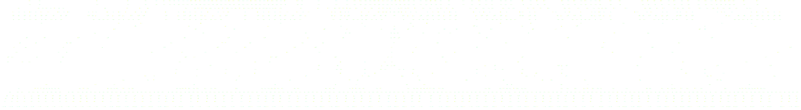

Refactoring the Ecosystem for Heterogeneity
-------------------------------------------

*Matthew Rocklin*

NVIDIA


### GPUs are neat

<hr>

### We need to think about protocols


### GPUs are neat

<hr>

### .


### First, an example

<iframe width="560"
        height="315"
        src="https://www.youtube.com/embed/QyyxpzNPuIE?start=1046"
        frameborder="0"
        allow="accelerometer; autoplay; encrypted-media; gyroscope; picture-in-picture"
        allowfullscreen></iframe>


### SVD Example

```python
import dask.array
.

rs = dask.array.random.RandomState()
x = rs.random((1000000, 1000), chunks=(10000, 1000))

u, s, v = np.linalg.svd(x)
u, s, v = dask.compute(u, s, v)
```



A complex algorithm built on the Numpy API


### SVD Example

```python
import dask.array
import cupy

rs = dask.array.random.RandomState(RandomState=cupy.random.RandomState)
x = rs.random((1000000, 1000), chunks=(10000, 1000))

u, s, v = np.linalg.svd(x)
u, s, v = dask.compute(u, s, v)
```


Works today on GPU arrays too


### Same code

<hr>

### Different Hardware

<hr>

### Different performance profile


*work by Peter Entschev [blog.dask.org/2019/06/27/single-gpu-cupy-benchmarks](https://blog.dask.org/2019/06/27/single-gpu-cupy-benchmarks)*


### GPUs are good for other things too

```python
>>> import pandas, cudf

>>> %time len(pandas.read_csv("nyc-taxi-2015-01.csv")
Wall time: 29.2s

>>> %time len(cudf.read_csv("nyc-taxi-2015-01.csv")
Wall time: 2.12s

$ du -h nyc-taxi-2015-01.csv
1.9G
```


### GPUs are good for other things too

```python
>>> import umap, cuml

>>> %time umap.UMAP(n_neighbors=5, init="spectral").fit_transform(cpu_data)
Wall time: 1min 49s

>>> %time cuml.UMAP(n_neighbors=5, init="spectral").fit_transform(cpu_data)
Wall time: 19.5s

$ du -h my_data
400 MB
```


### We don't have to code CUDA to use a GPU

<hr>

### Rapids and CuPy provide familiar APIs around GPUs


### GPUs are neat

<hr>

### We need to think about protocols


### .

<hr>

### We need to think about protocols


### The SciPy ecosystem is expanding

<hr>

### Lots of new faces (welcome!)

-  :)
-  :-)
-  ;)
-  B-)


### The SciPy ecosystem is expanding

<hr>

### Lots of new domains

-   Genomics
-   Cyber security
-   Genomics
-   Text processing


### The SciPy ecosystem is expanding

<hr>

### Lots of new technologies

-  Multi-core CPUs
-  Distributed Clusters
-  ARM
-  Accelerators (GPUs, TPUs, ...)


### The SciPy ecosystem is expanding

<hr>

### Lots of new institutional partners

-   Philanthropic foundations
-   Fresh startups
-   Large technology companies
-   VCs


### This is great!

<hr>

### ...


### This is great!

<hr>

### But also scary!


### The ecosystem works because everything fits together


### Integrating new components takes care

<hr>

### Otherwise we risk fracturing the ecosystem


### History

-   1990's Numarray and Numeric: fractured community
-   2000: Numpy unites the ecosystem
-   2000s: The golden age of compatibility
-   2009: Rise of Pandas, Numpy not able to grow fast enough
-   2010s: Rise of PyData/SciPy, garner attention
-   2015: Deep learning frameworks, large tech companies arrive
-   2019: Numpy, Tensorflow, PyTorch, CuPy, Jax, Sparse, Dask, ...

    Fractured community


### History

-   1990's Numarray and Numeric: fractured community
-   2000: Numpy unites the ecosystem
-   2000s: The golden age of compatibility
-   2009: Rise of Pandas, *Numpy not able to grow fast enough*
-   2010s: Rise of PyData/SciPy, garner attention
-   2015: Deep learning frameworks, large tech companies arrive
-   2019: Numpy, Tensorflow, PyTorch, CuPy, Jax, Sparse, Dask, ...

    Fractured community


### History

-   1990's Numarray and Numeric: fractured community
-   .
-   .
-   *We're back in the 90's, but with more time pressure*
-   .
-   .
-   2019: Numpy, Tensorflow, PyTorch, CuPy, Jax, Sparse, Dask, ...

    Fractured community


### Need to organize to facilitate growth

<hr>

### Carefully, but also quickly

<hr>

### .


### Need to organize to facilitate growth

<hr>

### Carefully, but also quickly

<hr>

### Protocols enable inter-project coordination


### Lets look at some successful protocols


### Protocol examples: `__iter__`

Implement the `__iter__` protocol to operate in for loops

```python
class MyObject:
    def __iter__(self):

for x in MyObject():
    ...
```


### Protocol example: `__array__`

Implement the `__array__` protocol to convert to a NumPy array

```python
import matplotlib.pyplot as plt

x = np.array(...)

plt.plot(x)
```


### Protocol example: `__array__`

Implement the `__array__` protocol to convert to a NumPy array

```python
import matplotlib.pyplot as plt

df = pandas.read_csv('myfile.csv')

plt.plot(df.balance)
```


### Protocol example: `__array__`

Implement the `__array__` protocol to convert to a NumPy array

```python
import h5py

x = numpy.ones(10000)

h5py.File('myfile.h5')['x'] = x
```


### Protocol example: `__array__`

Implement the `__array__` protocol to convert to a NumPy array

```python
import h5py

df = pandas.read_csv('myfile.csv')

h5py.File('myfile.h5')['x'] = df.balance
```


### Protocol example: `__array__`

Implement the `__array__` protocol to convert to a NumPy array

```python
import h5py

df = dask.dataframe.read_csv('myfile.csv')

h5py.File('myfile.h5')['x'] = df.balance
```


### Protocol example: `__array__`

Implement the `__array__` protocol to convert to a NumPy array

```python
import h5py

x = dask.array.random.random(1000000)

h5py.File('myfile.h5')['x'] = x
```


### Protocol example: `__array__`

Implement the `__array__` protocol to convert to a NumPy array

```python
import h5py, zarr

x = zarr.create_dataset(...)

h5py.File('myfile.h5')['x'] = x
```


### Protocol example: `__array__`

Implement the `__array__` protocol to convert to a NumPy array

```python
import h5py, zarr

x = h5py.File('myfile.h5')['x']

zarr.create_dataset(...)['x'] = x
```


### Protocols let us mix and match technologies

<hr>

### Enabling creative solutions that maintainers didn't foresee


### Protocol example: `fit/predict`

Implement fit/transform/predict to work with Scikit-Learn

```python
from sklearn import ...
from sklearn.cluster import DBScan
pipeline = Pipeline(..., DBScan(), ...)

pipeline.fit(X, y)
```


### Protocol example: `fit/predict`

Implement fit/transform/predict to work with Scikit-Learn

```python
from sklearn import ...
from umap import UMAP
pipeline = Pipeline(..., UMAP(), ...)

pipeline.fit(X, y)
```


### Protocol example: `fit/predict`

Implement fit/transform/predict to work with Scikit-Learn

```python
from sklearn import ...
from cuml import UMAP
pipeline = Pipeline(..., UMAP(), ...)

pipeline.fit(X, y)
```


### Protocol example: `.ipynb`

-   Classic notebook
-   Jupyter Lab
-   Nteract
-   .
-   .
-   .


### Protocol example: `.ipynb`

-   Classic Jupyter notebook
-   Jupyter Lab
-   Nteract
-   GitHub rendering
-   Netflix infrastructure
-   .


### Protocol example: `.ipynb`

-   Classic Jupyter notebook
-   Jupyter Lab
-   Nteract
-   GitHub rendering
-   Netflix infrastructure
-   Voilà


### Protocol example: `__array_function__`

Implement `__array_function__` to use NumPy functions

```python
import numpy

x = numpy.random.random((10000, 10000))

u, s, v = np.linalg.svd(x)
```


### Protocol example: `__array_function__`

Implement `__array_function__` to use NumPy functions

```python
import dask.array

x = dask.array.random.random((10000, 10000))

u, s, v = np.linalg.svd(x)
```


### Protocol example: `__array_function__`

Implement `__array_function__` to use NumPy functions

```python
import cupy

x = cupy.random.random((10000, 10000))

u, s, v = np.linalg.svd(x)
```


### Protocol example: `__array_function__`

Implement `__array_function__` to use NumPy functions

```python
import cupy, xarray

x = cupy.random.random((10000, 10000))

d = xarray.DataArary(x)
```


### Protocols level the playing field for technologies

<hr>

### New technologies can quickly compete

*For example an OpenCL Numpy implementation could gain traction quickly*


### Protocols level the playing field for technologies

<hr>

### New developers can engage, improving accessibility

*For example an OpenCL Numpy implementation could gain traction quickly*


### Protocol example: `__array_function__`

Implement `__array_function__` to use NumPy functions

```python
import cupy

x = cupy.random.random((10000, 10000))

u, s, v = np.linalg.svd(x)
```


### Protocol example: `__array_function__`

Implement `__array_function__` to use NumPy functions

```python
import clpy

x = clpy.random.random((10000, 10000))

u, s, v = np.linalg.svd(x)
```


### Protocol example: `__array_function__`

Implement `__array_function__` to use NumPy functions

```python
import clpy, xarray

x = clpy.random.random((10000, 10000))

d = xarray.DataArary(x)
```


### Protocols enforce consistency for users

<hr>

### Scientists quickly explore new functionality

*For example you can easily see if a GPU accelerates your workload*


### Example API Consumer: Dask Array


### Example API Consumer: Dask Array


### Example API Consumer: Dask Array


### Example API Consumer: Dask DataFrame


Works with either Pandas or RAPIDS cuDF for GPUs


### Pandas and Extension Arrays: internal

Pandas has many custom array-like internal types

-   Datetime with timezones
-   Categoricals
-   Sparse
-   Missing values

<hr>

```python
>>> import pandas as pd
.

>>> pd.Series(["Healthy", "No change", "No change"]).astype("category")
0      Healthy
1    No change
2    No change
dtype: category
Categories (2, object): [Healthy, No change]
.
```

.


### Pandas and Extension Arrays: external

Externalizing that API enables external packages to be Pandas native

-   CyberPandas
-   GeoPandas
-   Text
-   Decimal

<hr>

```python
>>> import pandas as pd
>>> from cyberpandas import IPArray  # <--- External library

>>> arr = IPArray([0, 1, 2, 3])
>>> s = pd.Series(arr)               # <--- Native integration
0    0.0.0.0
1    0.0.0.1
2    0.0.0.2
3    0.0.0.3
dtype: ip                            # <--- Neat!
```

What would previously be a community fork is now native and integrated


### (this works with Dask DataFrame too)

```python
>>> import pandas as pd
>>> from cyberpandas import IPArray

>>> arr = IPArray([0, 1, 2, 3])
>>> s = pd.Series(arr)
0    0.0.0.0
1    0.0.0.1
2    0.0.0.2
3    0.0.0.3
dtype: ip

>>> ds = dask.dataframe.from_pandas(s, npartitions=2)
Dask Series Structure:
npartitions=2
0     ip
2    ...
3    ...
dtype: ip                            # <--- Downstream benefits
Dask Name: from_pandas, 2 tasks
```


### Core projects define clear contracts

<hr>

### Enabling external ecosystem growth


### Core projects define clear contracts

<hr>

### Directing external ecosystem growth


### Summary

1.  GPUs are neat.  Let's play!
2.  The revolution is coming.   Let's plan.


### What should we do about it?

-  **Users:** Experiment new technologies, share experiences
-  **Developers:**: Build on protocols, not closed systems
-  **Core Maintainers:** Build extension points
