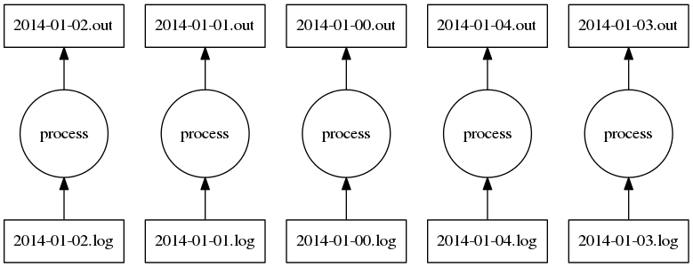
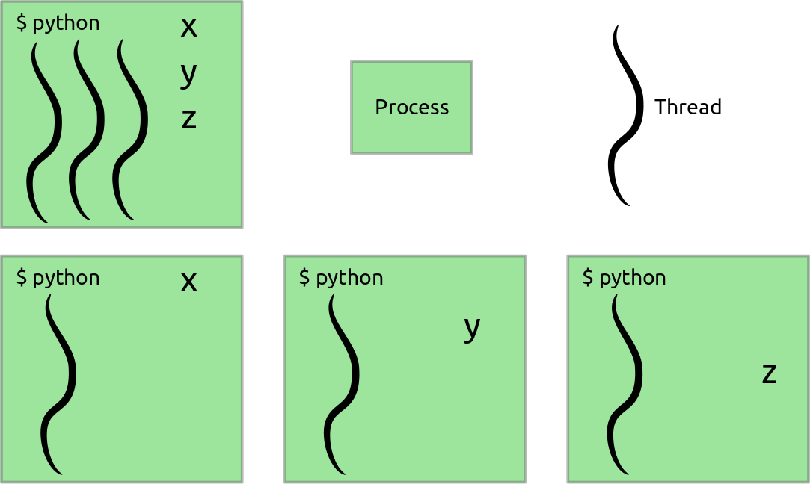
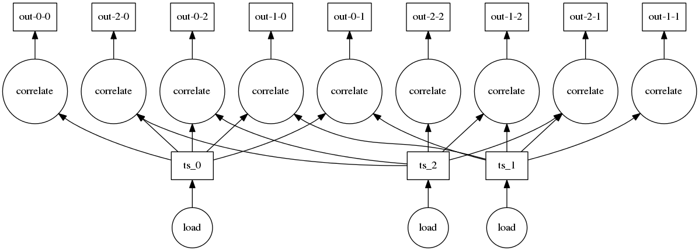
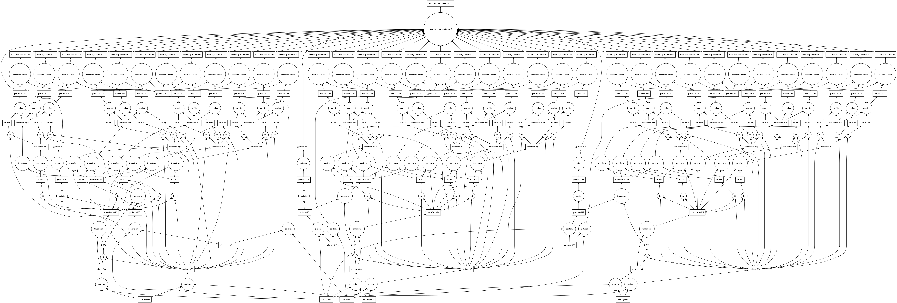

Python and Parallelism
---------------

*Matthew Rocklin*

Continuum Analytics

### Python has a sophisticated analytics stack

### Computers have many cores and fast hard drives

Outline
-------

0.  Don't use parallelism
1.  Multiprocessing
2.  Threading
3.  Complex analytic workloads
4.  Dynamic task scheduling (`dask`)
5.  Larger than memory arrays / dataframes
6.  Distributed

### Don't use parallelism

*  Explore APIs
*  Write C/Cython/Numba
*  Store data in nice formats
*  Use smarter algorithms
*  Sample

### Multiprocessing log files

    def process(filename):
        with open(filename) as f:               # Load from file
            lines = f.readlines()

        output = ...                            # do work

        with open(filename.replace('.log', '.out'), 'w') as f:
            for line in output:
                f.write(line)                   # Write to file

    import multiprocessing
    pool = multiprocessing.Pool()

    filenames = glob('2014-*-*.log')            # Collect all filenames
    # [process(fn) for fn in filenames]         # Single-core processing
    pool.map(process, filenames)                # Multi-core processing

### Multiprocessing log files

*   Benefits
    *  Dead simple
    *  Handles 80% of all cases
    *  Many software solutions
*   Drawbacks
    *  Dead simple
    *  Hard to share data between processes
    *  Function serialization

### Threads vs Processes

### Threading and Numeric Data

    pool = multiprocessing.pool.ThreadPool()
    filenames = glob('2014-*.*.npy')

    timeseries_list = pool.map(np.load, filenames)

    # correlations = [np.correlate(a, b) for a in timeseries_list
    #                                    for b in timeseries_list]

    futures = [pool.apply_async(np.correlate, (a, b)) for a in timeseries_list
                                                      for b in timeseries_list]
    results = [f.get() for f in futures]

### Threading and Numeric Data

*   Benefits
    *   Seamlessly share data between threads
    *   Avoid GIL with NumPy/Pandas/Sci*
*   Drawbacks
    *   A bit more complex (`apply_async`, `get`)
    *   Doesn't accelerate Pure Python

### Complex data dependencies (analysis)

### Embarrassingly Parallel (data ingest)

### Complex workloads -- GridSearch, CV, Pipeline

    pipeline = Pipeline([('cnt', CountVectorizer()), ..., ('svm', LinearSVC())])
    gridsearch = GridSearch(pipeline, {'svm__C': np.logspace(-3, 2, 10), ...})

### Complex workloads -- Larger-than-memory SVD

    u, s, v = da.linalg.svd(X)

### Dask executes task graphs nicely

*   Dynamic task scheduler
    *  Executes task graphs in parallel
    *  Respects data dependencies
    *  1 ms latency per task
    *  Minimizes intermediate data in memory
*   Parallel larger-than-memory collections
    *  Large Arrays
    *  Large DataFrames
    *  Large Python Lists
    *  Custom work

### dask.array/dataframe build graphs

*  Provides
    *  API compatible with numpy/pandas
    *  Limited by disk size not RAM
    *  Parallel execution on your laptop
    *  Comfortable into the 100s GB range
*  How it works
    *  Global operations break into many small operations
    *  Numpy/Pandas perform local operations
    *  Task graphs coordinate recipes

### Dask collections build graphs

    (2*x + 1) **2

### Dask Schedulers Execute Graphs

    (2*x + 1) **2

### Sometimes this fails

(but that's ok)

