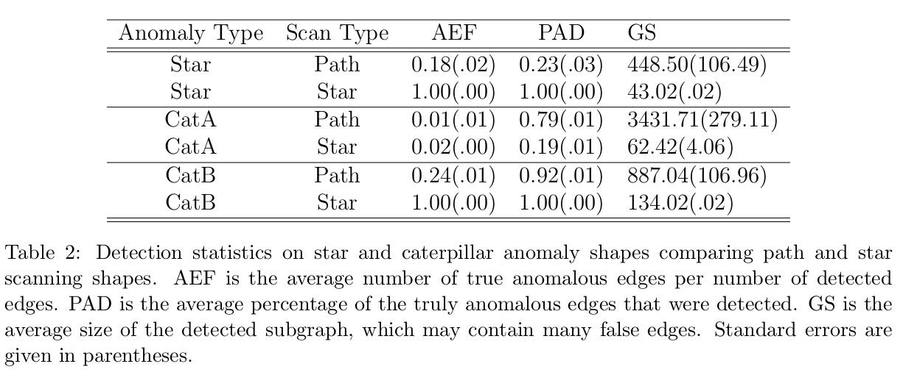

% RECAP: Scan Statistics for the Online Detection of Locally Anomalous Subgraphs
% LANL Groups
% September 23rd, 2013

Paper in a Slide
----------------

**Goal** --  Identify anomalous/intrusive network events

Model behavior on each edge

Sum behavior over traversals/subgraphs common to attacks

Edge Models
-----------

Two Phenomena:

1.  Bursty behavior during the day
2.  Long periods of inactivity

Two Models:

*   Markov model with two states
    *   Emission state - Emits 1
    *   Quiet state - Emits 0
*   Hidden Markov model with two layers
    *   In office
        *   Emission State - Emits 1
        *   Quiet State - Emits 0
    *   Out of office - Emits only 0's

Learn Common Behavior
---------------------

Given a string of events (connect, connect, don't connect, ...)

And a model (two level "at work/at computer" model)

Learn the following parameters

*   Probability of connection given that user is at work
*   Probability of transitioning from "at work" to "not at work" state
*   Probability of transitioning from "not at work" to "at work" state

Via Expectation-Maximization (iterative optimization scheme)

Test for Anomalous Behavior
---------------------------

Given a string of events (connect, connect, don't connect, ...)

And a model (two level "at work/at computer" model)

Learn the following parameters

*   Probability of connection given that user is at work
*   Probability of transitioning from "at work" to "not at work" state
*   Probability of transitioning from "not at work" to "at work" state

Via Expectation-Maximization (iterative optimization scheme)

Compute ratio of likelihoods under baseline parameters and newly trained parameters

Look for increases in transition probabilities to emission states

Edge Summation Patterns
-----------------------

Two fundamental patterns

1.  Star
2.  Path

Aggregating likelihoods across pattern requires

1.  Independence
2.  Computation (lots of 3 paths)

Independence
------------

\begin{figure}
\centering
\includegraphics[height=.5\textheight, width=.4\textwidth]{images/independence.png}
\end{figure}

Arguments for Independence

*   This layer of network protocol allows any pairwise connection
*   Of 40 000 edges and 300 000 2-paths only 1 in 10 000 have correlations above 50%

Independence assumption allows us to separate the likelihood and summation computations.

Results
-------

Introduce fake events into real data.  Measure likelihoods for each edge.

Results
-------

Paper then describes merits of searching for anomalies of type X using scanning
subgraph of type Y.  E.g. 

*   How well do path scans find star intrusions?  
*   How well do path scans find path intrusions?

Conclusion
----------

**Problems**

*   New edges arose and had to be neglected
*   Model misses obvious structure (daily, weekly schedules)
*   Model does not attempt to learn node structure (sys-admin, server, ...)

**Take aways**

*   A significant portion of the signal resides in local behavior
*   Complex models for local behavior encourage us to disconnect local measurements from network measurements

**Real Results**

*   System did detect an event.  Automatic reallocation of a machine to a new user at night caused the node to repeatedly hit administrative servers (e.g. calendar, mail)
