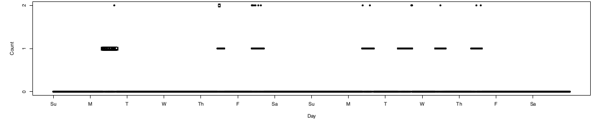
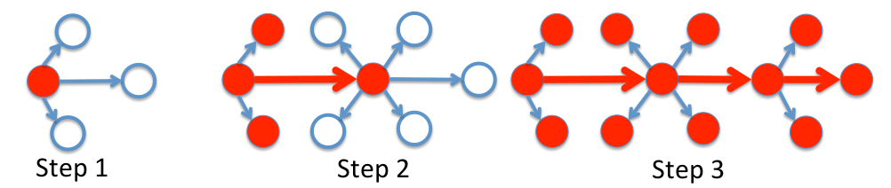
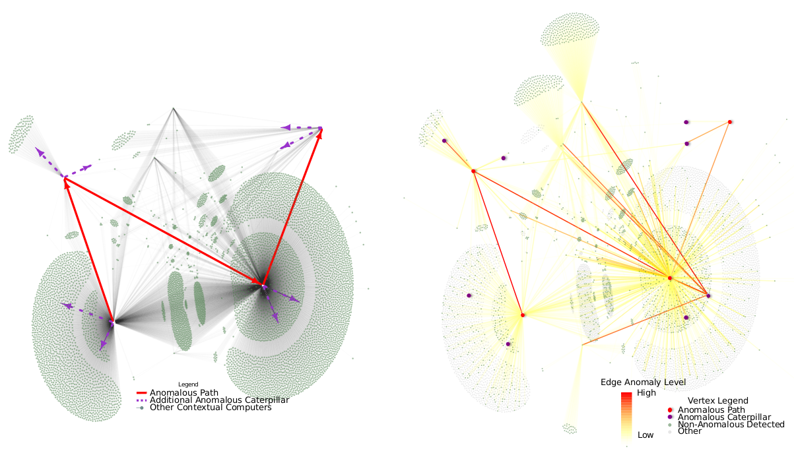

% RECAP: Scan Statistics for the Online Detection of Locally Anomalous Subgraphs
% LANL Groups
% September 23rd, 2013

Paper in a Slide
----------------

**Goal** --  Identify anomalous/intrusive network events

Edge Models
-----------

Two Phenomena:

1.  Bursty behavior during the day
2.  Long periods of inactivity

Two Models:

*   Markov model with two states
    *   Emission state - Emits 1
    *   Quiet state - Emits 0
*   Hidden Markov model with two layers
    *   In office
        *   Emission State - Emits 1
        *   Quiet State - Emits 0
    *   Out of office - Emits only 0's

Learn/Test for Detection
------------------------

Learn parameters for state transition probabilities from baseline data

Edge Summation Patterns
-----------------------

Two fundamental patterns

1.  Star
2.  Path

Aggregating likelihoods across pattern requires

1.  Independence
2.  Computation (lots of 3 paths)

Independence
------------

\begin{figure}
\centering
\includegraphics[height=.5\textheight, width=.4\textwidth]{images/independence.png}
\end{figure}

Arguments for Independence

*   This layer of network protocol allows any pairwise connection
*   Of 40 000 edges and 300 000 2-paths only 1 in 10 000 have correlations above 50%

Independence assumption allows us to separate the likelihood and summation computations.

Results
-------

Introduce fake events into real data

