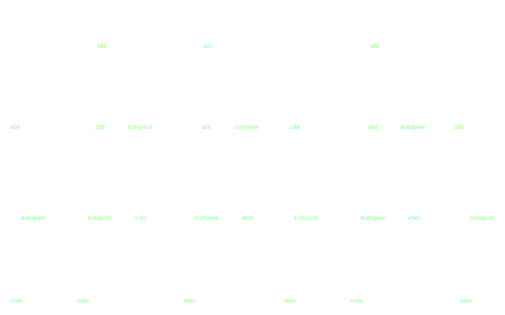

Dask: Parallel Computing in Python
----------------------------------


*Matthew Rocklin*

Continuum Analytics


### Python has a strong analytics stack (NumPy, Pandas)

<hr>

### that is mostly restricted to a single core and RAM


-  **Effective libraries** standard among analysts
    -   Pandas: dataframes
    -   NumPy: multi-dimensional arrays
    -   Scikit-learn: Machine learning
    -   ...
    -   *imaging, signals processing, natural language, finance, etc..*
-  **Efficient** using C/Fortran/LLVM/CUDA under the hood
    -   High-level Python API for accessibility
    -   Low-level optimized code for speed
    -   Sophisticated algorithms


### How do we parallelize an existing analytics stack?

<hr>

### of thousands of packages

### each with custom algorithms


### Sckit-Image: general image analysis

    skimage.feature.canny(im, sigma=3)


### Scikit-Allel: Specialized genomics


*Example taken from scikit-allel webpage*


### Need a parallel computing library

<hr>

### ... that is flexible enough

<hr>

### ... and light enough

<hr>

### ... to parallelize a disparate ecosystem


Outline
-------

-  Parallel NumPy and Pandas
-  Parallel custom code
-  Task Graphs and Task Scheduling
    -   Compare with other systems (Spark, Airflow)
    -   Dask's task schedulers
-  Example domain: machine learning
-  Q&A


### Dask.array


    # NumPy code
    import numpy as np
    x = np.random.random((1000, 1000))
    u, s, v = np.linalg.svd(x.dot(x.T))

    # Dask.array code
    import dask.array as da
    x = da.random.random((100000, 100000), chunks=(1000, 1000))
    u, s, v = da.linalg.svd(x.dot(x.T))


### Dask.DataFrame


    import pandas as pd
    df = pd.read_csv('myfile.csv', parse_dates=['timestamp'])
    df.groupby(df.timestamp.dt.hour).value.mean()

    import dask.dataframe as dd
    df = dd.read_csv('hdfs://myfiles.*.csv', parse_dates=['timestamp'])
    df.groupby(df.timestamp.dt.hour).value.mean().compute()


### But many problems aren't just big arrays and dataframes

<hr>

### The world is messy.  Algorithms can be complex.


### Fine Grained Code

    .

<hr>

    results = {}

    for a in A:
        for b in B:
            if a < b:
                results[a, b] = f(a, b)
            else:
                results[a, b] = g(a, b)

    .

### Parallelizable, but not a list, dataframe, or array


### Fine Grained Code

    from dask import delayed, compute

<hr>

    results = {}

    for a in A:
        for b in B:
            if a < b:
                results[a, b] = delayed(f)(a, b)  # lazily construct graph
            else:
                results[a, b] = delayed(g)(a, b)  # without structure

    results = compute(results)  # trigger all computation

### Parallelizable, but not a list, dataframe, or array


### Dask APIs Produce Task Graphs

<hr>

### Dask Schedulers Execute Task Graphs


### 1D-Array


```python
>>> np.ones((15,))
array([ 1., 1., 1., 1., 1., 1., 1., 1., 1., 1., 1., 1., 1., 1., 1.])

>>> x = da.ones((15,), chunks=(5,))
```


### 1D-Array


```python
x = da.ones((15,), chunks=(5,))
x.sum()
```


### ND-Array - Sum


```python
x = da.ones((15, 15), chunks=(5, 5))
x.sum(axis=0)
```


### ND-Array - Transpose



```python
x = da.ones((15, 15), chunks=(5, 5))
x + x.T
```


### ND-Array - Matrix Multiply


```python
x = da.ones((15, 15), chunks=(5, 5))
x.dot(x.T + 1)
```


### ND-Array - Compound Operations


```python
x = da.ones((15, 15), chunks=(5, 5))
x.dot(x.T + 1) - x.mean()
```


### ND-Array - Compound Operations


```python
import dask.array as da
x = da.ones((15, 15), chunks=(5, 5))
y = (x.dot(x.T + 1) - x.mean()).std()
```


### Dask APIs Produce Task Graphs

<hr>

### Dask Schedulers Execute Task Graphs


### Dask.array/dataframe/delayed author task graphs

<hr>


<hr>

### Now we need to run them efficiently


### Dask.array/dataframe/delayed author task graphs

<hr>


<hr>

### Now we need to run them efficiently


### Brief and Incomplete Summary of Parallelism Options

-  Embarrassingly parallel systems (multiprocessing, joblib)
-  Big Data collections (MapReduce, Spark, Flink, Database)
-  Task schedulers (Airflow, Luigi, Celery, Make)


### map

    output = map(func, data)  # Sequential

<hr>

    pool = multiprocessing.Pool()
    output = pool.map(func, data)  # Parallel

-   Pros
    -   Easy to install and use in the common case
    -   Lightweight dependency
-   Cons
    -  Data interchange cost
    -  Not able to handle complex computations


### Big Data collections

    from pyspark import SparkContext
    sc = SparkContext('...')

    rdd = sc.parallelize(data)
    rdd.map(json.loads).filter(...).groupBy(...).count()

    df = spark.read_json(...)
    df.groupBy('name').aggregate({'value': 'sum'})

-   Pros
    -   Larger set of operations
    -   Scales nicely on clusters
    -   Well trusted by enterprise
-   Cons
    -  Heavyweight and JVM focused
    -  Not able to handle complex computations


### This is what I mean by complex


### Spark does the following well

<table>
<tr>
  <td>
    
  </td>
  <td>
    
  </td>
  <td>
    
  </td>
</tr>
</table>


### Task Schedulers (Airflow, Luigi, Make, ...)


-  Pros
    -  Handle arbitrarily complex task graphs
    -  Python Native
-  Cons
    -  No inter-worker storage or data interchange
    -  Long latencies (relatively)
    -  Not designed for computational loads


### Want a task scheduler (like Airflow, Luigi)

<hr>

### Built for computational loads (like Spark, Flink)


-  Dynamic task scheduler for generic applications
-  Handles data locality, resilience, work stealing, etc..
-  With 10ms roundtrip latencies and 200us overheads
-  Native Python library respecting Python protocols
-  Lightweight and well supported


### Single Machine Scheduler

Optimized for larger-than-memory use.

*   **Parallel CPU**: Uses multiple threads or processes
*   **Minimizes RAM**: Choose tasks to remove intermediates
*   **Low overhead:** ~100us per task
*   **Concise**: ~1000 LOC
*   **Real world workloads**: Under heavy load by many different projects


### Distributed Scheduler

*   **Distributed**: One scheduler coordinates many workers
*   **Data local**: Moves computation to correct worker
*   **Asynchronous**: Continuous non-blocking conversation
*   **Multi-user**: Several users share the same system
*   **HDFS Aware**: Works well with HDFS, S3, YARN, etc..
*   **Solidly supports**: dask.array, dask.dataframe, dask.bag, dask.delayed,
    concurrent.futures, ...
*   **Less Concise**: ~5000 LOC Tornado TCP application

    All of the logic is hackable Python, separate from Tornado


### Distributed Network


### Setup Distributed Network

    $ dask-scheduler
    Scheduler listening at tcp://192.168.1.100:8786

    $ dask-worker tcp://192.168.1.100:8786
    $ dask-worker tcp://192.168.1.100:8786

```python
>>> from dask.distributed import Client
>>> client = Client('tcp://192.168.1.100:8786')
```

### Run locally on your laptop

```python
from dask.distributed import Client
client = Client()  # set up local scheduler and workers
```

### Deploy on cluster resource manager

-   dask-kubernetes
-   dask-marathon
-   dask-yarn
-   dask-drmaa
-   dask-ssh
-   dask-ec2
-   ...


### Distributed Scheduler


### Distributed Scheduler


### Distributed Scheduler


### Distributed Scheduler


### Distributed Scheduler


### Distributed Scheduler


### Distributed Scheduler


### Distributed Scheduler


### Distributed Scheduler


### Distributed Scheduler


### Distributed Scheduler


### Distributed Scheduler


### Distributed Scheduler


### Distributed Scheduler


### Distributed Scheduler


### Dask is easy to use and adopt

<hr>

### You already know the API

### You already have the dependencies installed


### Dask supports Pythonic APIs

-  NumPy/Pandas/SKLearn protocols and APIs
-  PEP-3148 concurrent.futures
-  PEP-492 async/await
-  Joblib (sklearn's parallelism library)

<hr>

### Dask is lightweight

-  Single-machine scheduler runs on stdlib only
-  Distributed scheduler is a Tornado TCP application
-  Pure Python 2.7+ or 3.4+


### Dask overview

-  **High level** APIs
    -  Dask.array = dask + numpy
    -  Dask.dataframe = dask + pandas
    -  Machine learning, lists, real time, and others
    -  Parallelizes custom systems
-  **Low level** task scheduler
    -  Determines when and where to call Python functions
    -  Works with any Python functions on any Python objects
    -  Handles data dependencies, locality, data movement, etc..


### Example Domain: Machine Learning

1.  Integrate with Scikit-Learn
    -   Create API compatible components like model selection

        ```python
        pipe = Pipeline(steps=[('pca', PCA()),
                               ('logistic', LogisticRegression)])
        grid = GridSearchCV(pipe, parameter_grid)
        ```
    -   Hijack SKlearn's internal parallel library, joblib

2.  Implement algorithms with dask.array

    ```python
    eXbeta = da.exp(X.dot(beta))
    gradient = X.T.dot(eXbeta / (eXbeta + 1) - y)
    ...
    ```

3.  Collaborate with other distributed systems

    -  **Pre-process** with dask.dataframe
    -  **Deploy** other distributed services (xgboost, tensorflow, ...)
    -  **Pass data** from Dask and **train** with other service

4.  Build custom systems with dask.delayed, concurrent.futures


### Example: Convex optimization algorithms with Dask array

```python
for k in range(max_steps):
    Xbeta = X.dot(beta_hat)
    func = ((y - Xbeta)**2).sum()
    gradient = 2 * X.T.dot(Xbeta - y)

    ## Update
    obeta = beta_hat
    beta_hat = beta_hat - step_size * gradient
    new_func = ((y - X.dot(beta_hat))**2).sum()
    beta_hat, func, new_func = dask.compute(beta_hat, func, new_func) # new

    ## Check for convergence
    change = np.absolute(beta_hat - obeta).max()

    if change < tolerance:
        break
```


### Example: Convex optimization algorithms with Dask array


Work mostly by Chris White (Capital One), Tom Augspurger (Continuum)


### Example: Dask + XGBoost

```python
df = dd.read_csv('...')    # load and clean with dask.dataframe
training_data = df[[...]]  # prepare training data and labels
labels = df['clicked']

import dask_xgboost
params = {'objective': 'binary:logistic', 'eta': 0.01, 'max_depth': 16}
bst = dask_xgboost.train(client, params, training_data, labels)  # hand off

>>> bst
<xgboost.core.Booster at 0x7fa1c18c4c18>
```

-  Launches XGBoost workers alongside Dask workers
-  Passes data off and lets XGBoost handle what it does best


Easy to build in ~ 15 hours.  Collaboration with Tianqi Chen, Olivier Grisel.
[dmlc/xgboost #2032](https://github.com/dmlc/xgboost/issues/2032)


### Example: Dask + XGBoost

```python
df = dd.read_csv('...')    # load and clean with dask.dataframe
training_data = df[[...]]  # prepare training data and labels
labels = df['clicked']

import dask_xgboost
params = {'objective': 'binary:logistic', 'eta': 0.01, 'max_depth': 16}
bst = dask_xgboost.train(client, params, training_data, labels)  # hand off

>>> bst
<xgboost.core.Booster at 0x7fa1c18c4c18>
```

-  Launches XGBoost workers alongside Dask workers
-  Passes data off and lets XGBoost handle what it does best


Easy to build in ~ 15 hours.  Collaboration with Tianqi Chen, Olivier Grisel.
[dmlc/xgboost #2032](https://github.com/dmlc/xgboost/issues/2032)


### Example: Gradient-free search

```python
from dask_patternsearch import search

def f(x):
    return x.dot(x)

x0 = np.array([1, 2, 3])
best, results = search(f, x0, stepsize, stopratio=1e-4)
```

-  Directs computation based on recent results
-  Fully live and asynchronous
-  Algorithm scales to very many dimensions


-  Implementation by Erik Welch (Continuum)


## Engagement

-  Developers
    -  ~150 contributors total (counting all subprojects)
    -  ~10 part time developers, about half at Continuum
    -  Core developers from Pandas, NumPy, SKLearn, Jupyter, ...
-  Funding agencies
    -  Strong developer community (maybe you?)
    -  Government (DAPRA, Army Engineers, UK Met, ...)
    -  Gordon and Betty Moore Foundation
    -  Companies who fund directly (largely finance)
    -  Institutions who use and contribute code, bug reports, and developer time
    -  Continuum Analytics


## Github issues in the last 48 hours

-  **ESGF/esgf-compute-wps**: Earth System Grid Federation
-  **matyasselmeci/dask_condor**: Deploy on Condor clusters
-  **DigitalSlideArchive/HistomicsTK:** Image analysis of diseased tissue
-  **alimanfoo/scikit-allel**: Genomics
-  **datasciencebr/serenata-toolbox:** Brazillian gov't analysis
-  **dask/dask-searchcv:** SKLearn GridSearch, model selection
-  **dask/fastparquet**: Parquet storage format
-  **pydata/xarray**: Labeled arrays and climate science
-  **SciTools/iris**: UK Met office weather analysis
-  **pyFFTW/pyFFTW**: Fast fourier transforms

*As of 2017-05-18 11:09 UTC-8:00*


### Thank you -- Questions?

-  Dask scales the existing Python ecosystem
-  Dask enables custom applications
-  Docs: [dask.pydata.org](https://dask.pydata.org/en/latest/) --
   Github: [github.com/dask](https://github.com/dask)
-  You can set it up right now during questions:

        $ conda install dask            # Install with conda
        $ pip install dask[complete]    # or with pip

        >>> from dask.distributed import Client
        >>> client = Client()  # starts "cluster" on your laptop

        >>> futures = client.map(lambda x: x + 1, range(1000))
        >>> total = client.submit(sum, futures)
        >>> total.result()


### Comparison to Spark

-  Reasons to prefer Spark
    -   More established
    -   All-in-one framework for clusters
    -   SQL support and high-level optimizations
    -   Complements existing JVM infrastructure
-  Reasons to prefer Dask
    -   Grows out of existing Python stack
    -   Familiar to Python users and applications
    -   Supports more complex computations
    -   Integrates nicely into existing systems, lightweight


### Spark

<table>
<tr>
<td>Map</td>
<td>Shuffle</td>
<td>Reduce</td>
</tr>
<tr>
  <td>
    
  </td>
  <td>
    
  </td>
  <td>
    
  </td>
</tr>
</table>

### Dask


